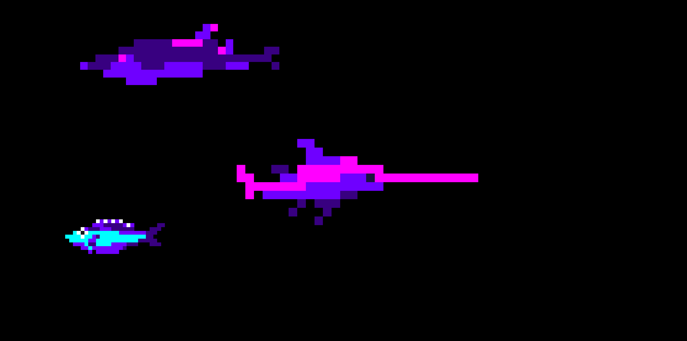
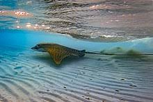
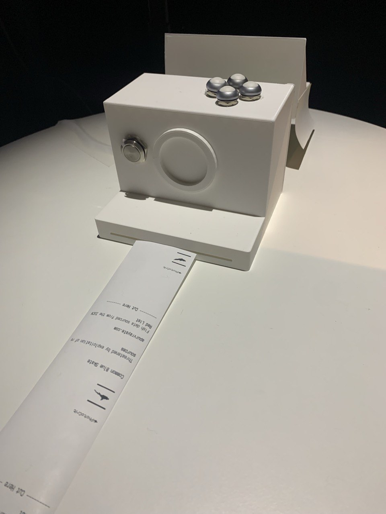
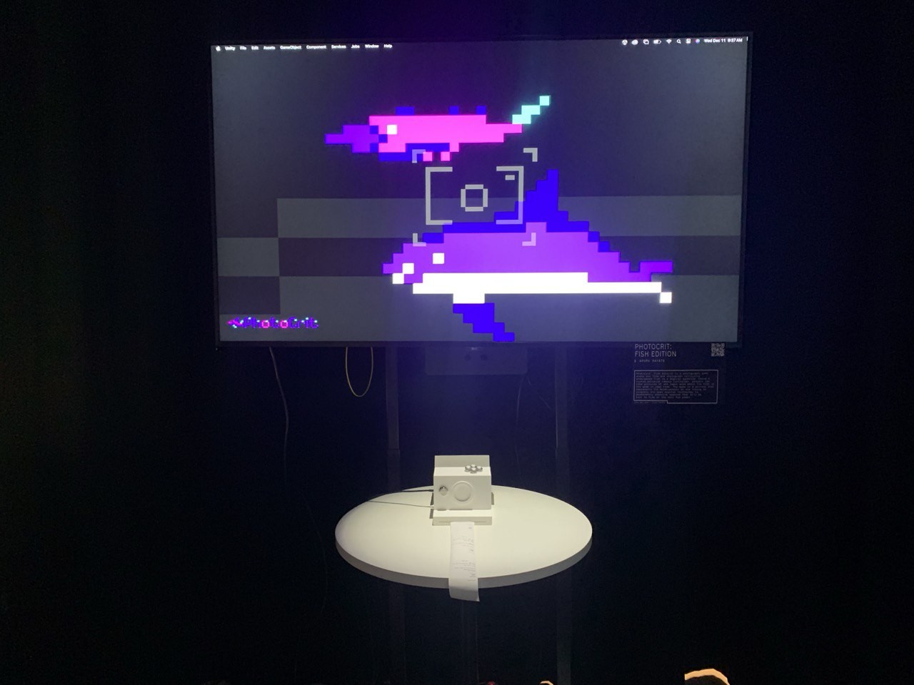
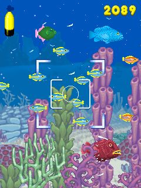
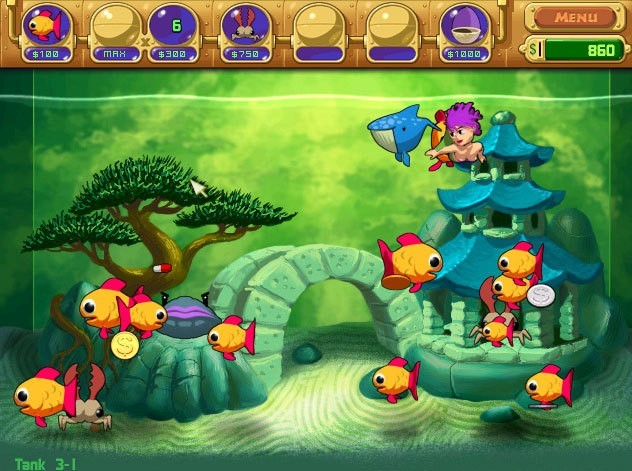
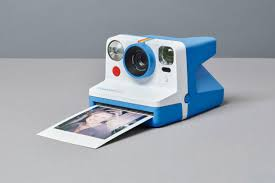
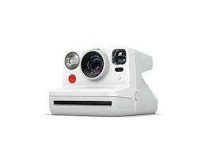
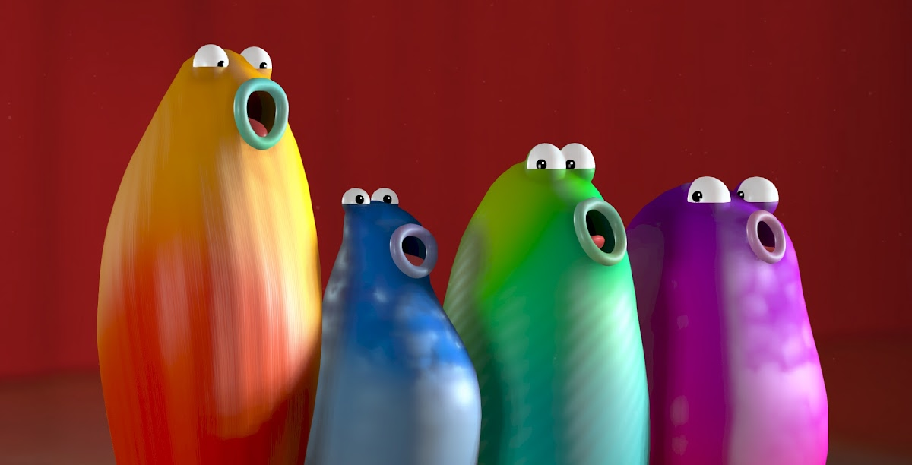
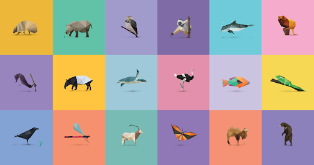

## Final Project

## Reflection

#### Project Description
PhotoCrit: Fish Edition is a photography game where you find and photograph critically endangered fish in a digital aquarium. Using a custom polaroid camera controller, players can take pictures of and learn more about the fish in the game in real time. The game is a gallery that represents the biodiversity we are losing to progress and uses digital technology to permanently enshrine species that will be lost to time in the next few years.

---

#### Process
This project was completed for both 'Computational Art and Design' and 'Physical Computing.' I want to talk about my process in three parts- the game, the game controller and the installation.

#### The Game
   
1. Gathering Data   
I decided to use data from the <a href="https://www.iucnredlist.org/">IUCN Red List website</a> because it provided the most accurate and official dataset with the most threatened species. However, the website combines the data for al species so I had to manually filter it in order to get data specifically about fish species. I made a spreadsheet of all the fish species that are currently critically endangered and filtered it again so I only had a list of all the fish registered as critically endangered in the past 4 years which was a total of 31 fish. Later on, I had to reduce this time period even more due to time and hardware constraints(that I will go into in the installation section). The final game ended up containing a total of 16 fish registered in the Red List in the past 2 years.

2. Creating Assets   
I knew I wanted to make a 2D game and after deciding to use a BW thermal printer for my controller; I also narrowed down my style to 2D pixel art. I used Aseprite to create most of my assets. I collected real life photos and videos of the fish that were in the game and  recreated their features in 2D. 

   

I also animated the 2D fish by creating 2D frames for them so that the game would become more dynamic. The original color scheme was muted and mostly inspired by the fish but I did not end up liking how they looked visually so I ended up switching to a more high contrast neon color scheme. I also made multiple versions of the background and also some logo and camera assets.

   

3. Coding the Game   
This was conceptualized as a mobile game so I decided to use Unity for the development. The project has scripts for the movement and behavior of the fish, the movement and control of the camera and a manager to speak to the Arduino and spawning and tracking of the fish in the scene. I originally also had a script to store the taken photographs in a local folder, but did not end up using it for the installation. I connected and sent messages to the Arduino using a plugin called Ardity.

---

#### The Game Controller
1. Planning the circuit and Sensor Tests   
Because I was using the Thermal Printer, my final circuit did not end up too complicated but I had to conduct a lot of tests with the printer to get high quality dark prints. I had to switch to a 12V power source and adjust the heat settings through the Arduino code. I was going to use a gyroscope for the movement controls but ended up going with buttons both because I really liked the buttons I had and I could not test the gyroscope/accelerometer sensor.

   

2. Writing the Code   
I used 2 Arduinos for the installation because serial communication and the Keyboard library clash with each other. One script receives messages from Unity about which fish has been photographed and then prints out its 2D bitmap asset along with specific text about that fish. The other script reads the input from the buttons and uses the Keyboard library to simulate keypresses for the game controls.

3. Creating the Object   
I 3D printed a polaroid camera chassis to house my electronics. My initial model that I found online was not suitable for 3D printing so I created a custom model by myself in Blender. I also printed a mini version of it first as a test and then printed a final version after adjusting the print orientation. I also soldered wires to the buttons and created a parallel circuit with all the button ground wires soldered together. I also used hot glue to connect everything securely together.

---

#### The Installation
I had a bunch of issues with the installation that I shall keep in mind next time I make something like this project. I had to use 2 Arduinos because the printer and Keyboard codes could not run together. This made the installation a bit difficult because the camera chassis was to small for everything. It was also very hard to keep the printer inside the chassis as sometimes the paper got stuck while sliding out. The orientation of the printer also did not match the slit in the chassis. There was also the issue of not enough of the print coming out of the chassis for the user to take back with them. Eventually I just ended up separating the printer to be put outside to make the experience of using it easier.

   

---

#### Final Thoughts
Even with all the installation issues, I learnt a lot while making and installing this project and will definitely improve on it in the future. This was the first time I made something with so many different parts and I feel like I can streamline my process much better in my next iteration.

<u>[Link to all Code & Video of Installation](https://drive.google.com/drive/folders/1hT5bIIZHs4BjF2R0SENvjzLc9m-YSxYj?usp=drive_link)</u> 

--- 

## Proposal

#### What are you making?

I am making a fish photography game called PhotoCrit for my Computational Art and Design project. You take pictures of critically endangered fish as part of a conservation effort. You learn more about these species and what is leading to their extinction. For physical computing, I will be making a polaroid camera that links to the game. The player can take pictures of the fish in the game and get real-time prints of the pictures they took.

---

#### Images/Inspiration  
**1. What the game might look like**

Fotoquest fishing is an old java game from 2006 that was also a fish photography game.  

Insaniquarium is an old game from 2001 that looks similar to what I am making.
  
**2. What the camera might look like**

I will model the pcomp project based on a polaroid camera. I might 3d print the camera chassis. It is important to note that while this project will look like a camera, it is functionally a printer. My main task will be to convert the image from the game into data that the Arduino and the thermal printer can read and then have it printed either wirelessly or through a physical connection. 
 
**3. Inspiration**

<u>[blob opera](https://artsandculture.google.com/experiment/blob-opera/AAHWrq360NcGbw?hl=en)</u>  
A website of interactive blobs that sing you a song

<u>[species-in-pieces](http://species-in-pieces.com/)</u>  
A website that uses CSS animations to show 30 endangered species

---

#### Initial List of parts  
1. Thermal printer + Arduino
2. Game prototype
3. Camera 3d model/old camera(camera rescue Tampere)
4. Gyroscope - move the camera - capture part of screen. (Screen only visible to some people?)
5. tbd

---

featured img: Box Jellyfish
