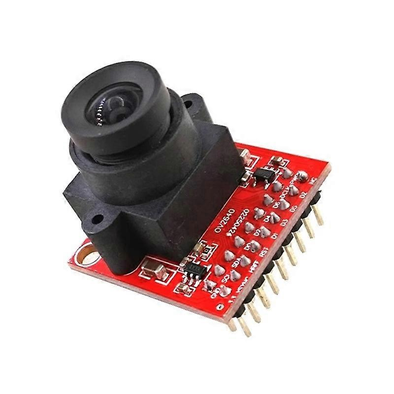
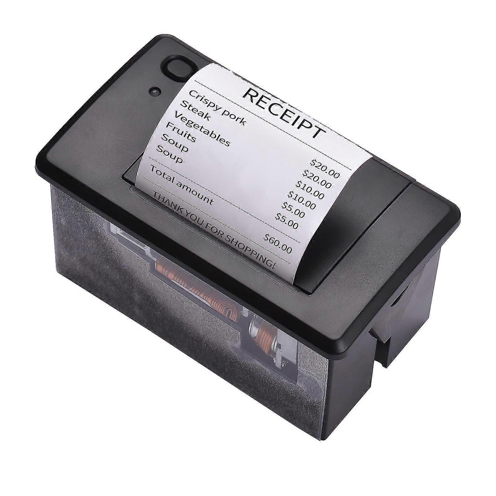

## Alt.Ctrl Interface

#### Find an interesting Alt.Ctrl Interface

I chose a different game by Playfool, the same collective that made "How (not) to get hit by a self-driving car." The game is called outdraw.ai and it is similar to other drawing party games but with the addition of an AI discriminator model. You have to try to draw something that other humans can understand but that confuses the AI model.



Here are some links to the game:

<u>[outdraw.ai](https://outdraw.ai/)</u>  
<u>[Steam Page](https://store.steampowered.com/app/3104020/outdrawAI/)</u>

---

#### Come Up with a concept for your own alt.ctrl interface 

I wanted to explore how to make a camera and also how to make a wireless printer and then use those as an interface for a game that I am currently making. 

#### 1. Camera

<u>[Link to sensor](https://www.fruugo.fi/uusi-ammattimainen-ov2640-kameramoduuli-stm32f4-ohjaimella-jpeg-pakkaus/p-260153128-568295112?language=fi&ac=croud&asc=pmax&gad_source=1&gclid=Cj0KCQiA57G5BhDUARIsACgCYnzTrxaVkEYbFcmW0l0V2Ea5hlNr35Z8nVQql2ydl91D_270_XJLkngaAoypEALw_wcB)</u>

#### 2. Thermal Printer

<u>[Link to sensor](https://www.fruugo.fi/embedded-thermal-receipt-printer-58mm-mini-printing-module-with-usbrs232ttl/p-309155093-692063927?language=en&ac=croud&asc=pmax&gad_source=1&gclid=Cj0KCQiA57G5BhDUARIsACgCYnyFKf7Zlb8jpu7FiAp58fMqoViC0jzRuaT_h1KCtwK9iV-d9VgwlLcaAmVoEALw_wcB)</u>  

My game is about collecting photographs of endangered fish. I want to create a physical camera that can be installed with the game so that people can take pictures and get them developed live. I plan to make this for my final project so I will be developing the concept further in the proposal for next week.

---

featured img: Lily of the Valley
