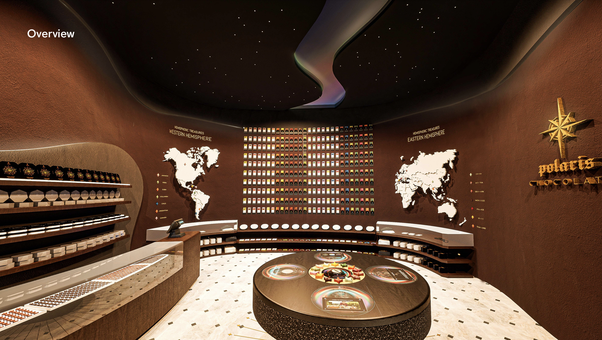
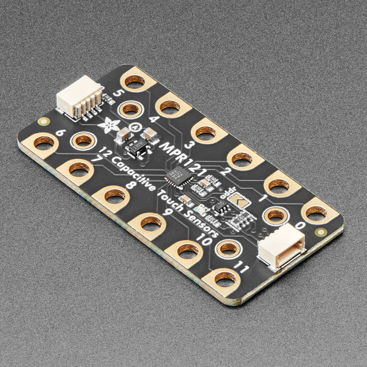
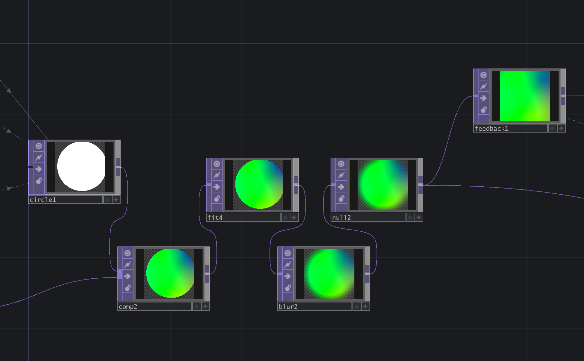
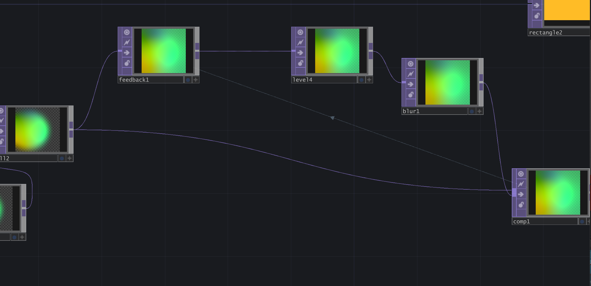
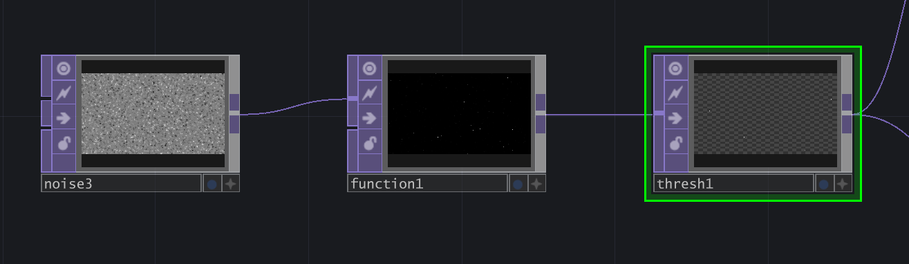
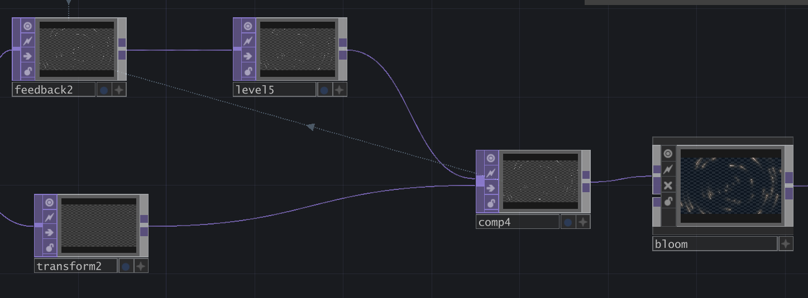
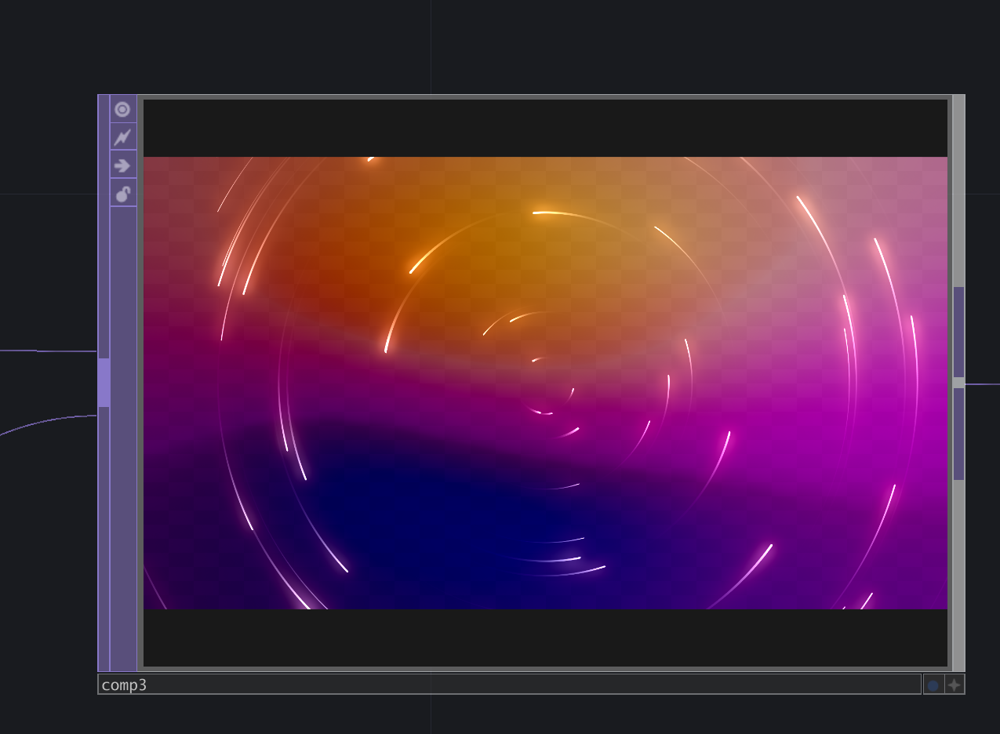
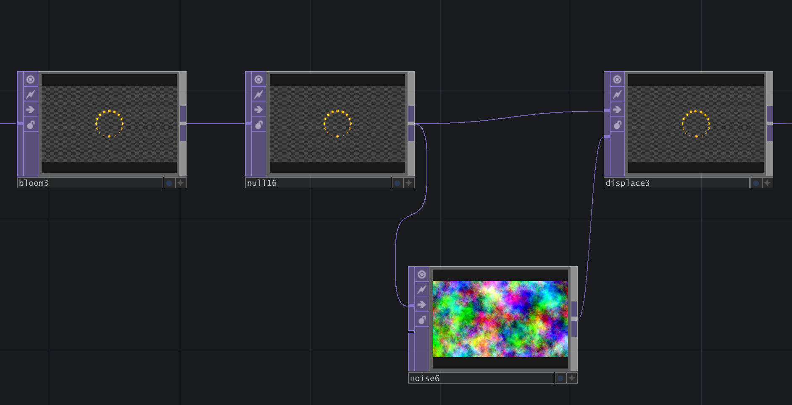
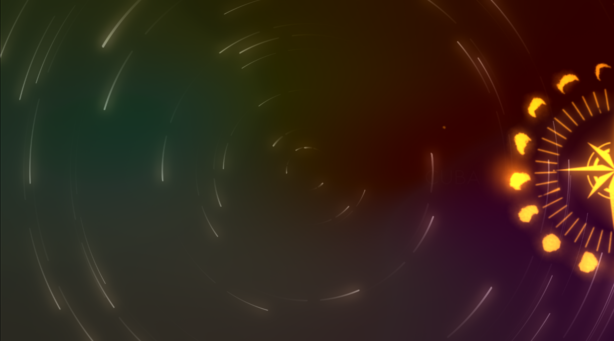
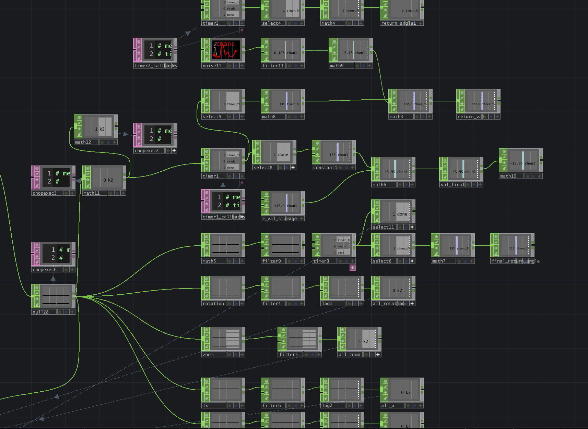

**Destined Place**

**Overview**

This is an **Interactive Installation** designed for my friend's Capstone Project - **Poloris Conceptual Chocolate Store**. Poloris is a unique chocolate brand created by my friend, characterized by its innovative combination of travel and chocolate. The brand not only offers emotional value to customers but also encourages them to explore and visit new destinations while collecting chocolates from various cities.

Within the store, there is an experiential interactive installation. According to my friend's original design, its primary function is to provide customers with detailed chocolate-related information, such as origin, flavor profiles, and farm details. Additionally, it offers travel tips and recommendations related to the corresponding countries associated with the chocolates. Moreover, if customers have a specific flavor in mind, the installation can also guide them to the exact location of the desired chocolate within the store.

**Thinking Process**

When I first encountered this interactive installation, my initial reaction was that its potential should extend beyond mere navigation from an **experience design perspective**. Considering the overall atmosphere and design keywords of the Poloris chocolate store, customers are likely seeking more than functional or rational design—they’re looking for surprises and moments of delight that can’t be found in other stores.

The store features elements such as the **Aurora Borealis**, a **flat map of the Earth**, and a **logo resembling a celestial chart**. Taking these into account, I identified the aesthetic direction for the entire project, drawing inspiration from these unique design cues.



(This is a rendered picture of the store)

I also applied a bit of reverse thinking here: typically, customers visit a city first and then purchase souvenirs from that city (in this case, chocolate). However, I believe a more romantic approach would be to inspire customers to develop an interest in a city *because* of a piece of chocolate—planting the idea of “I want to travel there” in their minds.


**Final Idea Polish**

Based on the brainstorm I had above, I want to make an installation that connects customer, countries, and chocolate behind it, spiritually, to guide or help the customers to the destined place. 


**Physical Controller**

The interaction shouldn't be very complicated. I want to focus more on the visual programming part this time, because the simple action can increase the "mysterious" kind of feeling (I think). Also, I was sick during final weeks, so I need to simplify the physical controller part :(

The idea comes from fortune-telling. I personally like tarot cards, as well as the traditional chinese fortune-teling called Ba Zi (the eight letters). 

The concept I envisioned is that humans possess their own magnetic field or energy, which could be used in a fortune-telling style to determine the countries that best suit them—or the ones they might be drawn to. To achieve this, my initial idea was to use a **capacitive touch sensor** connected to an Arduino. When the touch sensor detects human contact, it returns a value that varies based on each person's unique electrical resistance. I aimed to use these variations to correspond with different countries.




Labraries Used
[Adafruit MPR121 Library](https://adafruit.github.io/Adafruit_MPR121/html/index.html)


I also made changes on Code to get the input I want

```
#include <Wire.h>
#include "Adafruit_MPR121.h"

#ifndef _BV
#define _BV(bit) (1 << (bit)) 
#endif

// You can have up to 4 on one i2c bus but one is enough for testing!
Adafruit_MPR121 cap = Adafruit_MPR121();

// Keeps track of the last pins touched
// so we know when buttons are 'released'
uint16_t lasttouched = 0;
uint16_t currtouched = 0;

void setup() {
  Serial.begin(9600);

  while (!Serial) { // needed to keep leonardo/micro from starting too fast!
    delay(10);
  }
  
  Serial.println("Adafruit MPR121 Capacitive Touch sensor test"); 
  
  // Default address is 0x5A, if tied to 3.3V its 0x5B
  // If tied to SDA its 0x5C and if SCL then 0x5D
  if (!cap.begin(0x5A, &Wire1)) {
    Serial.println("MPR121 not found, check wiring?");
    while (1);
  }
  Serial.println("MPR121 found!");
}

void loop() {
  // Get the currently touched pads
  currtouched = cap.touched();
  
  for (uint8_t i=0; i<12; i++) {
    // it if *is* touched and *wasnt* touched before, alert!
    if ((currtouched & _BV(i)) && !(lasttouched & _BV(i)) ) {
      Serial.println(1); 
    }
    // if it *was* touched and now *isnt*, alert!
    if (!(currtouched & _BV(i)) && (lasttouched & _BV(i)) ) {
      Serial.println(0); 
    }
  }

  // reset our state
  lasttouched = currtouched;

  // comment out this line for detailed data from the sensor!
  return;
  
  // debugging info, what
  Serial.print("\t\t\t\t\t\t\t\t\t\t\t\t\t 0x"); Serial.println(cap.touched(), HEX);
  Serial.print("Filt: ");
  for (uint8_t i=0; i<12; i++) {
    Serial.print(cap.filteredData(i)); Serial.print("\t");
  }
  Serial.println();
  Serial.print("Base: ");
  for (uint8_t i=0; i<12; i++) {
    Serial.print(cap.baselineData(i)); Serial.print("\t");
  }
  Serial.println();
  
  // put a delay so it isn't overwhelming
  delay(100);
}
```

Due to the complexity of the visual programming part, I finally just used the capacitive touch sensor to detect input, so there will only be one input detected, which in "0". 

It will return a "1" when detected touching, and it will return a "0" when there is nothing. 


**Visual Programming - Touch Designer**

***Background - Constantly Changing Northern Light***

Since the Poloris Chocolate Store has the aurora light strip, I docided to use this element as the background of the installation. 


**Process of making**

1. **noise** - turn off the monochrome to give noise a changing color, modify the value of period, harmonics, and amplitude to make it larger and more smooth. Use absTime.seconds to make it move by changing the translate and rotate. 
2. resolution - 1920 x 1080
3. fit - fit to the screen size
4. level TOP - slightly change the color effect
5.  Circle TOP - to make a circle and use noise SOPs to control the x, y movement, and scale. 


   
6. Composite the moving circle with colorful bg, modify the effect as needed. 
7. Feedback - give it a more dynamic effect

   
8. FeedbackEdge - pre-existing tool to add effect

   


***Background - Star Tracks Effect***

1. noise TOP - modify the noise values to create a black and white image

2. function - to filter stars based on their brightness level

3. Threshold - leave only the brightest points as stars



4. Feedback - to rotate the star and modify the opacity to create star tracks



5. add effects to the star tracks - bloom, level etc. 

6. Composite star tracks with the northern light background




***Intractive Star Wheel***
When the capacitive touch sensor detects a touch input, the user needs visual feedback to know that the program has been activated. I utilized Polaris's logo and deconstructed it into different circular layers, each with unique effects and set to rotate in specific directions. Upon detecting input, the outermost two layers disappear, the entire Star Wheel expands, rotates, and moves to the right side of the screen. The ring representing lunar phases pauses at a specific phase depending on the detected country, displaying the corresponding color of that country. When the input is no longer detected, everything gracefully rotates back to its original position.






To ensure smoother animations, I utilized SOP elements for various calculations. As the Star Wheel rotates to enhance the dynamic effect of the animation, I also applied subtle distortions to the lunar phase ring, allowing it to twist and gradually settle accurately into its designated position.




**SOP Element Used:** 

* Timer
* Math
* Filter
* noise
* etc

I also write some codes on chopexec

**Example code**

```
def onInitialize(timerOp, callCount):
	return 0

def onReady(timerOp):
	return
	
def onStart(timerOp):
	op('transform7').par.rotate = 0

	return
	
def onTimerPulse(timerOp, segment):
	return

def whileTimerActive(timerOp, segment, cycle, fraction):
	angle_value = op('return_val')[0]
	op('transform7').par.rotate = angle_value
	return

def onSegmentEnter(timerOp, segment, interrupt):
	return
	
def onSegmentExit(timerOp, segment, interrupt):
	return

def onCycleStart(timerOp, segment, cycle):
	return

def onCycleEndAlert(timerOp, segment, cycle, alertSegment, alertDone, interrupt):
	return
	
def onCycle(timerOp, segment, cycle):
	return

def onDone(timerOp, segment, interrupt):
	#const1_value = op('constant1')[0]

	#op('transform7').par.rotate = const1_value
	
	
	angle_value = op('return_val')[0]
	
	op('r_val_storage').par.const0value = angle_value
	
	
	op('timer3').par.start.pulse()
	
	
	
	return

def onSubrangeStart(timerOp):
	return
```
