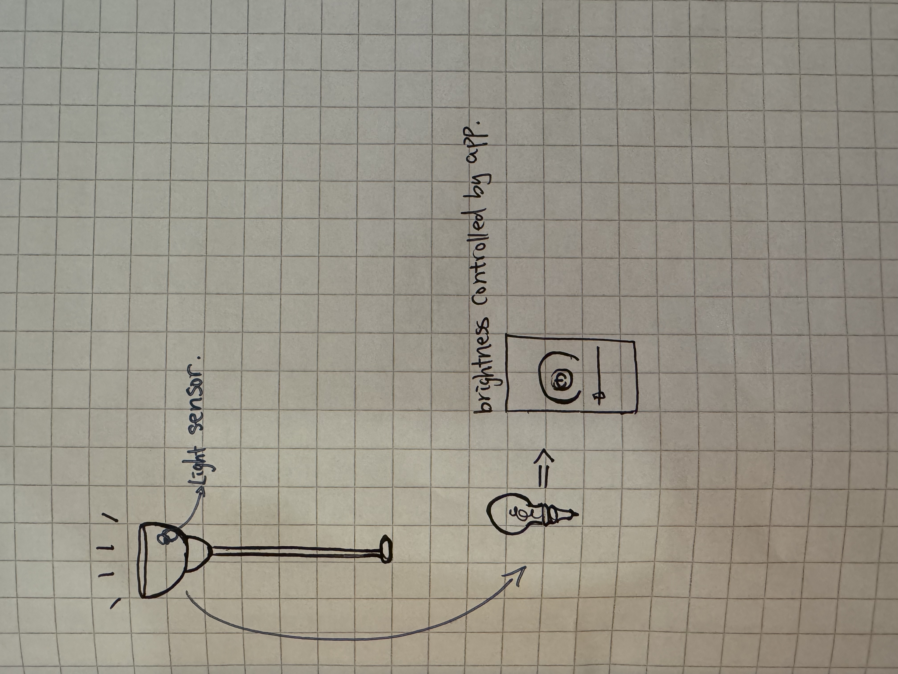
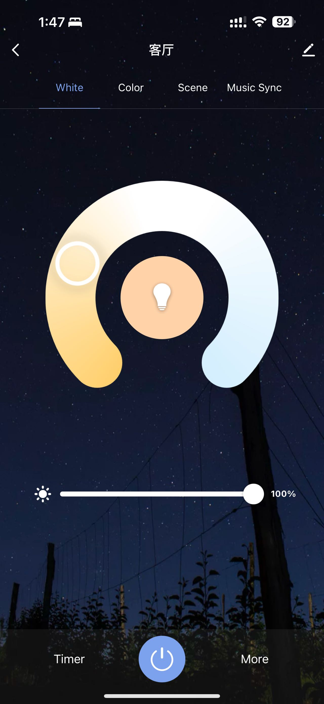

**1. Find an interesting existing Alt+Ctrl Interface**

**Hiyah!:** https://www.demiliu.com/hiyah

HIYAH! is a unique fighting game that combines physical interaction with fast-paced action, putting players in the role of a kung fu master armed with a stick to battle waves of enemies. 

Using a custom controller—a stick and a sandbag with four tinfoil weak points—players must strike the sandbag's corresponding points to reduce enemy health while avoiding counterattacks.

The game challenges players to time their attacks precisely, with dynamic enemy mechanics, a combo scoring system, and health recovery tied to performance. Visual feedback like blood-covered screen corners signals diminishing health, and the game ends when health runs out. After each session, players can view their score, the number of enemies defeated, and the highest score, encouraging repeated attempts to master their skills and set new records.

HIYAH! delivers an immersive and replayable experience that blends strategy, precision, and physical activity.

**Tool Used:** 

Makey Makey + Physical Controller

I personally really enjoy this kind of simple yet fun mechanic. Makey Makey is a controller that can only detect simple inputs, but as a designer, you can still create a lot of interesting variations within these limitations. In fact, based on my own experience with Makey Makey, it is precisely the simplicity of its input method that pushes designers to innovate in both physical controller design and game mechanics.

If I remember correctly, this physical controller was made entirely from discarded materials, with conductive tinfoil used for the contact points connected to Makey Makey. It’s precisely these very simple materials, combined with an interesting mechanic, that make this game incredibly fun and successful in my opinion.

**2. Come up with a concept for your own Alt+Ctrl Interface**

Just want to explore some potential ideas with the light sensor. 

The light sensor can detect the brightness of light and convert it into a numerical value that is sent back to the Arduino. Therefore, we can easily use the brightness of the light source to control the input value, serving as a game mechanic and functioning as a controller.

Therefore, when thinking about the mechanics, I am considering how to leverage the unique characteristics of the light sensor to enhance the immersive nature of the game, providing players with a more engaging, fun, and realistic experience.

It's just a rough idea with the controller part. 

When talking about controling the light, it reminds me of my smart light bulb that is controlled by phone app. 

And the app page looks like this 

Concept wise, I am contemplating how the alternating brightness and dimness of lights within a space can fundamentally impact the player's experience.

Consider if the imput of a horror game is controlled by real world light.

For example, in a game, the player is set in their own room, surrounded by ghosts and monsters. To escape, the player needs to search for clues (turning on light sources), but the light sources will attract ghost attacks. To avoid being noticed by the ghosts, the player must dim the lights. For a more immersive experience, sound input could also be detected, requiring the player to stay quiet to evade ghost attacks.

I think in this way, player can be placed in a immersive invironment, and with some reality hacking mechanism, they can have a much better player experience.
