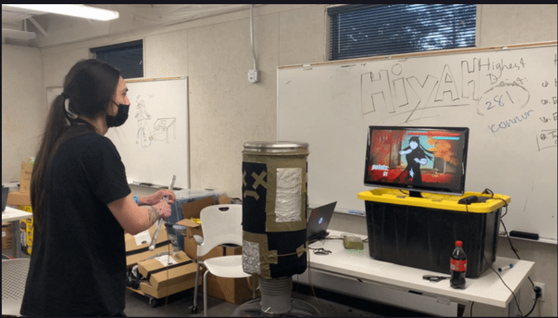
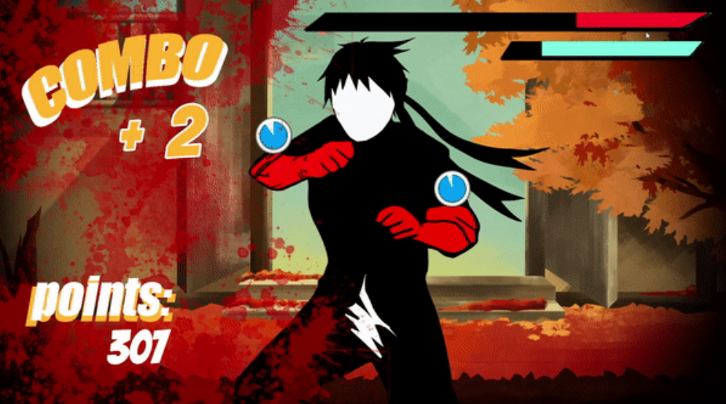
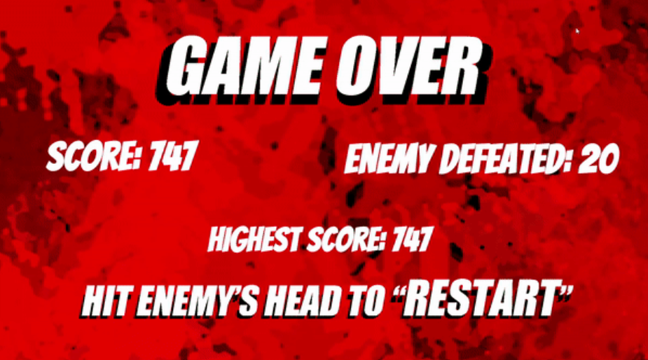

**1. Find an interesting existing Alt+Ctrl Interface**

**Hiyah!:** https://www.demiliu.com/hiyah

HIYAH! is a unique fighting game that combines physical interaction with fast-paced action, putting players in the role of a kung fu master armed with a stick to battle waves of enemies. 

Using a custom controller—a stick and a sandbag with four tinfoil weak points—players must strike the sandbag's corresponding points to reduce enemy health while avoiding counterattacks.

The game challenges players to time their attacks precisely, with dynamic enemy mechanics, a combo scoring system, and health recovery tied to performance. Visual feedback like blood-covered screen corners signals diminishing health, and the game ends when health runs out. After each session, players can view their score, the number of enemies defeated, and the highest score, encouraging repeated attempts to master their skills and set new records.

HIYAH! delivers an immersive and replayable experience that blends strategy, precision, and physical activity.

**Tool Used:** 

Makey Makey + Physical Controller

I personally really enjoy this kind of simple yet fun mechanic. Makey Makey is a controller that can only detect simple inputs, but as a designer, you can still create a lot of interesting variations within these limitations. In fact, based on my own experience with Makey Makey, it is precisely the simplicity of its input method that pushes designers to innovate in both physical controller design and game mechanics.

If I remember correctly, this physical controller was made entirely from discarded materials, with conductive tinfoil used for the contact points connected to Makey Makey. It’s precisely these very simple materials, combined with an interesting mechanic, that make this game incredibly fun and successful in my opinion.
