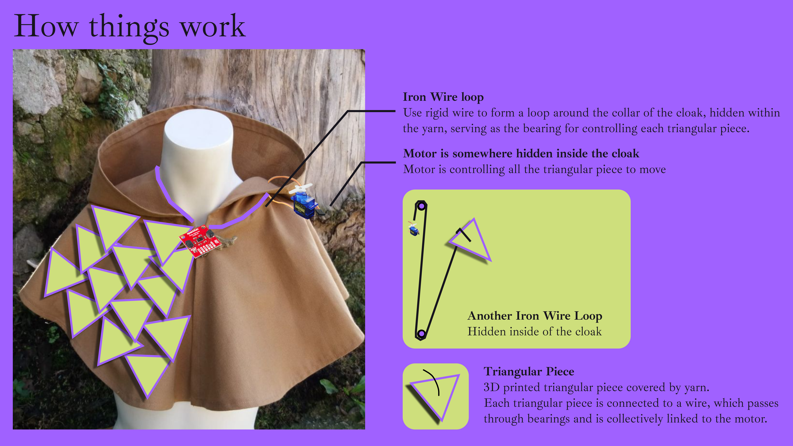

Create a project proposal for your final project. Think of this as a constantly evolving document where you take notes on your final project ideas. This deadline is for the first version of this.

Some short thoughts on what you would like to explore and work with conceptually and technically. What is it that you want to make? How does it look like? What does it do?

Some references (artworks/projects that are similar to what you would like to do)

Initial list of parts and components you think you will need

**Proposal** 

**Concept + Brainstorm #1**

**Inspiration**

**How Things Work**

**Concept + Brainstorm #2**

**Inspiration**

**How things work**

