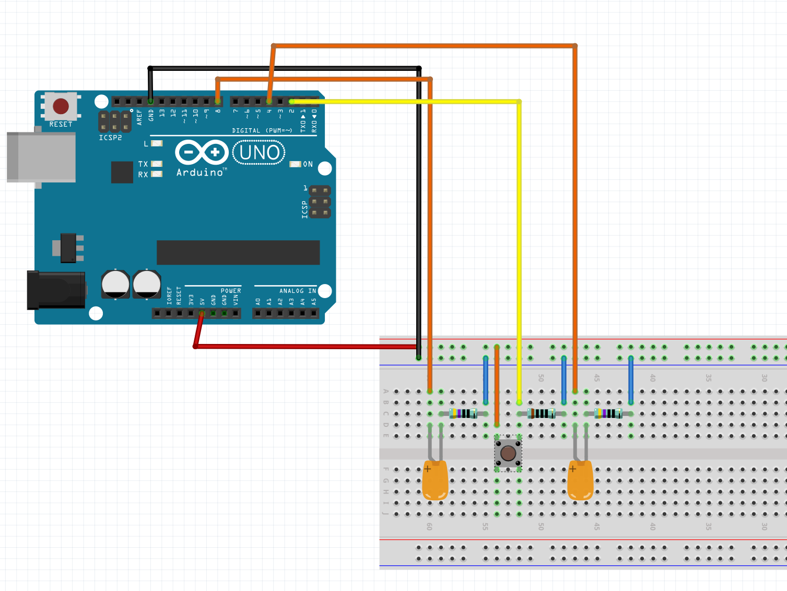
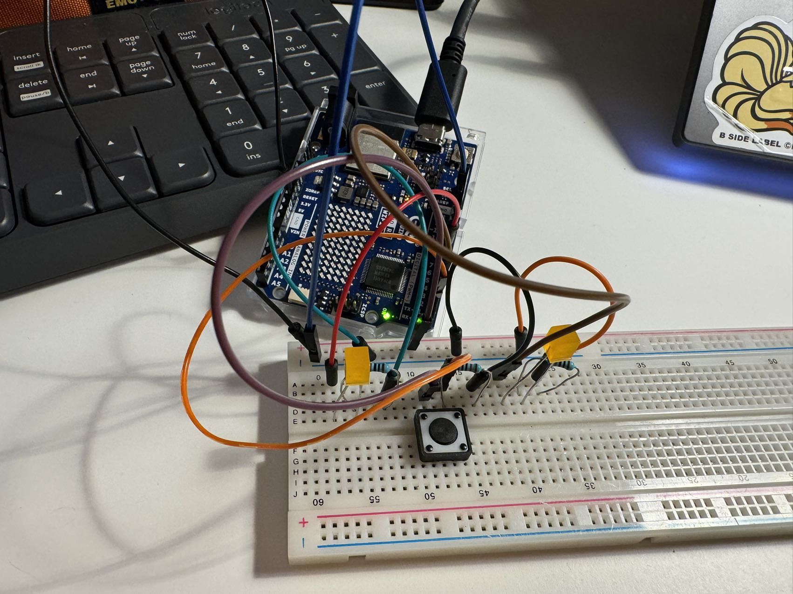

**First Arduino Work
INSTRUCTION**
Create a circuit and Arduino code that does the following

**Circuit #**
Connect two LEDs to your Arduino using a breadboard
Connect one switch to your Arduino using a breadboard
**Code #**
Read a momentary switch being pressed
When the program starts, both LEDs are off
When the switch is pressed once, the first LED turns on
When the switch is pressed the second time, the second LED turns on (the first one should also still be on)
When the switch is pressed the third time, both LEDs turn off
Repeat this same cycle of LEDs turning on and off in sequence (off, one LED, two LEDs, off…)

Circuit



Connecting the second LED is not hard, basically I just copied how LED 1 is connected. 

Firse LED - Connected to Port 4

Second LED - Connected to Port 8



And it works. 

I tested it out by activating both LED when I pressed the button. All are connected. 

(Except the first time I put the wrong port on code and confused about why it isn't work)


**CODE PART**

**First Attempt**

The logic to control the LEDs turn on and off looks like this 

```
if(btnVal == 1){

    //turn on first LED 
    digitalWrite(4, HIGH); 
    LED_4 = true; 
    
  }
  else if(btnVal == 1 && LED_4 == true){
    //turn on the sesond LEd
    digitalWrite(8, HIGH); 
    LED_8 = true; 

  }
  else if (btnVal == 1 && LED_4 == true && LED_8 == true){
    digitalWrite(4, LOW); 
    digitalWrite(8, LOW); 
    LED_4 = false; 
    LED_8 = false; 
  }
```

It doesn't work. 

Only the LED_4 will light up and then nothing will change after this. 

And then, I figured that under this condition, only the code under the first if statement will run. Once the condition is fulltilled, the rest of the code will be ignored.
