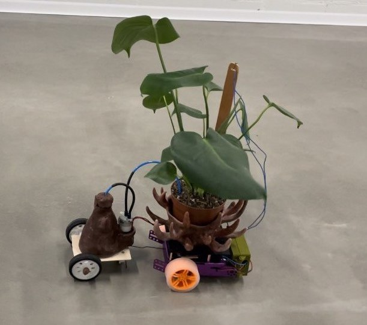
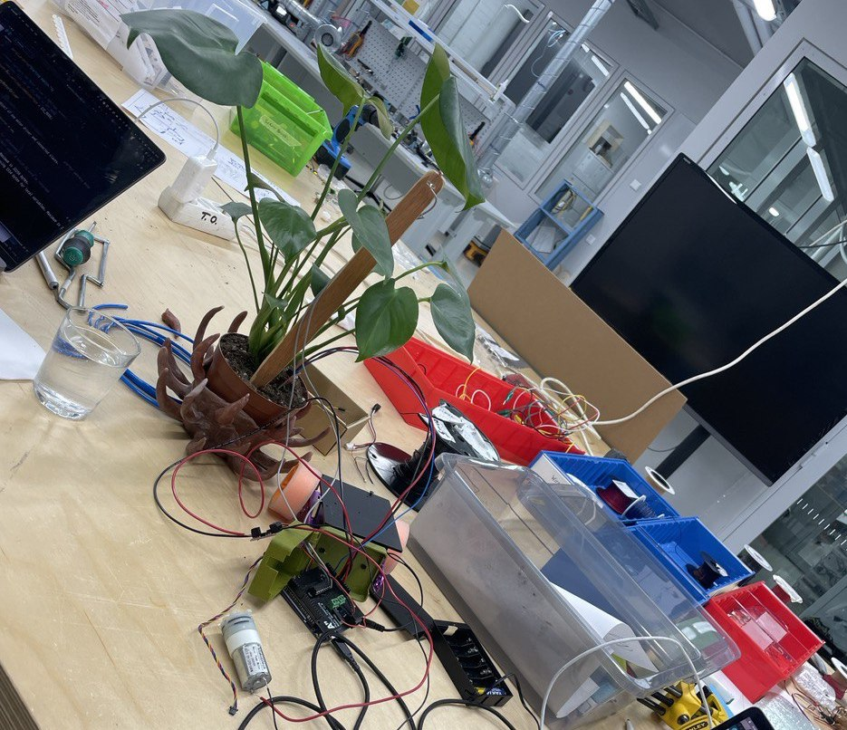
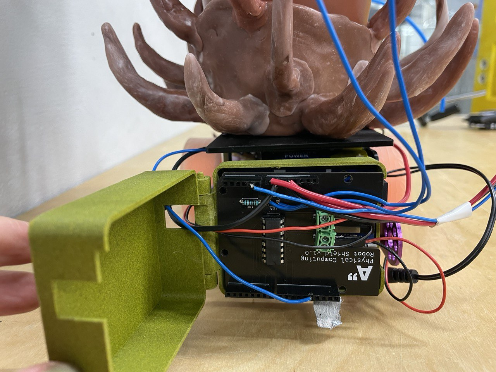
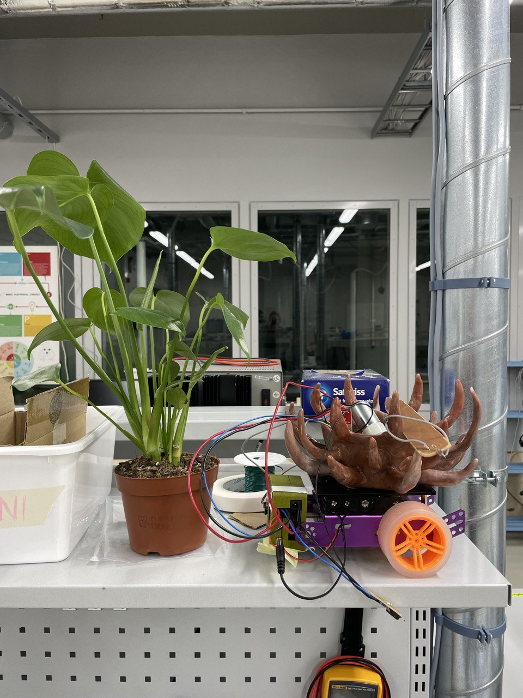
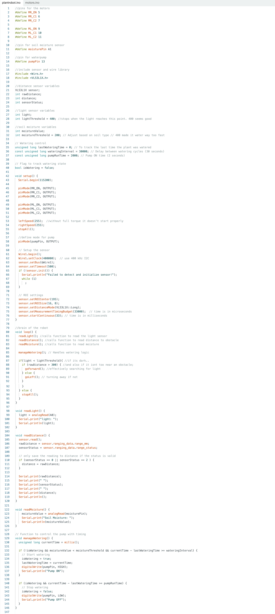

The Plantbot aims to challenge our understanding of agency and care. Designed to seek light, water itself, and navigate its surroundings; it takes charge of its own well-being, free from human intervention. In doing so, it subverts the expectation that plants exist solely for observation or decoration—passive objects to be discarded when they no longer meet our standards of health or beauty. This project is not merely about function; it’s a statement about autonomy, self-defense, and consent. It asks us to rethink our relationship with the living beings we nurture and the boundaries we impose upon them. At its heart, the Plantbot also serves as a metaphor for how we treat each other—how we touch, care for, and tether one another without always considering autonomy or agency. At its core, the PlantBot reimagines the balance between care and control, encouraging reflection on how we value and respect autonomy in all living things.

## Build

The robot is built on a **Purple Aluminum Chassis** from Adafruit ([Product Link](https://www.adafruit.com/product/3796)). It uses two **TT motors** paired with wheels for propulsion and a **caster wheel** at the back for smoother turning.

The chassis is equipped with the following components:

* Arduino Case: Positioned at the front, the case houses the Arduino microcontroller, which manages the robot's functionality.
* Distance Sensor: Mounted at the front of the Arduino case, this sensor detects obstacles in the robot's path to ensure smooth navigation.
* Watering System:

  * A water pump is installed on top of the chassis.
  * A custom-made plastic water reservoir, attached to the back of the chassis with thin wooden supports, is plumbed with plastic tubing.
  * The watering tube leads directly to the soil in the plant pot, where a SparkFun soil moisture sensor monitors moisture levels.

The plant, a Monstera Deliciosa, is secured on top of the chassis in a decorative plastic pot with spikes to prevent it from shifting. To monitor light levels, a light sensor is mounted on a tall wooden stick that extends above the plant.

The robot is carefully put together in a way that lets you aces the different parts and take it apart. I knew that the plant itself, although securely fastened to the chassis for safe driving, also needed to be detachable both for testing and plant check-ups. so the plant fits loosely in the polypot, which again is attached to the chassis with removable double-sided tape.

## How it works

When the light that hits the lightsensor above the plant measures below a value of 400 , the robot will drive until the light is above 400 again, sufficient for the plant. To avoid collisions while moving, the robot uses a distance sensor mounted on the front. If something is within 30 cm, it will turn away, specifically to the left, until it finds a clear path forward again. Effectively, the robot will move if it is too dark, and at the same time turn if there are obstacles in front of it, thus searching for a nice spot to stay

The robot also monitors the soil moisture level to decide when to water the plant. A moisture sensor is embedded in the soil, and if the value falls below a threshold (e.g., 200), the robot starts the watering process. The onboard water reservoir and pump deliver small amounts of water through a tube that leads directly to the soil. The robot pauses briefly between each watering, allowing the soil to absorb the moisture and the sensor to update its readings. This ensures the plant gets enough water without overwatering.

### Calibrating the sensors

A big part of making this robot behave correctly, is making sure the sensors react to to the right levels. Like sparkfun writes on their Soil Moisture Sensor webpage:

*to get any sort of useful data \[…], it is advised that you calibrate it to whatever soil you plan to monitor. Different types of soil can affect the sensor, and you may get different readings from one composition to the next.*  <https://learn.sparkfun.com/tutorials/soil-moisture-sensor-hookup-guide> 02.12.24

ie dipping the sensor in a cup of water gives readings of 800, and taking the moisture sensor out of the soil and into the air, will immediately give values for around 20, and activate the pump. This let me estimate a treshhold to 200, which I found fit very well in my soil. If exchanging the plant, this would of course have to be adjusted again.

The same goes for the light sensor. My light threshold is adjusted to the workshop’s conditions (the ceiling light gives a value of about 520. With my treshold set to 400, the hallway gives too dark readings, so the robot keeps driving there. This was helpful when test-driving). In a home or exhibition, the light threshold should be adjusted to suit the conditions there. For a plant, the optimal light level is one that allows it to perform effective photosynthesis - and should thus be what guides the light treshhold.

## The code

The code builds on the base we developed in class, where motor functions were already tied to the distance sensor for obstacle detection. I adapted this existing functionality by reversing the logic to search for light instead of darkness, which better suits the needs of a plant seeking an optimal environment for photosynthesis - this is after all a key need for an independent plant. Then I integrated the soil moisture and water pump system with the robot's movement logic.

The soil moisture and water pump functionality begins by using the SparkFun moisture sensor to measure the soil's moisture level. This value is read as an analog input and compared against a preset threshold that determines when the soil is considered “dry.” I found a good threshold to be 200. If the moisture value falls below this threshold, the code activates the water pump by setting its control pin to HIGH.

To prevent overwatering, I introduced a delay after each watering session, giving the soil time to absorb the water before the sensor takes another reading. The water pump only delivers short bursts of water during each activation. This is handled in the pump control function, which ensures the pump is switched OFF immediately after the burst is delivered, avoiding waste or oversaturation.

The soil moisture system is fully integrated into the main loop. It runs alongside the robot’s movement logic, meaning the robot can continuously monitor light and obstacles while checking and adjusting the soil moisture as needed. By structuring the moisture-checking and watering routines in a non-blocking manner, the robot can perform multiple tasks simultaneously without interruption.

the motors.ino is unchanged from the course, it tells the two motors when to turn on. It can be found on the [course page.](https://learn.newmedia.dog/courses/physical-computing/week-03/lesson-02/)

## Reflection

I faced challenges in many different areas of this project, including code, hardware wiring and aesthetic frustrations. Working with the polythermic morph plastic was completely new, and although exciting it was also time consuming and meticulous. I’m very happy with the “messy-on-purpose” creepy and organic result, so it was worth the struggle.

Through the duration of the project I had some issues with the Arduino's port not showing up and  connection not working. Restarting the software or checking cables, was a recurring frustration. I never figured out what the problem was, but I found a way around it and made it work in the end

issues with one motor moving in the wrong direction and the robot turning harshly. This highlighted the challenge of understanding and fine-tuning motor behaviour, particularly how PWM signals and directions interact with the physical build. I had at the start of the project lowered the left and right speed to 100, for “safe plant travel” this worked well in the early stages, as my robot was driving softly and slowly around. I wanted it to have a calmer feeling. But as I added more hardware, the water reservoir, wires and the extra cart, it became too bulky and heavy to operate on that speed. It took a lot (a lot!) of test drives and trials to find a way for the robot to move properly. I wouldn’t start without a little help when it was this heavy. I also kept the plant fairly dry, so it wouldn't be too heavy. This is a sad and ironic compromise, taking it out on the plants health to make the self-sufficient Plantbot work. In the end I figured it was better to just up the speed so it can get going. I ended up liking the result even better, it shoots off abruptly and unpredictably, giving the bot a feeling of free will and personality. Someone also commented that it was a little scary, which is perfect I think.

Writing the moisture sensor and pump control code presented a significant learning curve for me, as there was some new material and considerations to account for. Ensuring it worked without interfering with existing functionality (like movement and light tracking) required careful adjustments. It took some experimentation to find the right balance for soil moisture thresholds, watering delays, and pump timing. This process of trial and error, combined with coding refinements, was critical but challenging.

### Future work and improvements

In the future, I’d like to focus on a few key improvements to refine both the functionality and personality of the robot. First, better turning and manoeuvring would make its movements smoother and more precise. A lot of this can be refined in the code, and I would like to tidy it up and make it more advanced. But I also believe a lot can be done with the physical build to make the movement better. Reducing the weight would allow me to adjust the speed more freely, tailoring it to different conditions.

I’m imagining an “idle-state” feature, where the robot could play music for itself when it’s been stationary for a while, signalling contentment as it basks in the sunlight. Adding a sound output could be helpful for a lot of different “communication” for the robot, both when it’s content and not. This would have to be a careful consideration for me, since I’m mindful about how anthropomorphic I want this creature to be. Adding LEDs to signal when it’s dry or in a “do-not-approach” mode could enhance its communication abilities without sound. Finally, I’d love to explore a way to toggle the robot on and off via a Mac, rather than relying on disconnecting the battery. While I wouldn’t want extensive remote control (it would take away from the robot’s autonomy), simple on-off functionality would make managing the robot more practical without compromising its independence.

The most important feature to improve for me would be a self-defence mechanism. This is because my goal and focus of this project initially was to explore consent, justified aggression and self preservation. A way to “scare off” perceived threats would aid this vision well, and it could be done in several different manners. I have gotten a lot of interesting suggestions and ideas through the project runtime, and it is still up in the air how I would do it. With an extra distance sensor mounted next to the light sensor, the bot could sense when someone came near  the top of the plant. This information could trigger an counter-action, for example a weapons-yield. With an additional motor, the plant could swing a sword, or more fitting maybe use a motor-driven pulley system to press the trigger of a water gun, fed by the same reservoir as the soil. This would require another water pump, and again make the whole contraption heavier. Some simpler methods could be sound output, like a scream or hiss, or simply running away; putting the wheels in reverse when someone approaches the second distance sensor. The options are many, and there’s still many possibilities I’d like to explore for my plant robot.
