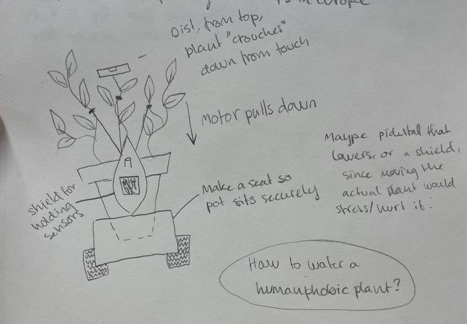
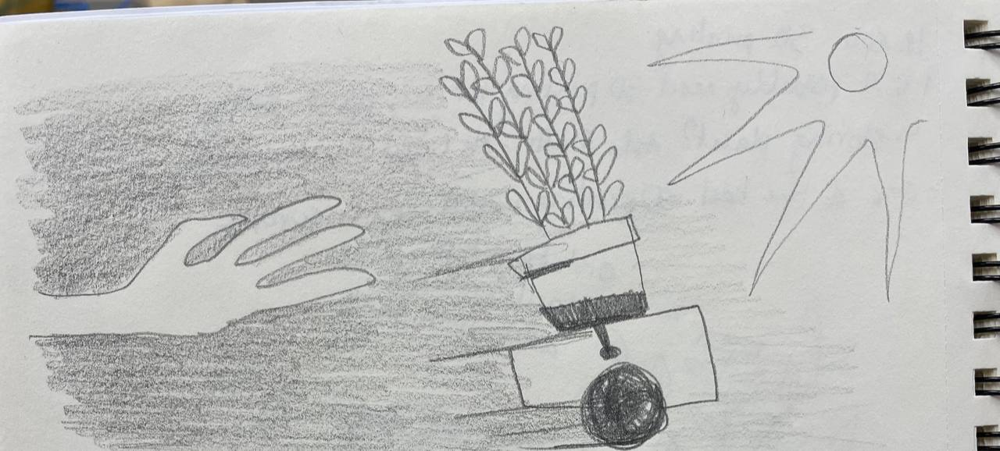
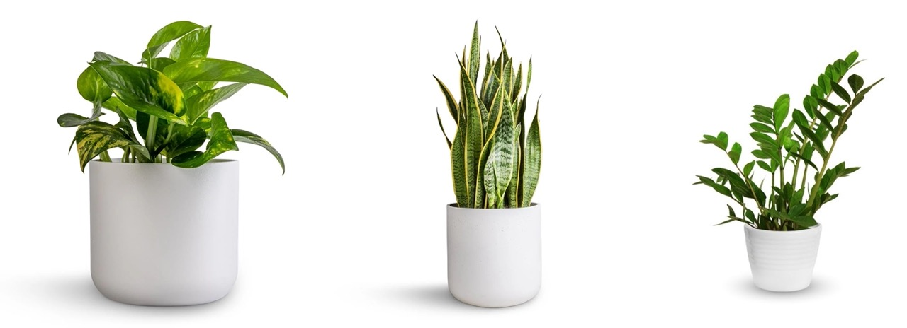
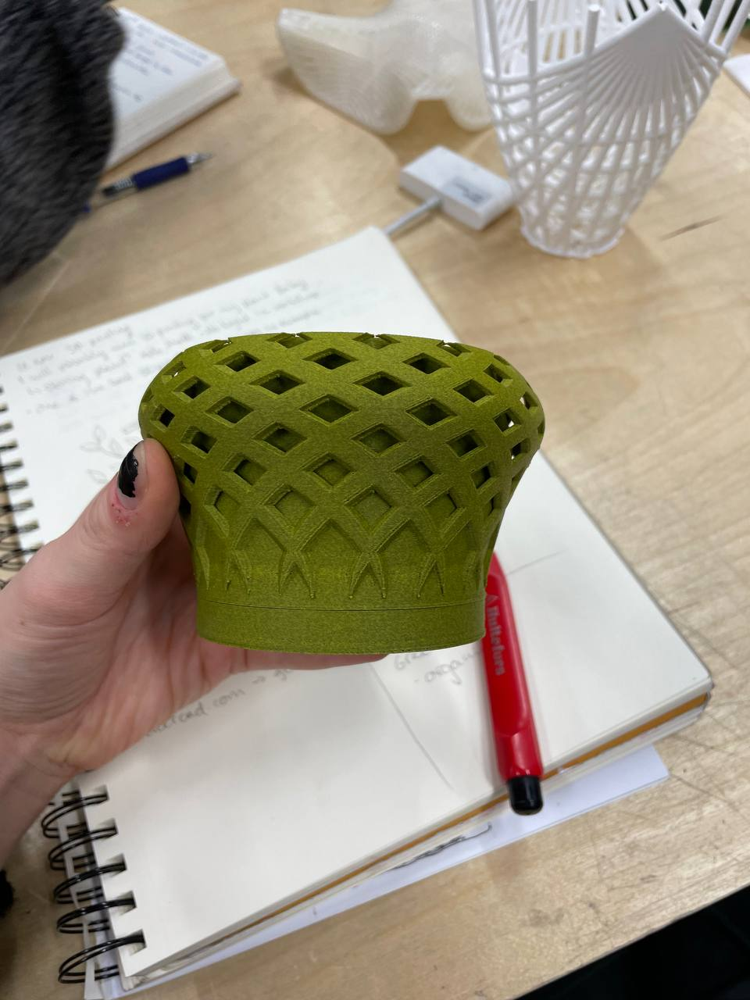

# My final project idea

**see w03 for more thoughts on what my project is about**

Verbalising my idea for the rest of the class was really helpful. I got feedback and some great suggestions to make the project more interesting and do-able. I also got to refine and consider which themes are important to me in this creation - namely hostility and defence, consent and independence. I will help emancipate this plant!Remaining friends with the plant is actually not so important to me, I care more about the plant’s ability to fend for itself.

### Problems to solve

* moving the plant itself with motors will stress and dammage the plant, against my intentions
* how do you water a humanphobic plant?

these issues lead to self destructive behaviours, which in a way are also a testament to how independent free beings are also free to hurt themselves. and that maybe a plant was never meant to be this free. a lil Frankenstein moment. But again, that isnt really the point I want to make. So I got some good suggestions to solve these issues.

### some interesting suggestions to consider

* Cat personality: the plant will come to you when hungry, but run from you when not. (humidity sensor will check if the soil is moist or not)

  Attack or feed: the plant has a spray bottle. it will use it on itself if it is thirsty, but use it on approaching humans if not. this could work in one of two ways:

  * Spraying itself on intervals, UNTIL someone closes a distance, then it will turn the bottle and spritz you
  * Checking if the soil is moist, if it is, the spray bottle is turned towards the world, if not, it is turned to the plant. closing the distance will trigger a spritz in either direction
  * alternative self defences: the plant could hiss or make noise instead of move, to show its displeasure.
  * self-soothing music: the plant could play itself music (Plantasia, made to be soothing for plants) when it has been inactive for a while. So it drives itself to a sunny, calm spot; rests and plays some music.
* Moving a pedestal, instead of moving the plant. I thought of an idea where the pedestal the plant sits on, would lower down and cover the plant if a hand came too near. Someone else suggested having a series of small plants on smaller pedestals, that again would move out of the way if touch is nearing. Although a good and interesting idea, I feel it would get too complicated for me

### Plant considerations

I need to find a suitable plant. I was thinking a pothos, it is a symbol of a basic house plant, it is resilient and cheap. others to consider are snake plants or zebra plants - also very resilient, but not really pliable. which is fine if I’m not going to move the plant itself. A small monstera would also be nice, it would give some more height.

Another thing is where to store the plant. there is no natural light in the workshop and it would be sad to leave the baby here. I need a spot that is bright and warm, where I can check up on it but no one else will take or damage it. Maybe the New Media headquarters?

I was worried some of the 3D printing materials wouldn't be safe for a plant, but got confirmed that normal PLA and rockfill would be fine. The green rockfill would also look very nice as an organic natural-looking material I think

## next steps

I need to make some decisions about what to actually go for, but i kjent stil, I will leave as many decisions as I can till the last minute so as to not close any doors for myself. I will make the choices impose themselves on me. What I do know, is that I want to fit a plant to system of sorts with wheels, similar to Bjørghild the robot.

* design a “cart”. Dubbing it plant cart from now on. This can be basically the robot-frame we already made
* 3D print a seat for the pot to fit snugly in in the cart, and make sure it can be skrewed onto the robot
* design a sensor holder. the distance sensor should be a tall stick on top of the plant, the light sensor too (it should ideally be where the main portion of the plant is)
* deciding on the actual behaviour of the plant
