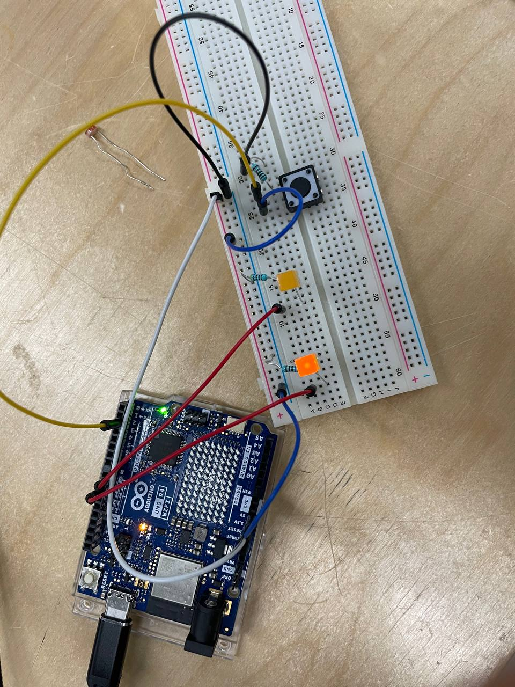
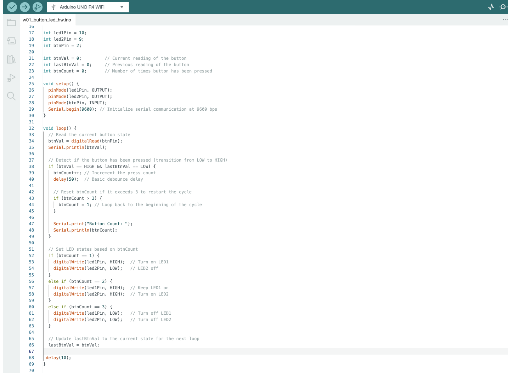

# hw w01

## The assignment:

Create a circuit and Arduino code that does the following:

\    Connect two LEDs to your Arduino using a breadboard

\    Connect one switch to your Arduino using a breadboard

write code that allows the following:

   Read a momentary switch being pressed

\    When the program starts, both LEDs are off

\    When the switch is pressed once, the first LED turns on

\    When the switch is pressed the second time, the second LED turns on (the first one should also still be on)

\    When the switch is pressed the third time, both LEDs turn off

\    Repeat this same cycle of LEDs turning on and off in sequence (off, one LED, two LEDs, off…)

## My process:

I started the assignment by copying the code from class where we made for turning a led on and off with a button . I figured it would be simple enough to just add another led to that same circuit.

So from there I was happy to leave my arduino behind, and write the code seperately and at home. This was not an amazing idea, as I could't check realtime if it actually worked. I figured I would do this with if-statements and counting the number of times you press a button. So if it was button press nr 1, light one led, button press nr 2, light both leds etc. 

I thought in theory this should work. I figured I would have to make some adjustments, but none I couldn't figure out. Which was true, to some degree, but I underestimated how difficult the circuiting itself would be. its not self evident to me. yet. fingers crossed it will just passively manifest in my brain slowly throughout the course, which wire goes where

I looked at the circuit board images from last week and got some help from Matti, with a working board I could see that my code wasnt quite functional. I figured my if-checks werent accurate enough, resulting in leds that seemed to react randomly. 

again with some pointers from Matti and looking at the course material, I added a variable for the last button state, so I could check that the button is off before it turns on. previously it would just keep passing the checks, messing up the output. I made a if-check just to check if i should increment the button-counter. Now the button counter only increments if the button is pressed once and wasnt already on. and the if-statements execute properly

