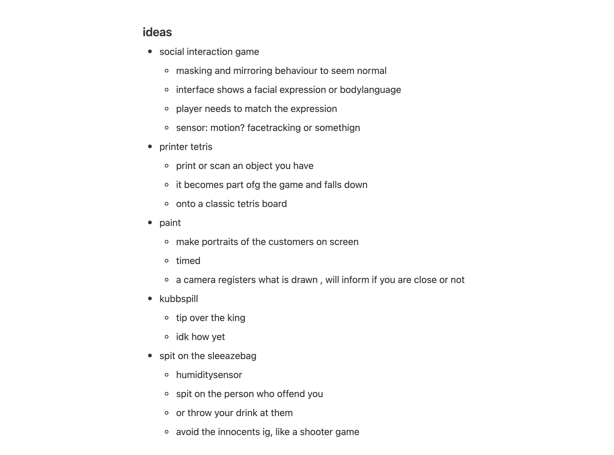

# Alt+Ctrl games

## some alt+ctrl game notes

I initially had a lot of ideas and inspirations after the first lecture, before I knew much about the limitations and actual possibilities with the sensors. I like the idea of playing with fitting in in society, or the societal repercussions of not fitting in. Either trying to "mask" to be normal, or punishing someone for not behaving (ie throwing a drink in someone's face).

I haven't explored further how this could actually be done, in terms of sensors and arduino-limitations.

## Project ideas

I wanted to explore the act of self-defence, in combination with guilt.

One idea, that i have kind of moved away from, is an inviting artefact, like a teddy bear, that retaliates to touch or someone approaching, signalling that it does not want the attention. The artefact that could provoke a feeling of guilt by reacting in a unexpected way to an action the viewer might see as innocent, making them reconsider consent and how they impose themselves on the world around them. I was thinking it could bite (I realise I can't actually make a killer robot that hurts people), or snarl (making sound) or move away. After the presentations earlier this week I realised how similar my idea is to the snake in a cage idea, where the snake "attacks" the audience's fingers.

Maybe integrated, or entirely separate, is that I really want to work with live plants somehow. I am really interested in making a "exoskeleton" for plants. I don't know if something similar has been done before, but I have seen a student project that made an automatic shade controller for a plant, I guess it would be in the same street. I would like to help the plant in some way, either in equipping it with self defence-mechanisms, like thorns, or having it move towards light.

For aggression, I imagine using a motor to push the object backwards so a range of spikes are revealed, or something like a sword is pushed up. This would be pretty bleak and sad as an interaction, and wouldn't be very integrated in something like a plant, so something more realistic and interesting could be to have the exoskeleton help different parts of the plant move, in response to human touch (or a manipulated interaction, if this proves difficult)  detected by a distance sensor.
