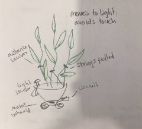

### Project thoughts so far

I wanted to work with plants some way, and give them some freedom or will of their own. I think the idea of a plant-exoskeleton is really cool, and now we already have a lot of code and tools that would be really helpful for a plant

1. it can move, one of the saddest andor most defining feature of plant life is being rooted in one place. what if we changed that?
2. it can search for light. Effectively feeding itself

Building on notions of self defense and aggression, themes I've also been interested in exploring, I am thinking of combining it with my plant interest. What if the plant can avoid predators/unwanted touch?

\- this can be achieved with distance sensors and motors. I imagine that if a treshhold is reached, a motor will control a string that is attatched to the plant, "yanking" it away.

Another way to go with this could be more active, giving the plant thorns that will emerge when the treshhold is reached.

