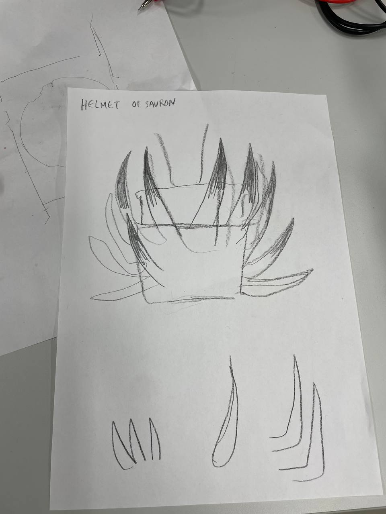

# An update on the work done in week 5

## 19.11

Things done:

* fusion crash course
* start on making 3d model
* test out thermoplast
* redirection plan

Instead of 3d printing a cover and plant-to-bot attatchment solution, I will mold it by hand with thermoplastic polymorphbeads - something i think will be more time effective for me as a 3d model and print n00b, and also look better with organic, and creepy shapes. I'm excited to work hands on with a new material!

<https://www.adafruit.com/product/3796>

21.11

Things done:

* bring ceramics pot to class
* mold a basic plant holder pot from thermoplastic

The ceramics pot is too small for the plant, and too heavy for the robot, so it cannot be used in the project, but I figured it could be of help with molding my own pot. It was.

Working with the polymorph beads was really challenging, but I eventually got the hang of it, and ended up loving the result. It looks like ceramics, but is way lighter. It has like a muddy look, which I like. The most challenging and important part was making the pot so the plant sits snugly inside. which it now actually does, despite looking like a droopy mess.

## 22.11

pot making day! I got assistance from media and perfomance artist friend Ania. We made the pot cooler with spikes, and I am very pleased with the final result.

saving attaching the pot to the shield for later, when wiring is done

some cool pics from potterymaking time:

