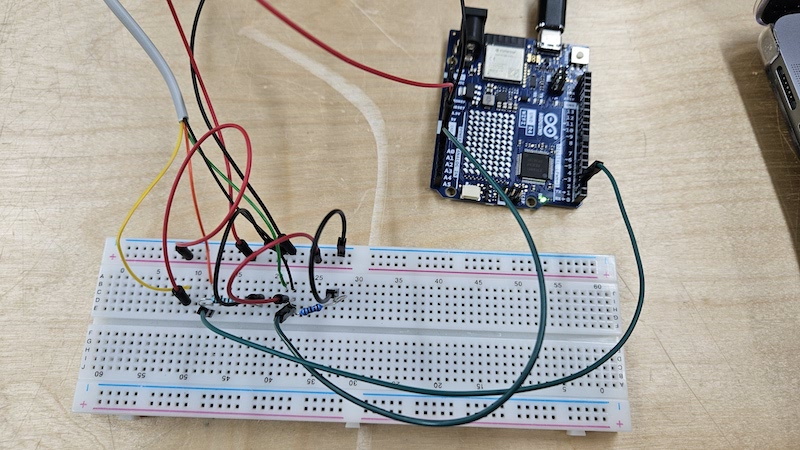
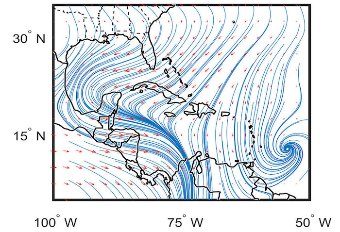

# Introduction


Winds around us are constantly moving and changing. Even though they are invisible, they are often felt by us or visualized by objects shaken by them. I want to capture the wind speed and direction data over a course of a few days or weeks in a very local destination: Aalto University art building (either Marsio or Varë). Using the collected wind data, I will make a series of shapes that mimic typography. 


**Recording option:** I would clamp a wind meter, connected to an arduino and a battery pack, somewhere on the balcony of the Marsio building. Over several days, the arduino will record and store the wind data via [Adafruit IO](https://io.adafruit.com/) API. Afterwards, I will clean up and organize the resulting data and visualize them into a series of typographic shapes. The shapes will then be converted into a printed matter or an animated illustration on a screen.

**Real-time option:** Alternatively or additionally, I can set up a real-time visualization of wind data that is currently being recorded. For this, the arduino connected to the wind meter can send the current wind data over WiFi to a p5.js application running on a computer inside Marsio. On p5.js, each wind will be visualized as a stroke of a calligraphic writing on a screen or a projector. The previous strokes will disappear after a few seconds.

# Testing & Challenges



*Successfully connected the wind meter to my arduino!*

<br/>


*The wind is too weak today! (Thanks Sasha for helping)*

<br/>

After testing the wind meter outside, I realized I cannot assume the wind data to be very versatile and dynamic at all times. For example, the wind direction and wind speed would remain the same over 10 minutes or more on a non-windy day. Because of this, it might be useful to collect wind on a balcony (usually higher places have more wind) over multiple hours or days. Lastly, I also realized that I should put the arduino in a waterproof case as it was raining that day.

# Example Data
I would get a series of times, speeds, and directions from wind meter into my Adafruit IO feed, and then I would convert the data into an array of json objects.
```
[
   {
    Time: ‘Nov 12 13:30:00’,
    Speed: 3.6,
    Direction: 127
   },
   {
    Time: ‘Nov 12 13:31:00’,
    Speed: 3.4,
    Direction: 129’
   },
   {
    Time: ‘Nov 12 13:32:00’,
    Speed: 3.6,
    Direction: 117’
   },
   ...
]
```

# List of parts and components

* Wind meter (speed and direction detector)  
* Arduino, Breadboard, Wires  
* Waterproof box (to protect arduino from the wind)  
* Battery pack (to power the arduino outdoors)  
* Clamp (to clamp the wind meter on a ramp outdoors)  
* Computer (for p5.js)
* Printer (for printing results)
* (Optional for real-time option) Projector or Screen

# Considerations

* Need to install a wind meter that can stay on a balcony of Aalto arts building over several days. Matti is helping with this.  
* Who knows, maybe the collected wind data will look completely different from what I expected. But the advantage to storing the data over days is that I can then decide how to visualize, sonify, or perform the data. So how my artistic interpretation of the data will look is open to change! 

# References

Here are some things that inspired me for this project. 



<br/>

*Traditional visualization of wind direction and speed. Image provided by CIGEFI*

<br/>


*A traditional Chinese calligraphy*

<br/>


*Example of Japanese and Korean writing*

<br/>


*Iterations of spaceship formation in response to users’ presses, by Hind al Saad*\
*<https://hindgalsaad.com/Iteration>*

<br/>


*February 2012, 2013. Set of 29 digital prints, 3 x  4 in. each. Edition of 30. 29 illustrations related to weather data for each day in February. <https://spweatherstation.net/>*

[](https://spweatherstation.net/)<br/>


*Dance Weather, 2009. 14 x 10.5 in., inkjet print. Translation of wind speed/direction data into dance steps. <https://www.janemarsching.com/>* 

<br/>

# Other helpful links

p5.js and Arduino serial communication - Send a digital sensor to a p5.js sketch\
[https://www.youtube.com/watch?v=feL_-clJQMs&t=1073s](https://www.youtube.com/watch?v=feL_-clJQMs&t=1073s) 

p5.js reference: map\
<https://p5js.org/reference/p5/map/>

Adafruit IO\
<https://io.adafruit.com/>
