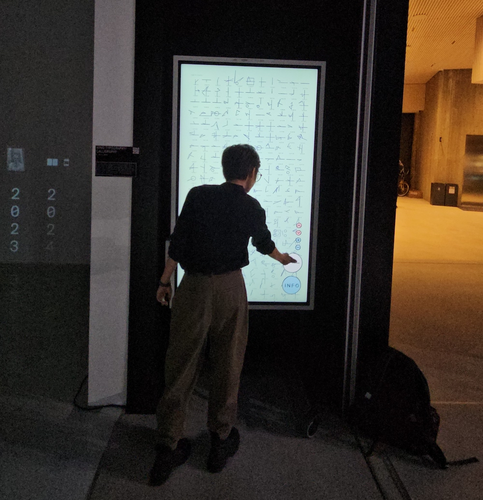

# Description

If wind could write, what would its words look like? 

Wind Typography is a visualization of wind data based on imagined typographic rules. The speeds and directions of winds were collected from Aalto campus, on the balconies of Marsio building (15 to 16 November) and Väre building (6 to 7 December). The data was then converted into typographic shapes using codes inspired by my first written language, Hangul (한글) -- the writing system of Korea. The resulting designs are illegible yet mimic text, evoking a sense of hidden meaning.

### Codes/Rules:

* For a wind with speed 0 kph, draw nothing.
* For a wind with speed 1 or 2 kph, draw a short and straight stroke that starts from the center of the grid.
* For a wind with speed 3 kph, draw a long and straight stroke that is centered on the grid.
* For a wind with speed that is even-numbered and bigger than 10 kph but less than 16 kph, draw a circle. If the speed is exactly 10kph, put a small circle positioned towards the angle of the wind direction. For all other circles, place the circle in the center of the grid and make its size dependent on its speed.
* For a wind with speed 18 kph or 20 kph, draw a rectangle. Rectangle is always positioned in the middle and its size reflects the speed.
* For all other winds, draw a stroke that starts from the previous ending point (if it is the first stroke of its unit, start from the center of the grid). The stroke’s length reflects the wind speed while the angle reflects the wind direction.
* Combine 5 different winds to create one unit. This is similar to how Hangul works, where 5 separate letters (represented by lines, circles, squares, etc.) combine into a single syllabic unit. Those syllabic units are then combined into words.

# Reflection

Before working on this project, I had no experience with physical computing and very little experience using p5.js. After the project, I feel like I have learned a lot in both realms. 

<b>On creative coding using p5.js:</b> My experience with p5.js was very shallow before this semester. I had worked on a couple small p5.js projects, but for those I refrained from drawing anything on p5.js to save time; instead, I depended heavily on image files (PNG) to create my results. This time, I decided to challenge myself and create every shape (and even some text) as vectors using p5.js code. It was confusing to learn at first but definitely worth it as this approach gave me more control over the shapes. I also learned many of the p5.js built-in functions (draw(), mouseClicked(), mouseWheel(), dist(), map(), lerp(), and more). Also, I’m proud of myself for re-learning middle school math / trigonometry to create some of the shapes.

<b> On physical computing:</b> As someone who had worked as a software engineer for several years, it was challenging and empowering to learn how to code outside of the digital realm. In the beginning of the class, I struggled with working with electronics. I often received help from my classmates while building basic circuits. However, by the time I got to my final project, I was able to prototype circuits on my own from scratch. I finally understood the concept behind it, and it felt great! Afterwards, I got to apply my knowledge onto an original project that was meaningful for me. What else can I ask for?

Overall, I had a lot of fun working on Wind Typography. It was neat to combine my different interests (creative coding, typography, data visualization, and the environment) into a single project. I also enjoyed the physical component of the project. It was at times painful (troubleshooting electronics during snow without gloves is not exactly pleasant) and frustrating (poor internet speed in the balcony exacerbated by the weather or the balcony doors often being locked). Yet, somehow the physical part of it made the whole experience more fun, real, and grounding. I have to say, I definitely felt the wind throughout the process. This project helped me realize how meaningful physicality is for me, even for works with digital outputs. I hope I get to continue computing physically.

# Equipment

* Sparkfun weather station (used the wind meter part; did not use the rainfall meter)
* Arduino NANO (because it works well with Adafruit IO)
  Wires and shield (to connect the Arduino to the meter)
* Batteries and battery pack (to power the Arduino)
* Weatherproof box (to house the arduino and batteries outdoors for multiple days)
* Cable ties and tape (to secure the weather station and weatherproof box to the balcony fences)
* Laptop (for creative coding)
* (Bonus) Screen (for exhibiting the work; in my case, I could use Aalto’s Samsung ViewFinity)

# Journey

Studied the wind meter and connecting it to arduino via breadboard setup.

Transferred the breadboard setup to a more robust shield setup.
(Soldering was really fun)

Installed the wind meter on the Marsio balcony. The battery ran out. And once the snow came the internet barely worked. Time for a new location.

Installed the wind meter on the Varë balcony. Hands frozen but the meter works.

Sent the data via Arduino to Adafruit IO where I could view and export the data as CSVs (feat. Alepa gloves)

Converted the exported data into shapes on p5.js.

Polished the codes/rules on p5.js.

 

Deployed my p5.js project and adjusted it to fit the dimensions of the exhibition monitor. Exhibited during Aalto Demo Day.
