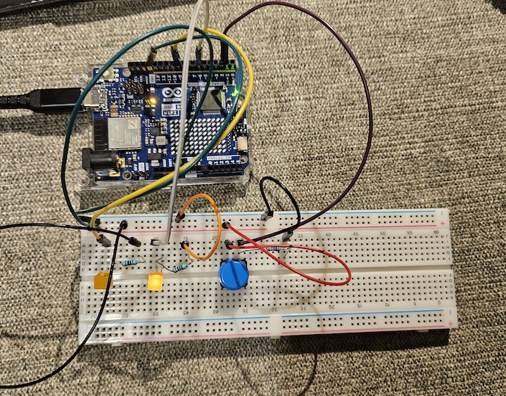

## Instructions

Circuit

* Connect two LEDs to your Arduino using a breadboard
* Connect one switch to your Arduino using a breadboard

Code 

* Read a momentary switch being pressed
* When the program starts, both LEDs are off
* When the switch is pressed once, the first LED turns on
* When the switch is pressed the second time, the second LED turns on (the first one should also still be on)
* When the switch is pressed the third time, both LEDs turn off
* Repeat this same cycle of LEDs turning on and off in sequence (off, one LED, two LEDs, off…)

___

## Circuit



This works!

___

## Code Attempt 1


```
int ledPin1 = 9;
int ledPin2 = 6;

int btnPin = 2;
int btnVal = 0;

int count = 1;
int previousCount = 0;

void setup() {
  // put your setup code here, to run once:
  pinMode(ledPin1, OUTPUT);
  pinMode(ledPin2, OUTPUT);
  pinMode(btnPin, INPUT);
  Serial.begin(9600);
}

void loop() {
  // put your main code here, to run repeatedly:
  btnVal = digitalRead(btnPin);
  // when the button is clicked
  if (btnVal == HIGH){
    // if led 1 and 2 are both off, turn on led 1
    if (btnVal == HIGH && digitalRead(ledPin1) == LOW && digitalRead(ledPin2) == LOW){
      digitalWrite(ledPin1, HIGH);
      delay(500);
    // if led 1 is on and led 2 is off, turn on led 2
    } else if (btnVal == HIGH && digitalRead(ledPin1) == HIGH && digitalRead(ledPin2) == LOW) {
      digitalWrite(ledPin2, HIGH);
      delay(500);
    } else if (btnVal == HIGH && digitalRead(ledPin1) == HIGH && digitalRead(ledPin2) == HIGH) {
      digitalWrite(ledPin1, LOW);
      digitalWrite(ledPin2, LOW);
      delay(500);
    }
  }
}
```

#### Attempt 1 Reflection

I realized that this is an ideal solution, as I'm using an arbitrary delay amount. In other words, if the user presses the button for more than 500 milliseconds, then the LED's would move to the next state.

Looking at the internet, it seems like there is a mechanism called "debouncing", but I haven't figured out how to use it yet. There is also an "input changed" tutorial that Matti posted in the new media dog website (https://learn.newmedia.dog/tutorials/arduino-and-electronics/arduino/digital-io-input-changed/), so perhaps I could incorporate that.
