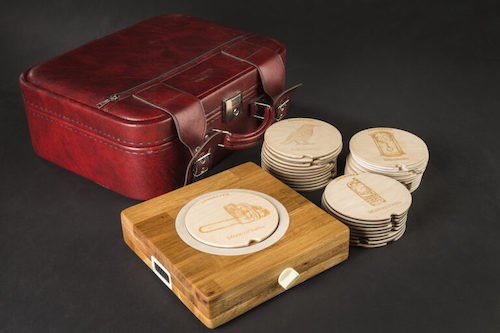
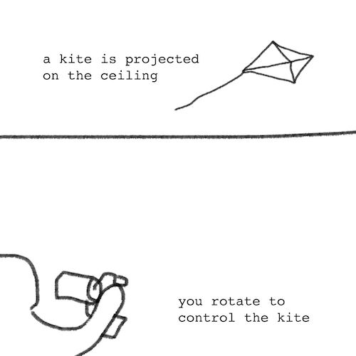

## 1. Find an interesting existing Alt+Ctrl Interface

https://shakethatbutton.com/tic-tac-toe-thing/

This is "Tic Tac Toe Thing" where players can play a tactile Tic Tac Toe game. The game has one additional rule to normal Tic Tac Toe: users can undo the other player's move. 

I like the simplicity and tactility of this piece. It uses a familiar and simple game into a tactile box.

https://mansteri.com/works/aanimuseo-v/

Bonus: I don't think this is a game interface, but I also really enjoyed Matti's tactile sound player where you can insert different wooden pieces onto a board to play sounds. Again, I like the simplicity of interface. I also really enjoyed that the interface is wooden and that it involves a collection of interesting sounds.

## 2. Come up with a concept for your own Alt+Ctrl Interface

Sensors I'm interested in:

1. wind sensor (anemometer) - I believe the data from the sensor would be continuous.

* Idea: attach windsensor to an arduino and place outside. Use arduino to communicate to a computer somewhere indoors. The user can rotate a rotating controller to work with the wind to fly a virtual kite.

2. NFC (Near Field Communication) tags - It would be interesting to use NFC tags to trigger sounds. I believe the tags would cause binary output. 

* Idea: Make a house that plays certain sounds when certain objects (with NFC tags) are placed inside. It's a house party of small objects and their sounds. For example, I could laser cut little pieces of Hawtu deck (https://en.wikipedia.org/wiki/Go-Stop) where each piece triggers a different sound.

3. Temperature sensor - I enjoy the idea of sensing warmth (and life) using temperature sensor. I believe the temperature sensor data would be continuous.

* Idea: Create a wooden coaster that plays a certain sound when a warm mug is placed on it. There should be a temperature sensor inside the coaster.

Example sketch of idea #1:

## 3. Complete the MyCourses introductions for the 3D Printing and Laser Cutter workshops

* laser cutter workshop: done.
* 3d printing workshop: done.
