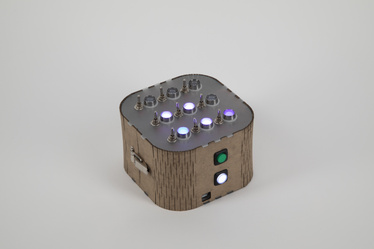

## 1. Find an interesting existing Alt+Ctrl Interface

https://shakethatbutton.com/tic-tac-toe-thing/

I like the simplicity and tactility of this piece. It uses a familiar and simple game into a tactile box.

## 2. Come up with a concept for your own Alt+Ctrl Interface

## 3. Complete the MyCourses introductions for the 3D Printing and Laser Cutter workshops
