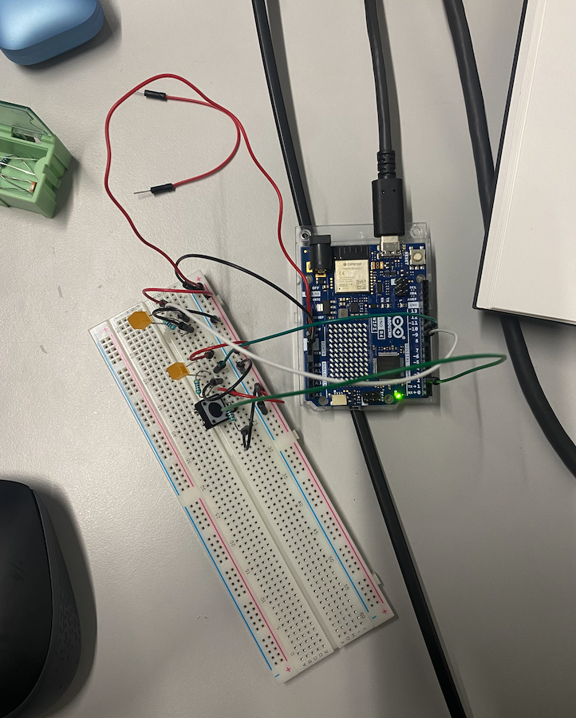

Final Code:

int counter = 0;

int buttonState = 0;

int lastButtonState = 0;

void setup() {

  // put your setup code here, to run once:

  pinMode(9,OUTPUT); //light 01

  pinMode(10,OUTPUT); //light 02

  pinMode(2,INPUT); //button

  Serial.begin(9600);

}

void loop() {

  // put your main code here, to run repeatedly:

  buttonState = digitalRead(2);

  if(buttonState != lastButtonState){

\    if(buttonState == HIGH){

\    if(counter<2){

\    counter ++;

\    }else{

\    counter = 0;

\    }

\    Serial.println(counter);

\    } else{

\    Serial.println("off");

\    }

\    delay(30);

  }

  lastButtonState = buttonState;

  if(counter == 0){

\    digitalWrite(9,HIGH);

\    digitalWrite(10,HIGH);

  }else if(counter == 1){

\    digitalWrite(9,LOW);

  }else{

\    digitalWrite(10,LOW);

  }

}

Reflections:

My first instinct after getting the two LEDs to work with the button was to use a counter. Originally when I made the circuit to only have two pins and a button, I used one pin to control both lights, so I also added another pin to separately control the LEDs.

I started with defining a counter that I added into an if statement that checked in the button was pressed. And whenever the button was pressed, the counter would be added into. This brought the problem that when you press the button the input is read more than once. So the counter quickly went up to 5. After this I tried if statements that would work with these thresholds. So if the counter was <5 then the first pin would turn on. But this was too finicky and annoying to work with.

I got my friend Guus to help me think it through and together we came up with the code from a few Arduino forum posts. Specifically these:

https://docs.arduino.cc/built-in-examples/digital/StateChangeDetection/

https://forum.arduino.cc/t/long-button-press-proceeding-counter-just-once/505307/3

Since she helped me write the final code, I only half understand how it works. But I think it's pretty similar to the tutorial about Falling and Rising Edge (https://learn.newmedia.dog/tutorials/arduino-and-electronics/arduino/digital-io-rising-or-falling-edge/) But I only realized this existed after I had asked Guus for help. 

So the code first checks if the current button state is the same as the previous button state. If they are not the same, the code checks if the button input is on and if the counter is less than 2. If these are both true, it adds to the counter. Otherwise the counter becomes 0. So whenever the counter becomes 3, it resets. After all these checks, the last button state is saved in the button state variable. 

This is all followed by another if statement, which checks the counter and turns on the LEDs. If the counter is 0 then both LEDs are off. If the counter is at 1 then the first LED turns on, otherwise the second LED turns on. 

So first the code checks the button state and adds to the counter depending on the value. Then it saves the previous button state and check the counter for turning on an LED.

I think that's how it works.

