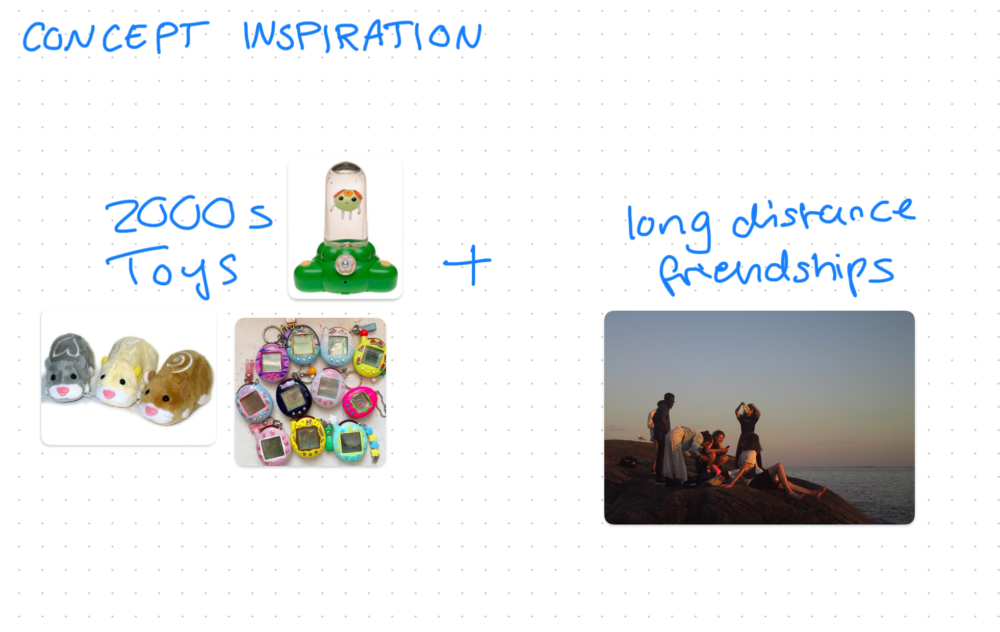
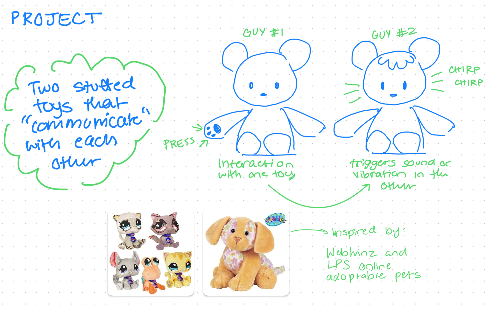
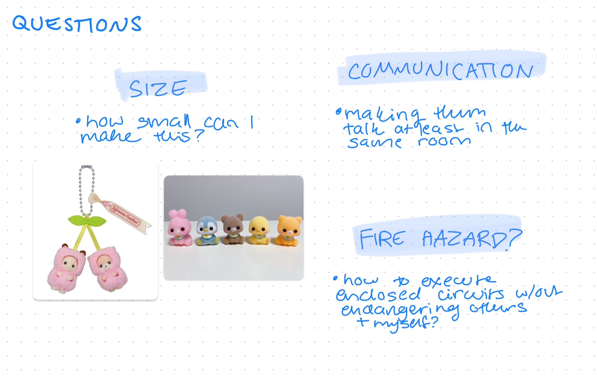

For this project, I was most inspired by 2000's children's toys. Mostly because they have a nostalgic element for me, I've been wanting to work with them for a while, and there's a lot of electronic toys from this era too. 

Thinking about my childhood lead me to think about the different friendships I've had, which lead me to think about long distance friendships. Most of my relationships in general are long distance or will eventually become long distance, and the struggle with maintaining these relationships has been a part of my life for as long as I can remember. I wanted to find a way to combine these two things in this project. 

Though I ideated on this for a while, I eventually came up with a very simple idea that I was very drawn to regardless. The idea is to use two stuffed animals to communicate with each other long distance. So when input is given on one toy, the response is shown on the other. 

There's many different ways that these could be interacted with. The first one I thought of here was a pressure sensor or a button in the paw that triggers sound in the other toy. I think shaking the toy would also be fun, using microphone input or waking up the other toy by shining a light on a light sensor or something. Output wise, I think the best options are sounds and vibrations. 

For this project, I think I'm most interested in using buttons to trigger sounds and vibrations. I would like to also use microphone input because I like the idea that the toys could 'speak' to each other. 

The original idea was inspired by a toy that a friend of mine got from a vending machine, which is made of a squishy silicone material. I wanted to replicate something like this in a keychain like toy, but I was struggling to make this idea work due to the size constraints. 

Even though this project is meant to work long distance, I'm mostly concerned with getting these to communicate with each other in the same room. I would rather have the final product function more as a prototype.  

My final concern was using circuits in a stuffed toy. While I generally know that this is possible, I'm not personally sure how to execute it properly.
