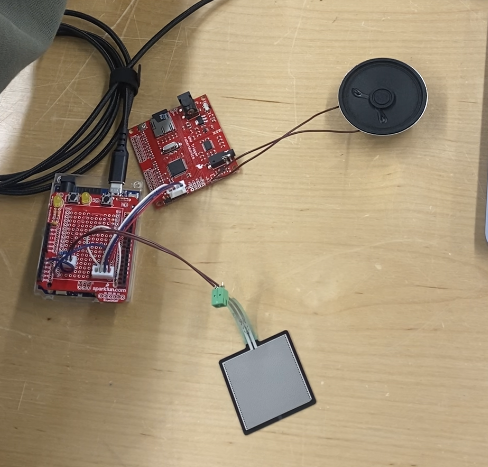
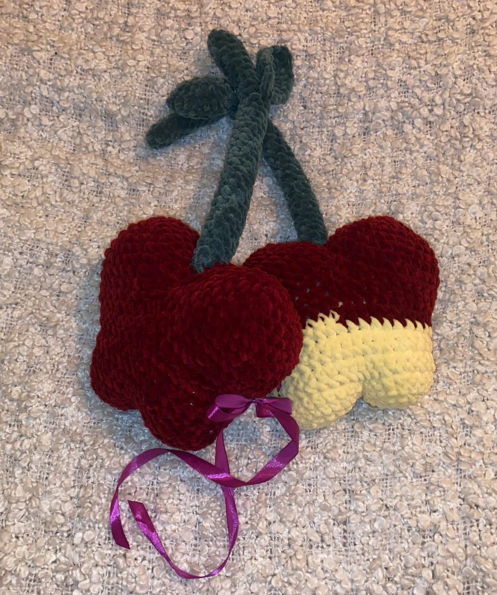
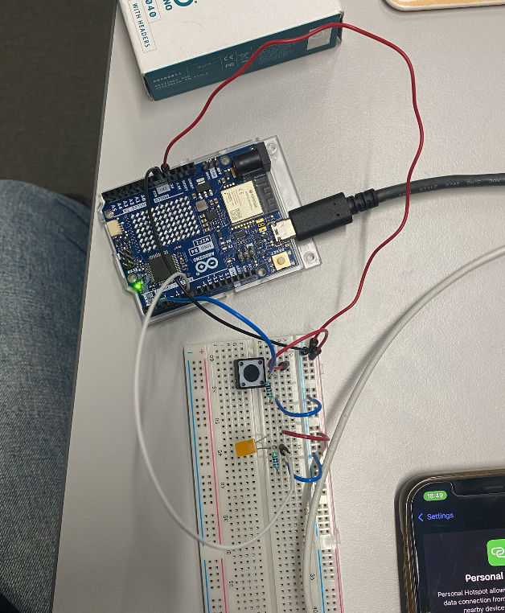
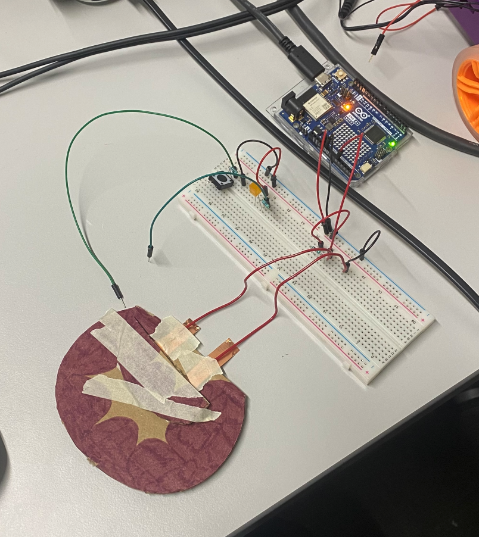
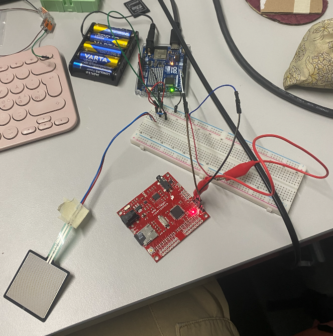

This is the final documentation for the project ‘Wish You Were Here.’ The project consists of two stuffed toys which use the Arduino cloud to send pressure sensor data between the toys to trigger sound output. 

## The Outcome

### Internal circuit

***Components:***

*Arduino Uno R4 + circuit board*

*Pressure sensor*

*WavTrigger*

*Piezo speaker*

*Battery pack (Computer as power supply in picture)*



### Casing

\**These are not actually tied together, I just placed them like this because they are meant to be cherries*



## The Journey to Get Here

### **OSC prototype**

I don’t work with electronics in my regular work very often so I had really no idea how to approach building this project. Matti suggested that I create a prototype using OSC messaging and some buttons and LED’s which was the first version of the prototype.

**Issues at this stage:** None

### **Arduino Cloud Prototype**

The next version was to switch to Arduino’s Cloud service to send data over wifi between two Arduino’s. The first step was configuring the arduino’s to communicate with the cloud. This took me some time because small bugs kept appearing with the configuration. When they were eventually updated, I found this tutorial from Arduino to do exactly what I’m trying to do:

<https://docs.arduino.cc/arduino-cloud/features/device-to-device/>

Following this tutorial, I made two button + LED circuits which communicated with each other through wifi.

**Arduino 1**

```cpp
#include "thingProperties.h"

int buttonPin = 2;
int ledPin = 7;

void setup() {
  // Initialize serial and wait for port to open:
  pinMode(buttonPin, INPUT_PULLUP);
  pinMode(ledPin, OUTPUT);
  
  // Initialize serial and wait for port to open:
  Serial.begin(9600);
  // This delay gives the chance to wait for a Serial Monitor without blocking if none is found
  delay(1500); 

  // Defined in thingProperties.h
  initProperties();

  // Connect to Arduino Cloud
  ArduinoCloud.begin(ArduinoIoTPreferredConnection);
  
  /*
     The following function allows you to obtain more information
     related to the state of network and Arduino Cloud connection and errors
     the higher number the more granular information you’ll get.
     The default is 0 (only errors).
     Maximum is 4
 */
  setDebugMessageLevel(2);
  ArduinoCloud.printDebugInfo();
}

void loop() {
  ArduinoCloud.update();
  // Your code here 
  
  int buttonState = digitalRead(buttonPin);
  
  if(buttonState == HIGH) {
    switch_2 = true;
    delay(500);
  }else{
    switch_2 = false;
  }

  
}

void onSwitch2Change() { // useless
  // Do nothing
}

void onSwitch1Change() { // triggered by other button
  // Do something
    if(switch_1) {
      digitalWrite(ledPin, LOW);
    }
    else{
      digitalWrite(ledPin, HIGH);
    }
  Serial.println("onswitch1change device 2, switch 1:" + switch_1);
}
```

**Arduino 2**

```cpp
#include "thingProperties.h"

int buttonPin = 2;
int ledPin = 7;

void setup() {
  // Initialize serial and wait for port to open:
  pinMode(buttonPin, INPUT_PULLUP);
  pinMode(ledPin, OUTPUT);
  
  // Initialize serial and wait for port to open:
  Serial.begin(9600);
  // This delay gives the chance to wait for a Serial Monitor without blocking if none is found
  delay(1500); 

  // Defined in thingProperties.h
  initProperties();

  // Connect to Arduino Cloud
  ArduinoCloud.begin(ArduinoIoTPreferredConnection);
  
  /*
     The following function allows you to obtain more information
     related to the state of network and Arduino Cloud connection and errors
     the higher number the more granular information you’ll get.
     The default is 0 (only errors).
     Maximum is 4
 */
  setDebugMessageLevel(2);
  ArduinoCloud.printDebugInfo();
}

void loop() {
  ArduinoCloud.update();
  // Your code here 
  
  int buttonState = digitalRead(buttonPin);
  
  if(buttonState == HIGH) {
    switch_2 = true;
    delay(500);
  }else{
    switch_2 = false;
  }

  
}

void onSwitch2Change() { // useless
  // Do nothing
}

void onSwitch1Change() { // triggered by other button
  // Do something
    if(switch_1) {
      digitalWrite(ledPin, LOW);
    }
    else{
      digitalWrite(ledPin, HIGH);
    }
  Serial.println("onswitch1change device 2, switch 1:" + switch_1);
}
```

**Circuits**



The heavy lifting of the communication is essentially done through the Arduino Cloud’s ‘Things.’ You can configure your Arduino to do a variety of actions through these things. In my case, both Arduino’s have two boolean variables which are synced to each other. These boolean variables are set to either true or false based on the button state. For example, when Arduino 2 detects that the button state in Arduino 1 has become true, it turns on the LED in it’s own circuit, and vice versa. Once this prototype was working, I had to begin changing components. 

**Issues at this stage:**

The Arduino Cloud can only communicate through a 2.4 Ghz wifi speed. The Aalto wifi network is 5.0 Ghz. iPhones (which is the phone I have) can emit a hotspot of 2.4 Ghz but only if its an iPhone 12 or later. I have an iPhone 11. Thank you Guus for loaning me your hotspot through out this project.

## Changing Components

**Pressure sensor**

I originally thought I would use a DIY velostat pressure sensor for this project.



However, at later stages of development, this became an issue, because the velostat was not giving consistent readings. It was jumping from the lowest readings being 60-50 to the lowest sometimes being 100-120. This would make setting a threshold for triggering the sound output more difficult. This problem was solved by getting some actual pressure sensors which give more predictable ranges. 

**Sound output**

The sound output was the most stressful part of this project. Even following some basic tutorials and asking for help from a more experienced programmer, getting the sound to even output once was very challenging. In summary, here’s an extract from my reflections while I was working on this project:

> So I have tried to make the speakers work myself, and I have tried to have my friend make it work. I cannot find a simple or working way to play audio through this goddamn speaker. There are either issues with the libraries or there is outdated information. The arduino’s architecture is incompatible with some of the libraries that are most often referenced in tutorials. I can get the arduino to read an SD card with the sound files, but playing the audio file seems to be near impossible. The PCM library that is often referenced in tutorials, say that to play sound without an SD card, you require an Audio encoding software. The only link I can find to this software refers to a google drive that doesn't exist. I’m starting to consider switching to another kind of output device, because this bitch is really annoying to work with. 

Eventually, the sound was able to be played using a wavTrigger component and a lot of help from Matti and my friend Guus. So once I had a consistent pressure sensor and a working sound output, I could implement them to the cloud. 

**Issues at this stage:**

Inconsistent readings from DIY pressure sensor

Outdated libraries and the Arduino Uno R4 being weird

## Final Circuit and Code

Here is the final working prototype and code.

**Libraries:**

thingProperties.h

The library that Arduino uses to make the ‘Things’ work. It’s always included in the sketches for the cloud.

Metro.h and wavTrigger.h

Both libraries which are used to make the sound output work.

**Arduino 1**

```cpp
#include "thingProperties.h"
#include <Metro.h>
#include <wavTrigger.h> //This one has been altered to include the Arduino library in the code


//include a bunch of libraries

int buttonPin = A0; 
int ledPin = 1;
//Make pin variables

wavTrigger wTrig;
Metro gSeqMetro(6000);

void setup() {
  // Initialize serial and wait for port to open:
  pinMode(buttonPin, INPUT_PULLUP);
  pinMode(ledPin, OUTPUT);
  
  // Initialize serial and wait for port to open:
  Serial.begin(9600);
  // This delay gives the chance to wait for a Serial Monitor without blocking if none is found
  delay(1500); 

  // Defined in thingProperties.h
  initProperties();

  // Connect to Arduino Cloud
  ArduinoCloud.begin(ArduinoIoTPreferredConnection);

  wTrig.start();
  delay(10);
  wTrig.stopAllTracks();
  wTrig.samplerateOffset(0);
  
  /*
     The following function allows you to obtain more information
     related to the state of network and Arduino Cloud connection and errors
     the higher number the more granular information you’ll get.
     The default is 0 (only errors).
     Maximum is 4
 */
  //setDebugMessageLevel(2);
  //ArduinoCloud.printDebugInfo();
}

void loop() {
  ArduinoCloud.update();
  // Your code here 
 // Serial.println(ArduinoCloud.connected());
  
  //int buttonState = digitalRead(buttonPin);
  int buttonState = analogRead(buttonPin);
  Serial.println(buttonState);
  
  if(buttonState > 400) {
    switch_1 = true;
  }else{
    switch_1 = false;
  }
  
}

void onSwitch2Change() { // triggered by other button
  // Do something
  if(switch_2){
    //digitalWrite(ledPin, LOW);
  }else{
    //digitalWrite(ledPin, HIGH);
  }
    Serial.println("onswitch2change device1, switch 2:" + switch_2);
    wTrig.trackPlaySolo(1);
  
}

void onSwitch1Change() { // useless ?
  // Do nothing
}
```

**Arduino 2**

```cpp
#include "thingProperties.h"
#include <Metro.h>
#include <wavTrigger.h>
//Include a bunch of libraries

int buttonPin = A0;
int ledPin = 1;
int test = 9;
//Make pin variables

wavTrigger wTrig;
Metro gSeqMetro(6000);

void setup() {
  // Initialize serial and wait for port to open:
  pinMode(buttonPin, INPUT_PULLUP);
  pinMode(ledPin, OUTPUT);
  
  // Initialize serial and wait for port to open:
  Serial.begin(9600);
  // This delay gives the chance to wait for a Serial Monitor without blocking if none is found
  delay(1500); 

  // Defined in thingProperties.h
  initProperties();

  // Connect to Arduino Cloud
  ArduinoCloud.begin(ArduinoIoTPreferredConnection);

  wTrig.start();
  delay(10);
  wTrig.stopAllTracks();
  wTrig.samplerateOffset(0);
  
  /*
     The following function allows you to obtain more information
     related to the state of network and Arduino Cloud connection and errors
     the higher number the more granular information you’ll get.
     The default is 0 (only errors).
     Maximum is 4
 */
 // setDebugMessageLevel(2);
 // ArduinoCloud.printDebugInfo();
}

void loop() {
  ArduinoCloud.update();
  // Your code here 
  
  int buttonState = analogRead(buttonPin);
  Serial.println(buttonState);
  
  if(buttonState>400) {
    switch_2 = true;
  }else{
    switch_2 = false;
  }

}

void onSwitch2Change() { // useless
  // Do nothing
}

void onSwitch1Change() { // triggered by other button
  // Do something
    if(switch_1) {
    }
    else{
    }
      Serial.println("onswitch1change device 2, switch 1:" + switch_1);
      wTrig.trackPlaySolo(1); //play track number 1
}
```

**Circuits**



**Issues at this stage:**

Uploading libraries to the Arduino Cloud was challenging. The zip files of the libraries needed to include a document about the libraries, like name, author, date of publishing etc. This file needed to be in the file format ‘document’ and this was explained on Arduino’s website in a very unclear way. A regular .txt file will not work, it has to be a ‘document.’

Some challenges in finding female to female jumper cables which was fixed in a very janky way with alligator clips.

### Soldering and casing

The bread board was changed to a circuit board which attached onto the Arduino. The final circuit soldered together can be seen in the very beginning of this documentation.

Once the internal parts were fully applied together, I made a crochet casing for them as two cherries. The circuit is placed inside, with the Arduino and the wavTrigger in a small pouch to make the stuffing process slightly easier. Otherwise, when the battery pack is plugged in, the Arduino will begin to search for the wifi connection that it has been assigned. Once it connect, the devices should be able to communicate with each other.

## Final Reflections and Improvements

This was the last course project I had to complete for my studies in Aalto University (aside from my thesis project). Which was fitting in a way, because I did my first course in this university in 2019 also in the mechatronics basement. Back then I also did a project that I had no idea how to approach, which was building ceramic printing clay printers.

This project might not sound as impressive as a DIY clay printer, but it’s final outcome is put together and I understand how it works. Both of which are things I couldn’t say about my clay printer. This project has shown me that I’ve learned now how to plan a project which can fit my skill level and knowledge, and which I can execute in a 3-4 week time span in a way that I am happy with. Something that I have struggled with for the entire duration of my studies. So even though this is quite a simple execution, this project is an amalgamation of everything that I have learned at this university. From putting together a realistic project proposal to working with code and electronics which are not my usual medium and that often frustrate me and require me to ask for extra support. Asking for help is also something I struggle with, but have been able to come to terms with for the sake of making stronger projects. It took my five years to learn how to do all this, but I did it in the end.

Outside of my personal reflections, here are some improvements that I think the project could use in future iterations:

Add more reaction sounds. Would be nice if they could cycle through different sounds

Add a heating element. I still think these toys would be at their best if they don’t have a bunch of flashing lights and stuff. The most outputs I would want to implement are sound and heat.

The casing could be more convenient. Eg. the ribbon closing was the best I could do for now, but it would be more convenient if it were a zipper. Additionally, the circuits inside could have better casings so that they are better protected and the toys feel overall much softer. I also wish the final product was much larger so it could be easier to hug

Again, thank you to Matti and Guus for helping me execute this project to its full extent!
