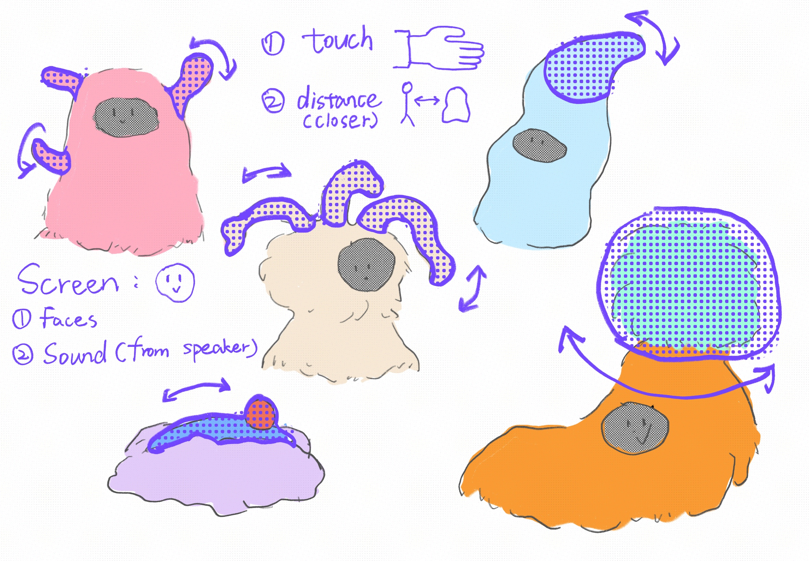
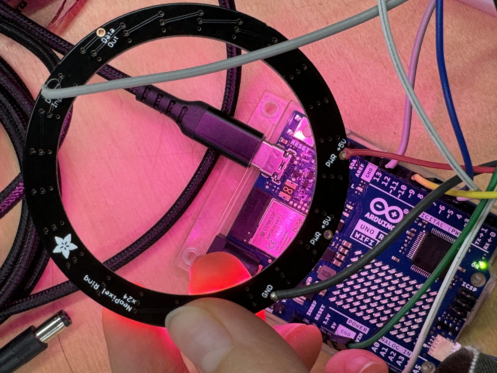

> The inspiration comes from "socializing" which we do every day. After socializing with people for so many years, I suddenly feel that socializing with a furry unknown creature might be also a good choice. 
>
> <https://miro.com/welcomeonboard/bTZTRlBURkRvTHRGLzFsa3NvaFU1ZmIwMDZ6MGF0KzV3WWxoWk1LdVg1WWhEWDFHUTNCVXIycmttQTdCZzNDNi9oVDVFQzcvNnlFU3Zwd3BaL1phTGtIaWRuYU5xcG5rZUJIM25iQSs1QXY3TXJiRC94Qy9hLzUwR0gwMlRPS0chZQ==?share_link_id=534445760282>

I used Arduino to create some work in the past time, but only in some simple ways. I'm so happy to learn physical computing because this is an opportunity to learn this skill systematically. At the beginning of this project, I want to try more Arduino components and use the wonderful resources from this course. Additionally, I am so addicted to plush toys and fluffy stuff. So the concept of this project quickly came up in my head. Let me make some soft fluffy robot! 




Firstly, I tried to write very simple code to prototype the functions of a robot. 


Then starting to build it on an Arduino board.


Because I want to make a very soft robot, the sensors shouldn't be too hard. I made this soft pressure sensor by using the conductive fabric.


In the beginning, I planned to use an LED display to show the robot's face and express different emotions. Due to the material and budget, I finally chose this Neo pixel ring as plush on the cheek. 

When people touch or squeeze the arms(pressure sensors), neo-pixel rings will turn on.




After testing all parts of the robot, I realized that I used so many components. There are 4 servo motors, 2 neo pixels rings, 3 pressure sensors, 2 distance sensors and 1 speaker, which were very challenging and unfamiliar for me. Also, I was not very clear with all stuff's names in English. Everything seemed difficult for me. 

However, after a week of exploration and learning, I gradually understood the connection and structure between my work and Arduino. Then everything became clearer, even the progress was quite tortuous. 

Unfortunately, neo pixels' and servo motors' libraries are conflicted with each other. I decided to separate functions and components into two Arduino boards(Arduino Uno Wifi 4 and Arduino Uno). 


Physical building stage:

I used laser cut to make the bottom base and head base. 

Using metal mesh and iron wire to make the structure(skeleton).


Put all the electronic parts on the structure. 

At this stage, everything went well until I found that the value of pressure sensors wasn't stable when I sewed it with fabric and filler. It caused neo-pixel rings to blink. Finally, Matti suggested me to change the fixed value to the readable value. 

```c
int sensor1Min = 0;
int sensor1Max = 0;
int sensor2Min = 0;
int sensor2Max = 0;
int sensor3Min = 0;
int sensor3Max = 0;

 if (fsrValue1 > fsrValue2 && fsrValue1 > fsrValue3){
    targetBrightness = map(fsrValue1, sensor1Min+20, sensor1Max, 0, 255);
  }
  if (fsrValue2 > fsrValue1 && fsrValue2 > fsrValue3){
    targetBrightness = map(fsrValue2,sensor2Min+7, sensor2Max, 0, 255);
  }
  if (fsrValue3 > fsrValue1 && fsrValue3 > fsrValue2){
    targetBrightness = map(fsrValue3, sensor3Min+20, sensor3Max, 0, 255);
  }
```


Soldering


组装


```c
//LED speaker

#include <Wire.h>
#include <Adafruit_NeoPixel.h>
#include <AltSoftSerial.h>    // Arduino build environment requires this
#include <wavTrigger.h>
#include <VL53L1X.h> 

VL53L1X sensor;
wavTrigger wTrig; 

// define NeoPixel Ring's pin and number of pixels
#define PIXEL_PIN 12  
#define NUM_PIXELS 48  

Adafruit_NeoPixel strip(NUM_PIXELS, PIXEL_PIN, NEO_GRBW + NEO_KHZ800);

// Pressure sensor
#define FSR_PIN1 A0
#define FSR_PIN2 A1
#define FSR_PIN3 A3

// PINK
const int R = 200;
const int G = 20;
const int B = 60;

int currentBrightness = 0;
int targetBrightness = 0;  

int sensor1Min = 0;
int sensor1Max = 0;
int sensor2Min = 0;
int sensor2Max = 0;
int sensor3Min = 0;
int sensor3Max = 0;

 // read pressure sensor (0 to 1023)
int fsrValue1 = analogRead(FSR_PIN1);
int fsrValue2 = analogRead(FSR_PIN2);
int fsrValue3 = analogRead(FSR_PIN3);

// distance
int distance = 0;               
unsigned long lastPlayback = 0; 
const unsigned long playbackInterval = 60000; 

unsigned long lastShortDistancePlayback = 0; 
const unsigned long shortDistanceDelay = 3000; 

unsigned long lastFSRActivation = 0;
const unsigned long fsrDebounceInterval = 2000; 

void neoRing1(){
  fsrValue1 = analogRead(FSR_PIN1);
  fsrValue2 = analogRead(FSR_PIN2);
  fsrValue3 = analogRead(FSR_PIN3);

  if (fsrValue1 > fsrValue2 && fsrValue1 > fsrValue3){
    targetBrightness = map(fsrValue1, sensor1Min+20, sensor1Max, 0, 255);
  }
  if (fsrValue2 > fsrValue1 && fsrValue2 > fsrValue3){
    targetBrightness = map(fsrValue2,sensor2Min+7, sensor2Max, 0, 255);
  }
  if (fsrValue3 > fsrValue1 && fsrValue3 > fsrValue2){
    targetBrightness = map(fsrValue3, sensor3Min+20, sensor3Max, 0, 255);
  }

  targetBrightness = constrain(targetBrightness, 0, 255);

 //  currentBrightness % targetBrightness
  if (currentBrightness < targetBrightness) {
    currentBrightness += 3; // increase
    //delay(10);
  } else if (currentBrightness > targetBrightness) {
    currentBrightness -= 3; // decrease
    //delay(10);
  }

  strip.setBrightness(currentBrightness);
  setRingColor(R, G, B);
  
  Serial.print("FSR Value1: ");
  Serial.print(fsrValue1);
  Serial.print("  FSR Value2: ");
  Serial.print(fsrValue2); 
  Serial.print("  FSR Value3: ");
  Serial.print(fsrValue3); 
  //Serial.print("targetBrightness: ");
  //Serial.println(targetBrightness);
  //Serial.print("currentBrightness: ");
  //Serial.println(currentBrightness);
  //Serial.println("ring done");
}


void setup() {
  Serial.begin(115200);   
  Wire.begin();
  Wire.setClock(400000);
  if (!sensor.init())
  {
    Serial.println("Failed to detect and initialize sensor!");
    while (1);
  }
  // information on range and timing limits.
  sensor.setDistanceMode(VL53L1X::Long);
  sensor.setMeasurementTimingBudget(50000);
  sensor.startContinuous(50);

  // Initialize NeoPixel
  strip.begin();
  strip.show(); 
  strip.setBrightness(20); 

  sensor1Min = analogRead(FSR_PIN1);
  sensor1Max = sensor1Min + 100;
  sensor2Min = analogRead(FSR_PIN2);
  sensor2Max = sensor2Min + 20;
  sensor3Min = analogRead(FSR_PIN3);
  sensor3Max = sensor3Min + 100;

  // Initialize WAV Trigger
  wTrig.start();
  delay(10);
  wTrig.stopAllTracks();
  wTrig.masterGain(10); // volume
  Serial.println("Setup complete");
}

void speaker(){
  distance = sensor.read() / 10; // mm --> cm
  if (sensor.timeoutOccurred()) {
    Serial.println("Distance sensor timeout!");
    return;
  }

  Serial.print("  Distance: ");
  Serial.print(distance);
  Serial.println(" cm");
  // Play different sound files
  if(distance <20){
    wTrig.trackPlaySolo(3); 
    delay(500);
    
  }
  if (distance <= 100 && distance >=20) {
    wTrig.trackPlaySolo(2); 
    //delay(2000);
  } else if (distance > 100) {
    if (millis() - lastPlayback >= playbackInterval) {
      wTrig.trackPlaySolo(4);
      lastPlayback = millis();
    }
  }

  //Pressure sensor
  //if (fsrValue1 > sensor1Min+50 || fsrValue2 > sensor2Min+10 || fsrValue3 > sensor3Min+50) {
    //Serial.println("All FSR sensors activated. Playing track 5.");
    //wTrig.trackPlaySolo(5); // 播放第 5 个音频
   // delay(500); // 防止重复触发
 // }
  if ((fsrValue1 > sensor1Min + 30 || fsrValue2 > sensor2Min + 5 || fsrValue3 > sensor3Min + 30) &&
      millis() - lastFSRActivation > fsrDebounceInterval) {
    Serial.println("All FSR sensors activated. Playing track 5.");
    wTrig.trackPlaySolo(5); 
    lastFSRActivation = millis(); 
  }
}

void loop() {
  neoRing1();
  speaker();
}

void setRingColor(int red, int green, int blue) {
  for (int i = 0; i < NUM_PIXELS; i++) {
    strip.setPixelColor(i, strip.Color(red, green, blue));
  }
  strip.show(); // refresh
}

void playFile(int trackNumber) {
  wTrig.stopAllTracks(); 
  delay(10); 
  wTrig.trackPlaySolo(trackNumber); 
  Serial.print("Playing track: ");
  Serial.println(trackNumber);
}
```

```c
#include <Wire.h>
#include <Servo.h>  
#include <VL53L1X.h>  

// 定义引脚
const int servoPin1 = 9;  
const int servoPin2 = 10; //（head）
const int servoPin3 = 11;
const int servoPin4 = 12;     
Servo myServo1;               // SG92R
Servo myServo2;      //MG995R（head） 
Servo myServo3;// SG92R
Servo myServo4;
VL53L1X sensor;

int currentAngle = 90;   
int targetAngle = 90;   

void servo(){

  int distance = measureDistance();
  if (distance < 0 || distance > 100) { 
    distance = 100; 
  }

  targetAngle = map(distance, 0, 100, 0, 180);
  targetAngle = constrain(targetAngle, 0, 180);

  if (currentAngle < targetAngle) {
    currentAngle += 3; 
  } else if (currentAngle > targetAngle) {
    currentAngle -= 3;
  }

  myServo1.write(currentAngle); //  1
  myServo2.write(currentAngle); //head
  myServo3.write(currentAngle); // 3
  myServo4.write(180 - currentAngle); // 2

  Serial.print("Distance: ");
  Serial.print(distance);
  Serial.print(" cm, Current Angle: ");
  Serial.print(currentAngle);
  Serial.print(", Target Angle: ");
  Serial.println(targetAngle);
}

int measureDistance() {
  int distance = sensor.read() / 10; // mm --> cm
  if (sensor.timeoutOccurred()) {
    Serial.println("Sensor timeout!");
    return -1; 
  }
  return distance;
}


void setup() {
  Serial.begin(115200);   
  Wire1.begin();
  Wire1.setClock(400000); 

  sensor.setBus(&Wire1);
  sensor.setTimeout(500);
  if (!sensor.init()) {
    Serial.println("Failed to initialize sensor!");
    while (1);
  }
  sensor.setDistanceMode(VL53L1X::Long);
  sensor.setMeasurementTimingBudget(50000);
  sensor.startContinuous(50);

  myServo1.attach(servoPin1, 600, 2000);
  myServo1.write(currentAngle);
  myServo2.attach(servoPin2, 600, 2000);
  myServo2.write(currentAngle); 
  myServo3.attach(servoPin3, 600, 2000);
  myServo3.write(currentAngle); 
  myServo4.attach(servoPin4, 600, 2000);
  myServo4.write(currentAngle); 

}

void loop() {
  servo();

  delay(100);
}
```
