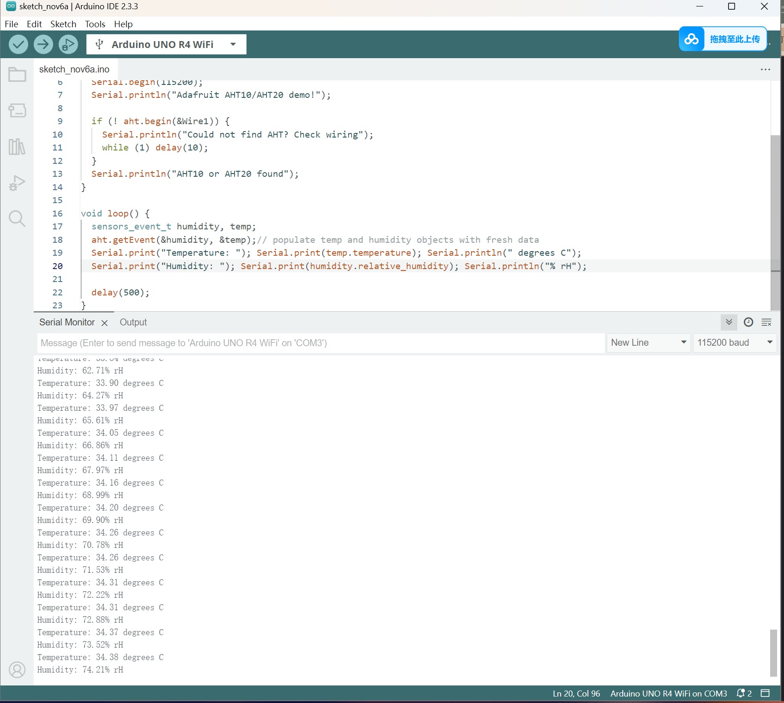

Feature: Duck from Matti and my baby mango :)

Background: An AIGC work, I like it

**1. Find an interesting existing Alt+Ctrl Interface**

"Puppet Master"

Description: This is a game that users can control the puppet in the game scenario. But! This is not a game that we need to lead the character to the victory. The goal in this game is make your puppet suffering in limited time, the puppet suffer more, player will get highter score. Players would hold a teddy bear toy and control bear's legs to make puppet move. 

Reason I chose this: Firstly, the way to manipulate the character(the puppet) is very attractive for me. It is a teddy bear which is so cute, but mean while player control this cute bear to torture the puppet. It creates a strong sense of contrast, which I think is very novel. Secondly, Teddy bears and puppets are also related and similar. Controlling a teddy bear with limbs to destroy and self-harm is more realistic than controlling a game character with a controller.

https://noxirea.itch.io/puppet-master

https://www.youtube.com/watch?v=jaNljzYFQGY&t=20s

**2. Come up with a concept for your own Alt+Ctrl Interface**

**Sensor: Temperature and Humidity Sensor | AHT20**

**如果您可以访问传感器，请弄清楚如何使用 Arduino 读取传感器的值。将传感器的数据打印到串行监视器或串行绘图仪。**

**What kind of objects could the sensor be attached to?**

\-Materials with high air permeability, because I found that this sensor must be very close to detect changes in temperature and humidity. For example, breathable fabrics and paper

\-Materials that can directly conduct heat, such as metals, but the speed of heat conduction of metal materials varies, and further exploration is needed

\-If we want to monitor temperature and humidity at the same time, this may require two sensors, and use packaging of different materials to detect changes in the two values ​​as accurately and quickly as possible

**\------------------------------------------------------------------**

**Warm Moomin**

**Description:** The work consists of a plush ball/moomin wrapped with a sensor and a screen. By holding/breathing on the ball, people can increase the temperature and humidity to affect the strength of the fire on the screen, so that the Moomin on the screen can get warmer. If the temperature gradually drops, the Moomin will feel cold and eventually freeze into ice. Let's warm up the Moomin!

Moomin is sooooo cute, nobody wants to let him frozen, right?

Of course I will change the character if I decide to make this game complete, because I don't want to be sued by company. 

Short-distance interaction(0-40cm)

**Sketch:** 

**3. Complete the MyCourses introductions for the 3D Printing and Laser Cutter workshops** 

