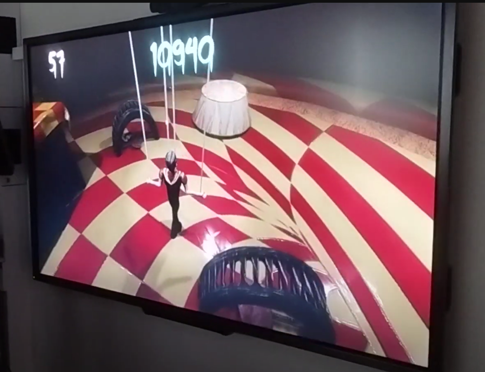
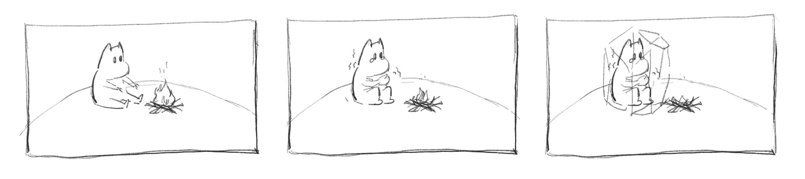
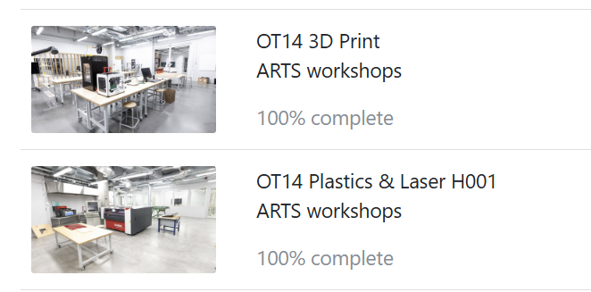

Feature: Duck from Matti and my baby mango :)

Background: An AIGC work, I like it

**1. Find an interesting existing Alt+Ctrl Interface**

"Puppet Master"

Description: This is a game that users can control the puppet in the game scenario. But! This is not a game that we need to lead the character to the victory. The goal in this game is make your puppet suffering in limited time, the puppet suffer more, player will get highter score. Players would hold a teddy bear toy and control bear's legs to make puppet move. 

Reason I chose this: The way to manipulate the character(the puppet) is very attractive for me. Firstly, it is a teddy bear which is so cute, but mean while player control this cute bear to torture the puppet. It creates a strong sense of contrast, which I think is very novel. Teddy bears and puppets are also related and similar. Controlling a teddy bear with limbs to destroy and self-harm is more realistic than controlling a game character with a controller.

https://noxirea.itch.io/puppet-master

https://www.youtube.com/watch?v=jaNljzYFQGY&t=20s

**2. Come up with a concept for your own Alt+Ctrl Interface**

**Sensor: Temperature and Humidity Sensor | AHT20**

**Warm Moomin**

**Description:** 

**Sketch:** 

**3. Complete the MyCourses introductions for the 3D Printing and Laser Cutter workshops** 

