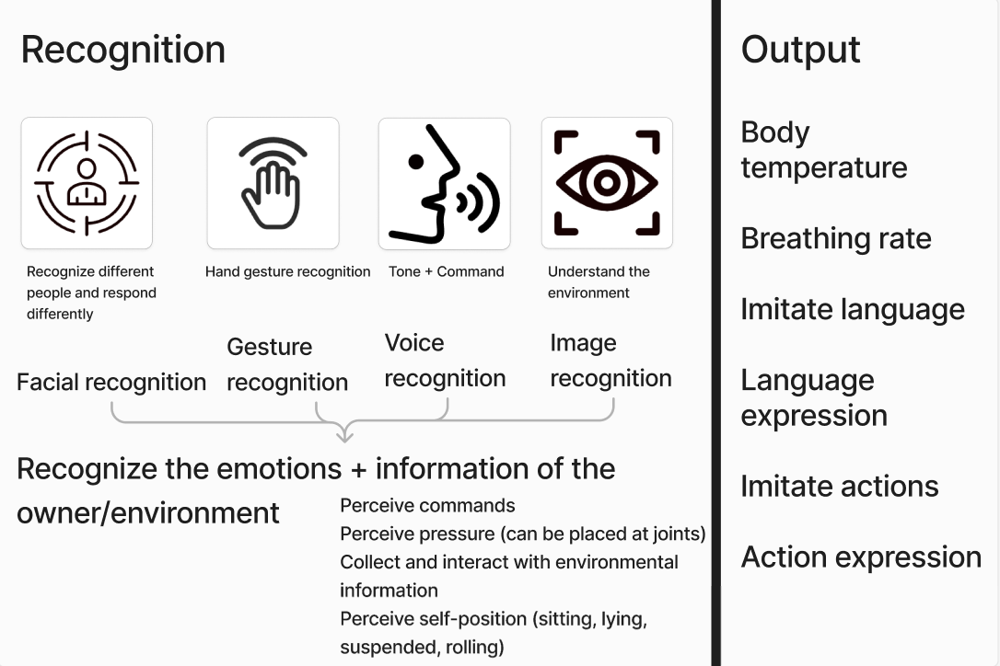
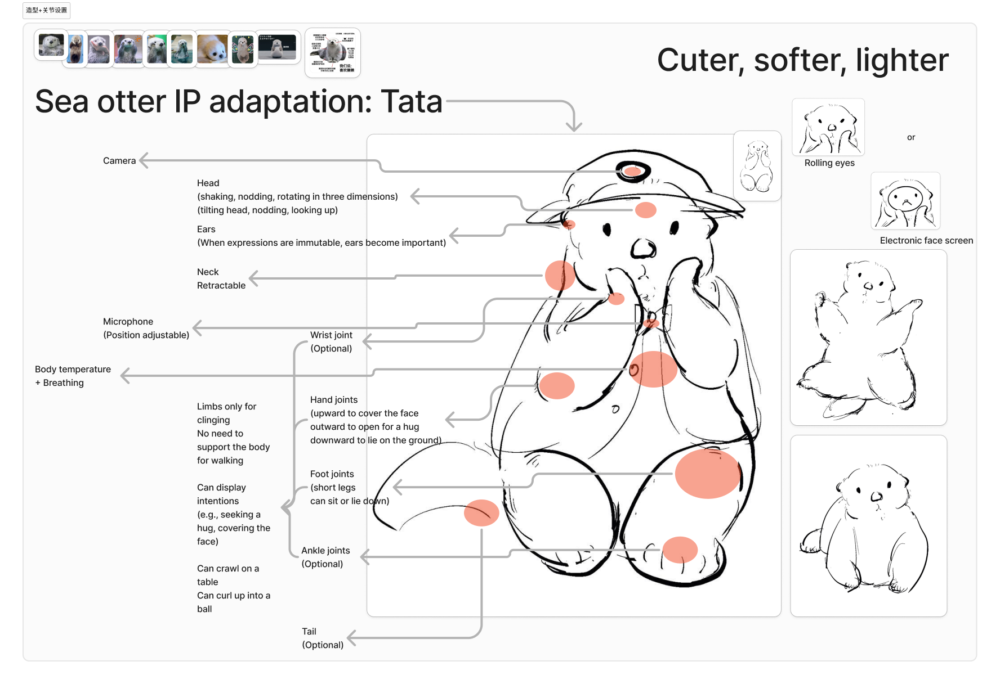
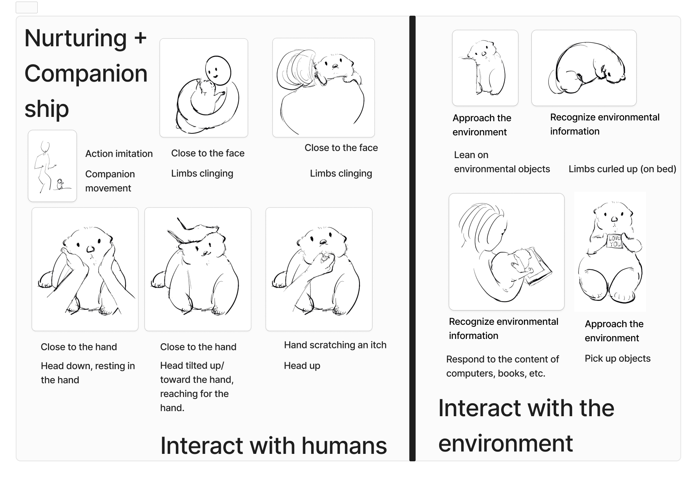
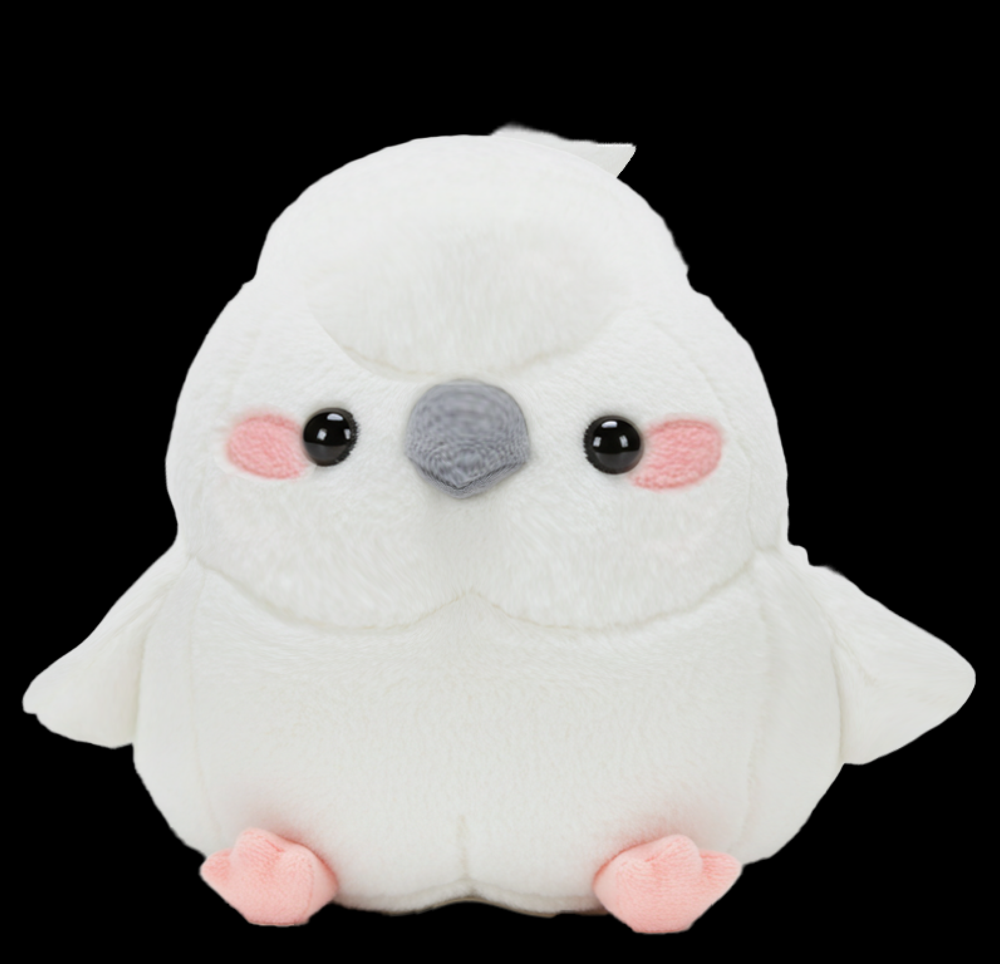
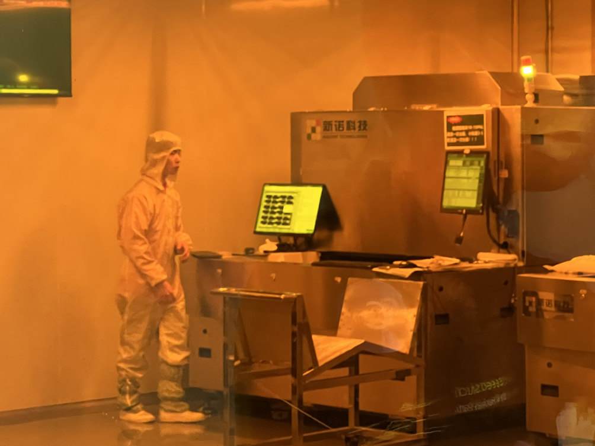
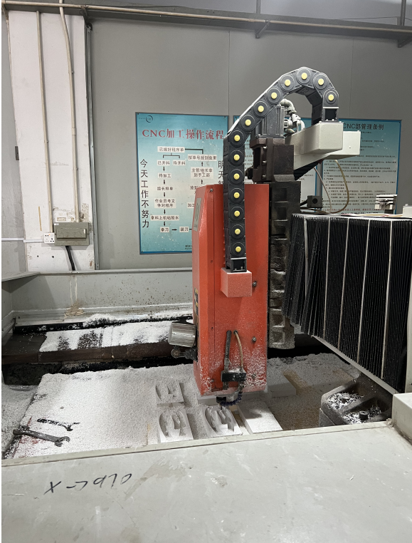
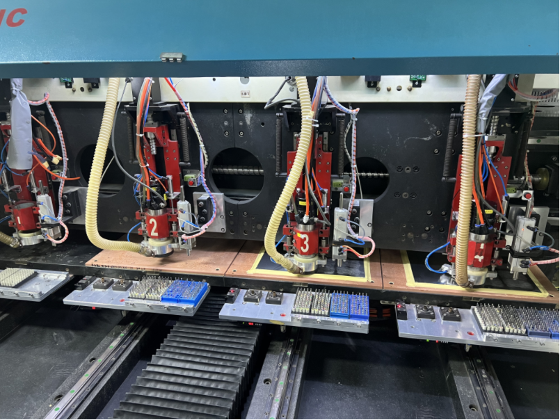
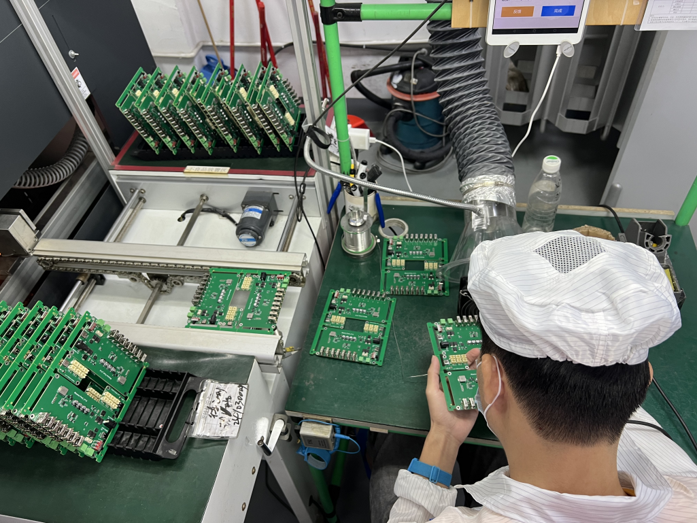
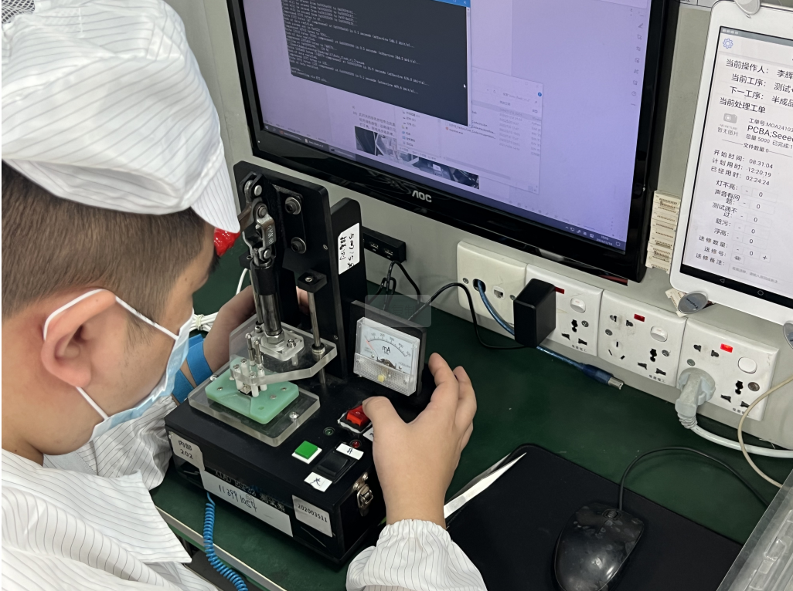
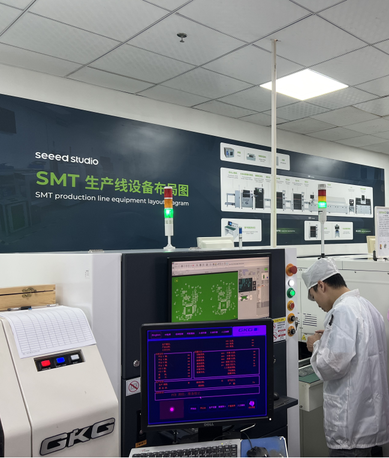

**Introduction**
This AI Companion Toy is an AI-powered nurturing pet designed for young, high-end consumers. It caters specifically to young adults living independently in big cities who lack emotional interaction, offering emotional comfort and interactive support. By integrating technologies such as voice interaction, motion interaction, and emotional simulation, the product leverages hardware sensors and local AI capabilities to deliver personalized, multidimensional emotional companionship. It is suitable for scenarios such as leisure and entertainment, fitness assistance, household chores, and daily commuting.

\-

**Product Features**

It integrates a camera, microphone, LED screen, and various sensors. Through AI language models, multimodal perception technology, and hardware interaction, the product delivers the following core features:

* **Motion Interaction**

  : Mimics user movements and interacts with people and the environment.

* **Voice Interaction**

  : Supports command recognition, emotional simulation, and gradual learning of the user’s language expressions.

* **Personality Space**

  : Dynamically adjusts personality traits based on real-time data, providing personalized responses to the user’s emotions and behaviors.

* **Environment Understanding**

  : Collects data using the camera, microphone, and tactile sensors to analyze user movements, speech, and environmental information, enabling adaptive and context-aware outputs.

\-
**Main Objectives**

* Provide human-like emotional expressions and multimodal interactive experiences.

* Gradually adapt to the user’s personality and behavior through continuous learning.

* Enhance the toy’s intelligence and entertainment value using sensors and AI technology.

* Ensure high stability and simple, user-friendly interactive behavior.

\-

**Interaction Design**

**Appearance**

\-

**production process**

Collaborating with different factories：

Mold factory

Chip factory

**Video:**
[38d9ce9b1ea93a1b5fff530987db03d7_raw.mp4](https://1drv.ms/v/c/314ba15a9b23cde5/EcA3ic__0GdFkI_IoiJ5GswBYOJthC_gI6eUWoHF2UEoaQ?e=tY3vvY)

\-

**Trail**

At first I did this.

I want to develop this product into a commercialized offering.
