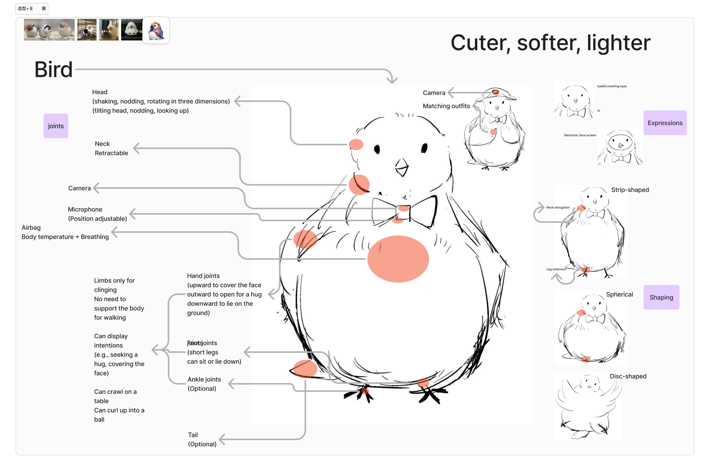
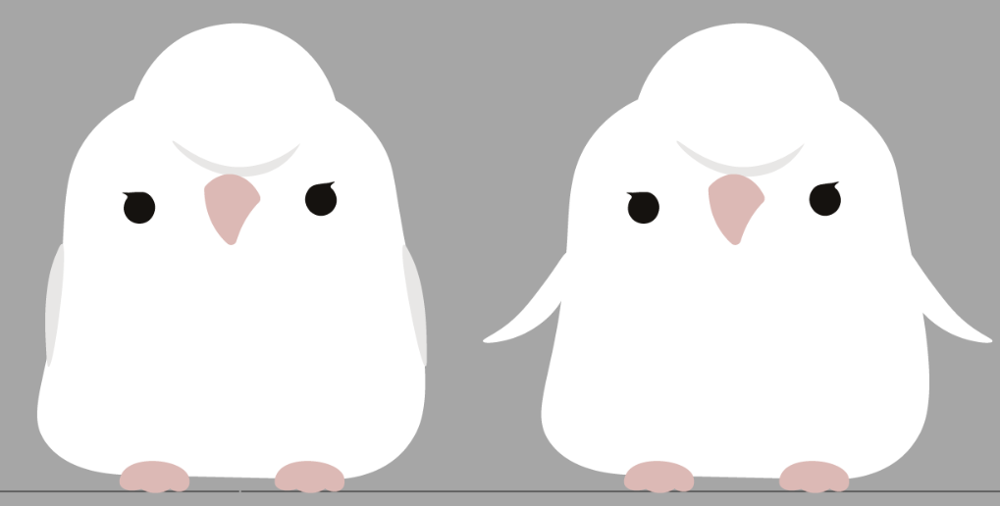
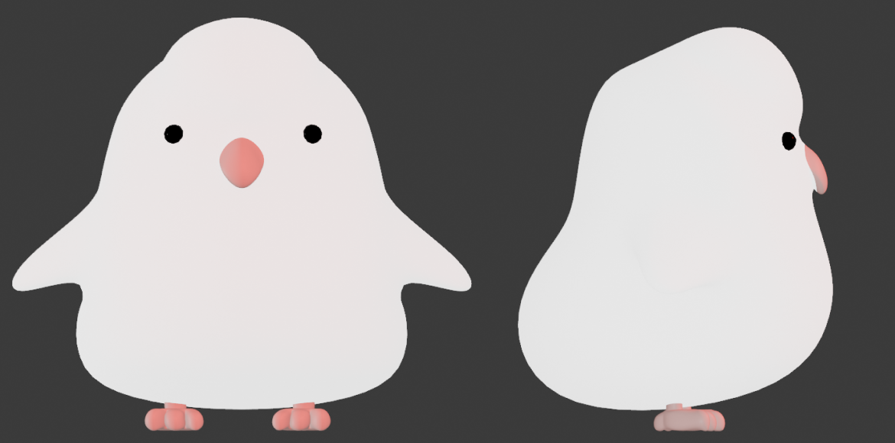
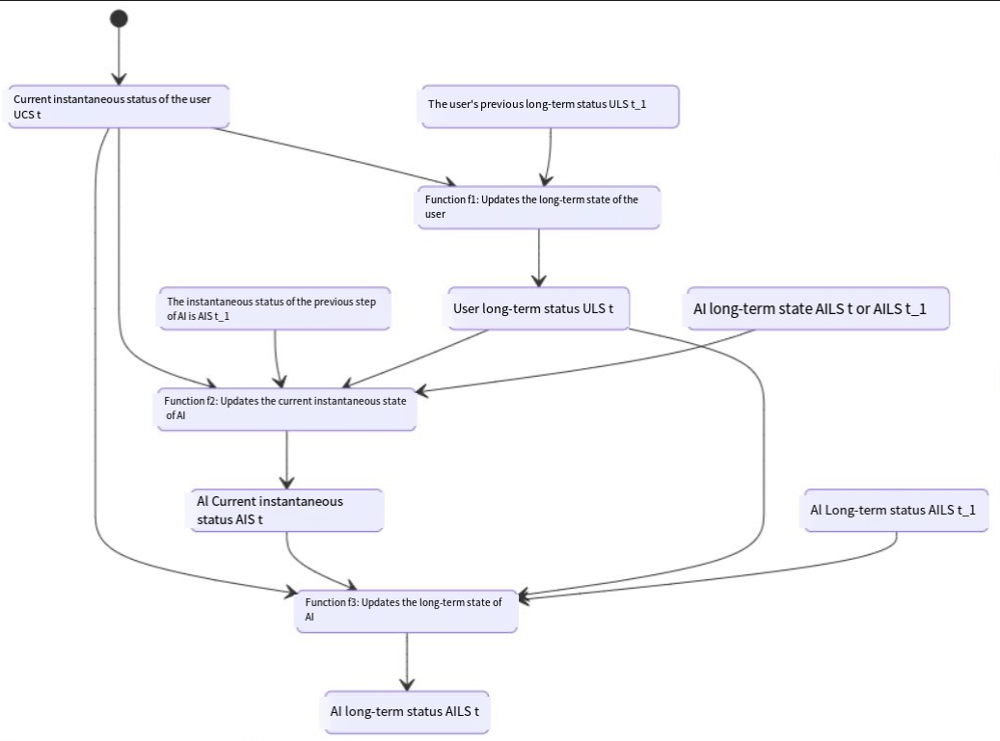

**Introduction**

Hoki is an AI-based nurturing companion pet designed for the young mid-range consumer demographic. It caters specifically to young adults living independently in big cities who lack emotional interaction, offering emotional comfort and interactive support. By integrating technologies such as voice interaction, motion interaction, and emotional simulation, the product leverages hardware sensors and local AI capabilities to deliver personalized, multidimensional emotional companionship. It is suitable for scenarios such as leisure and entertainment, fitness assistance, household chores, and daily commuting.

\-

**Product Features**

It integrates a camera, microphone, LED screen, and various sensors. Through AI language models, multimodal perception technology, and hardware interaction, the product delivers the following core features:

* **Motion Interaction**

  Mimics user movements and interacts with people and the environment.
* **Voice Interaction**

  Supports command recognition, emotional simulation, and gradual learning of the user’s language expressions.
* **Personality Space**

  Dynamically adjusts personality traits based on real-time data, providing personalized responses to the user’s emotions and behaviors.
* **Environment Understanding**

  Collects data using the camera, microphone, and tactile sensors to analyze user movements, speech, and environmental information, enabling adaptive and context-aware outputs.

\-

**Main Objectives**

* Provide human-like emotional expressions and multimodal interactive experiences.
* Gradually adapt to the user’s personality and behavior through continuous learning.
* Enhance the toy’s intelligence and entertainment value using sensors and AI technology.
* Ensure high stability and simple, user-friendly interactive behavior.

\-

**Interaction Design**

Cultivation + Companionship. This product develops a real-time evolving personality and habits for accompanying daily life.

**IP Design**

Inspired by the idiom "parrot what others say" due to the AI pet's focus on voice, action, and emotional interactions, we have designed the product to take the form of a parrot.

Appearance: Features a head, body, two legs, two wings, and a tail.

Material: The surface is made of soft plush material, while the internal structure consists of a plastic/resin framework. Key parts (such as the wings and head) are reinforced with high-strength resin or other lightweight rigid materials for support.

concept

3d model

\-

**Technical Development**

This AI smart companion toy features a dual main control architecture core (AX630C + STM32) and utilizes multiple sensor inputs (such as a camera, microphone, touch sensors, MPU6050, etc.) to collect user inputs. It leverages a locally running large model (qwen-2-1.5B) to achieve high-quality language and emotional interactions. Its mechanical structure includes a "three-axis gimbal head," two "wire-driven legs," and a "foot pad + tail" that support simple movements. The software layer integrates finite state machines and factorization models (FFM), allowing for real-time and long-term tracking and updates of the user's AI aspects, thereby realizing a continuously evolving and personalized companion function.

During the design and implementation process, sensor selection, camera focus capabilities, motor-driven movement and steering control, large-scale model inference, and multi-modal calculation adjustments and optimizations were required. Priority was given to improving the safety margin and redundancy mechanisms of the AI personality to ensure the toy could interact with users in a variety of scenarios in a safe, friendly, and engaging manner.

\-

**production process**

Collaborating with different factories：

Mold factory

Chip factory

**Video:**
[38d9ce9b1ea93a1b5fff530987db03d7_raw.mp4](https://1drv.ms/v/c/314ba15a9b23cde5/EcA3ic__0GdFkI_IoiJ5GswBYOJthC_gI6eUWoHF2UEoaQ?e=tY3vvY)

\-

**Trail**

At first I did this.

I want to develop this product into a commercialized offering.

So, I began collaborating with a startup company.
