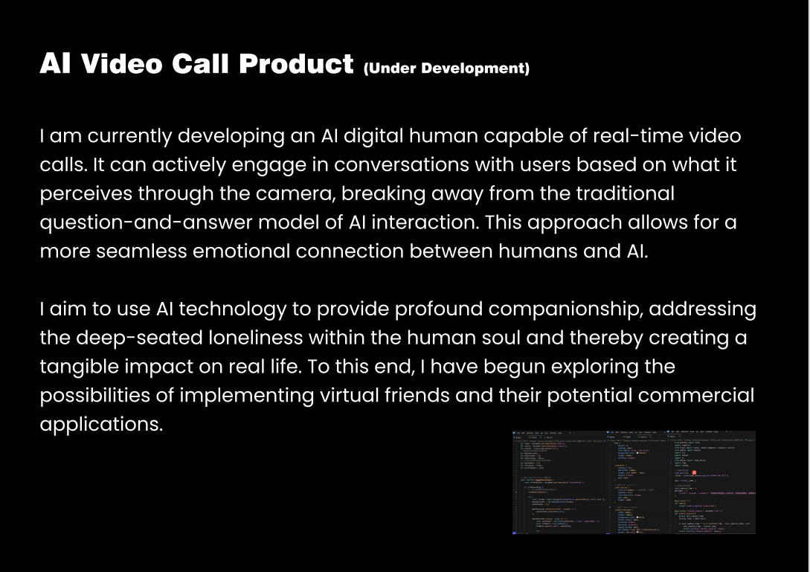

**Introduction**

\-
This is an AI companion plush pet designed for young, high-end consumers.

**Product Features**

Emotional Interaction, Motion Interaction, and Language Interaction
  (Includes emotional nurturing, habit formation, and conversational development)

Equipped with motion and language interaction capabilities, such as responding with movements and feedback when touched. It can be taught to speak through organized unit models, adapt its language to different user groups and scenarios, and offer emotional value by using algorithms to assess emotions and provide companionship.

**Interaction Design**

Includes touch interaction, voice interaction, and more. For example, the plush toy responds with motions when hugged and reacts differently based on various conversational styles during communication with users.

**Process**

At first I did this.

I want to develop this product into a commercialized offering.
