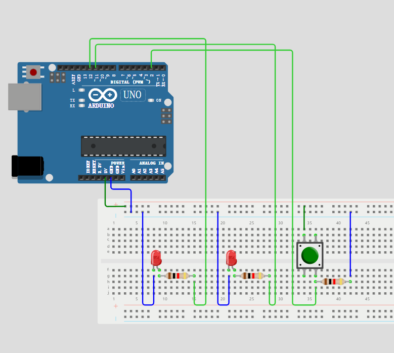
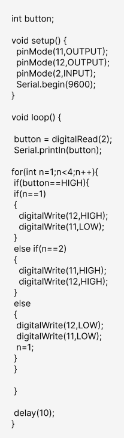
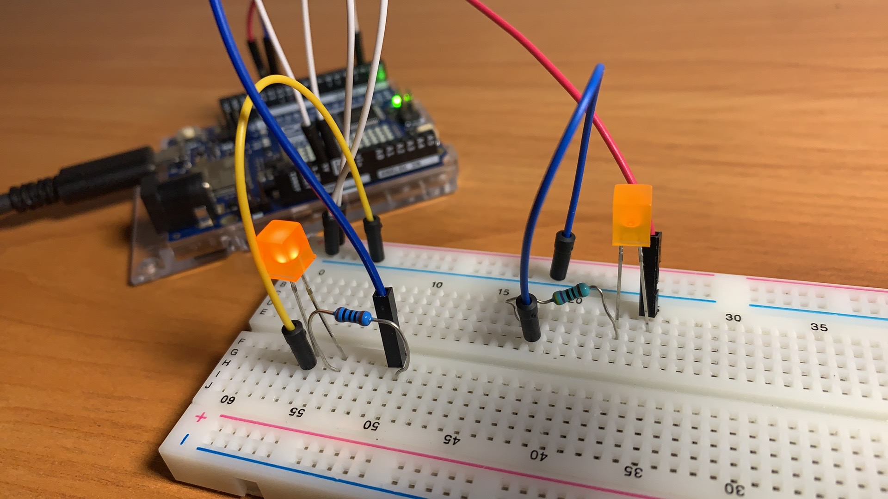
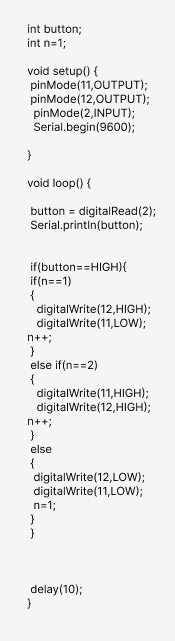
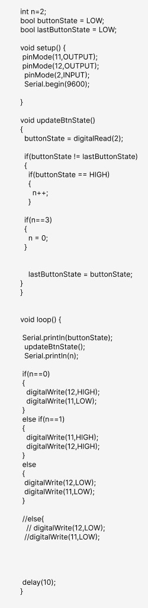
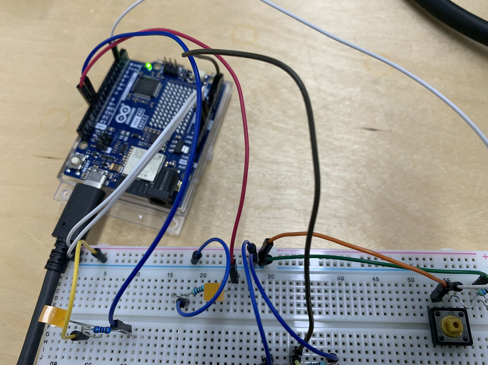
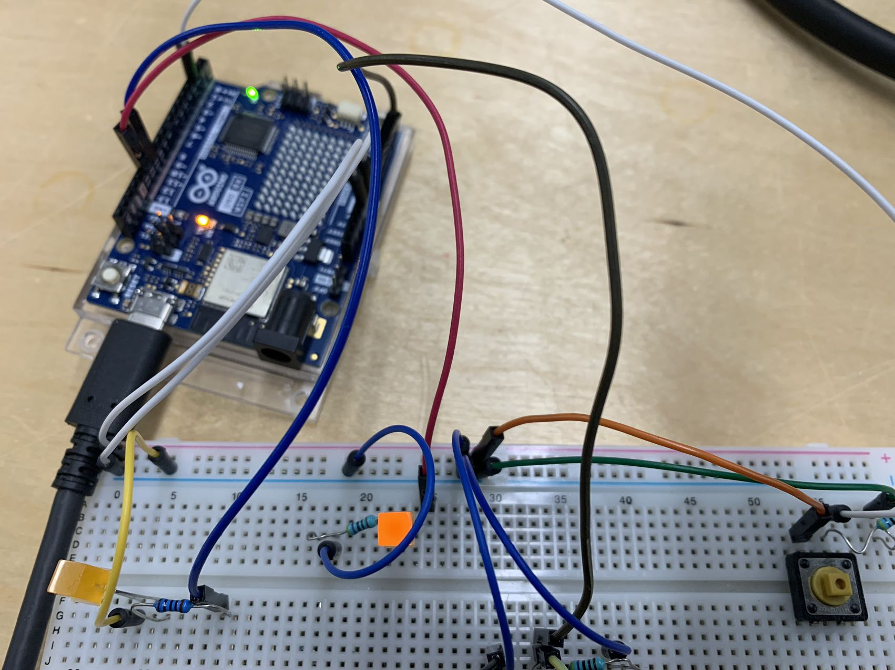
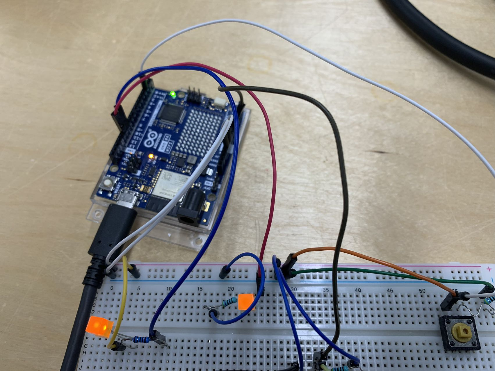
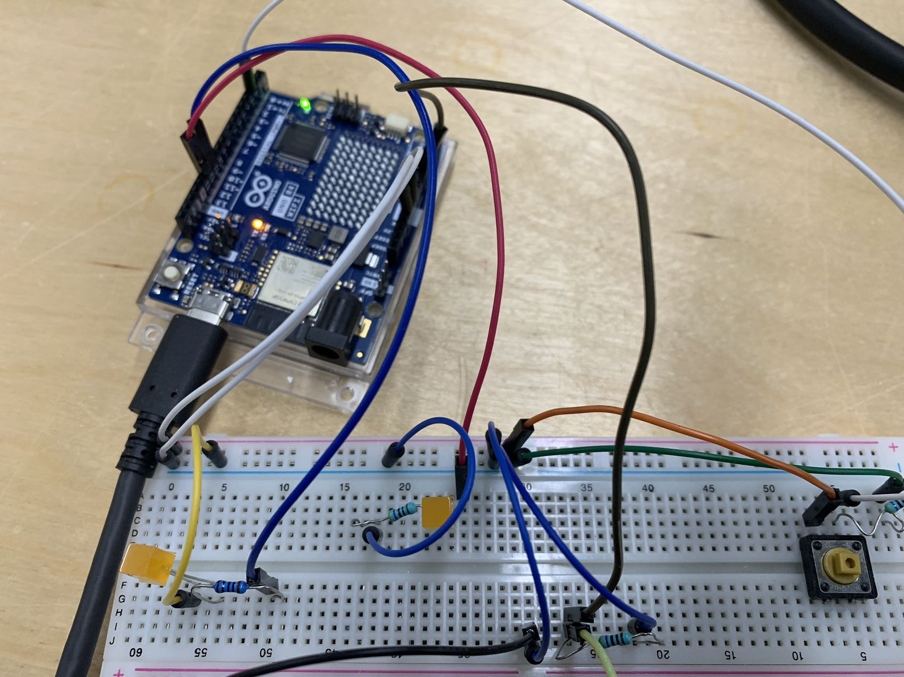

INSTRUCTURE:

Read a momentary switch being pressed

When the program starts, both LEDs are off

When the switch is pressed once, the first LED turns on

When the switch is pressed the second time, the second LED turns on (the first one should also still be on)

When the switch is pressed the third time, both LEDs turn off

Repeat this same cycle of LEDs turning on and off in sequence (off, one LED, two LEDs, off…)

Wiring Diagram:

Wiring:

Attempt 1: 

Failure. After uploading the code, both small lights lit up. 

This code cannot correctly track the number of button presses and switch between three states. The for loop inside it executes continuously in each iteration of the loop() function, rather than based on the number of button presses.

Attempt 2: 

Failure. The two small lights automatically alternate flashing, and the button does not function.

Attempt 3: 

Success. Store the button state, treating pressing and releasing the button as a complete button press.

