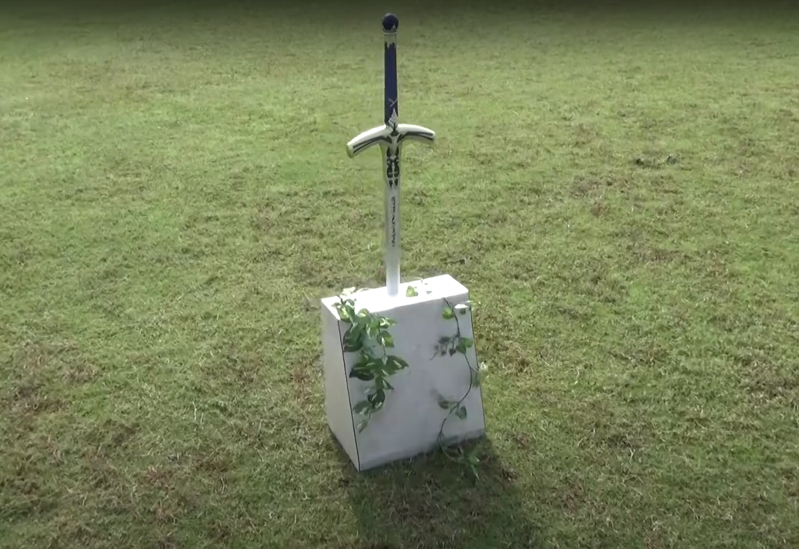
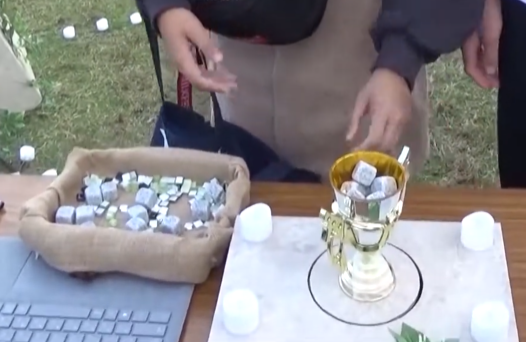

I. Find an interesting existing Alt+Ctrl Interface

The Sword

* <https://www.youtube.com/watch?v=Kwi6uEYIEXU>

"The sword was born about 100 years ago. And long time, anyone could not pull out the sword. But, if make a Holy Grail that weighs the same as the artifact, can pull out the sword."

II. Come up with a concept for my own Alt+Ctrl Interface

III. Complete the MyCourses introductions for the 3D Printing and Laser Cutter workshops (DONE)

* <https://mycourses.aalto.fi/course/view.php?id=23273>
* [https://mycourses.aalto.fi/course/view.php?id=19552](https://mycourses.aalto.fi/course/view.php?id=23273)
