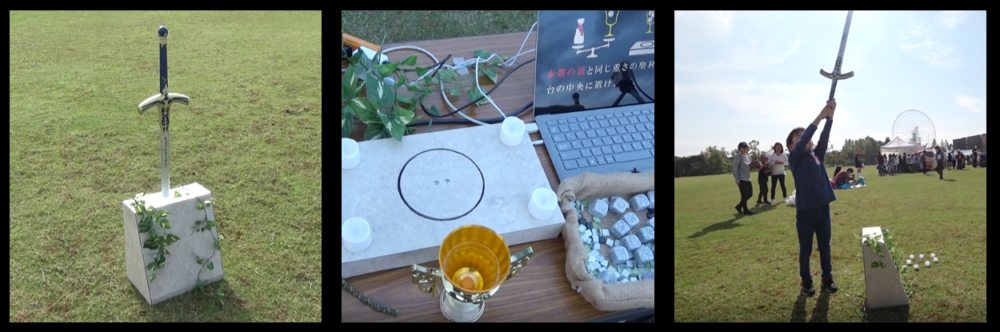
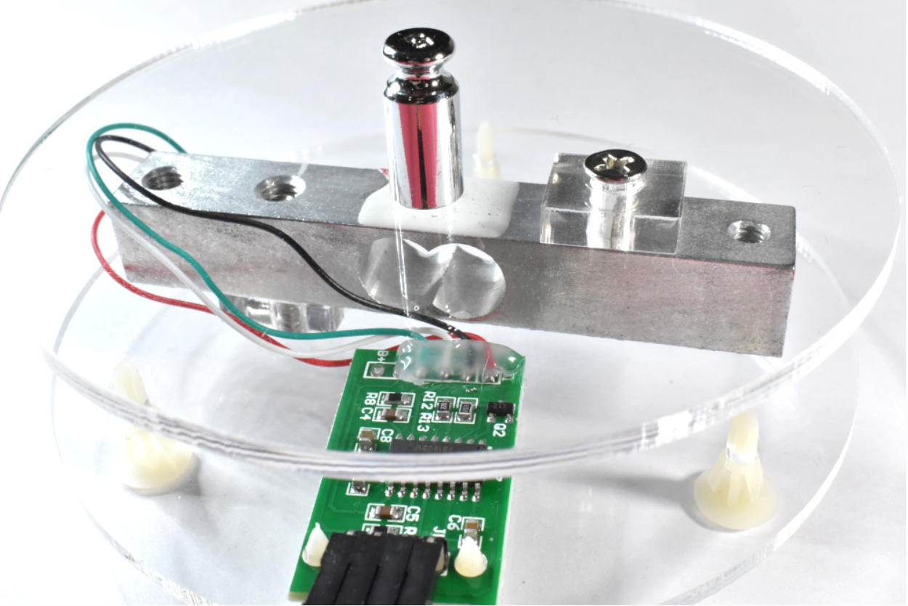
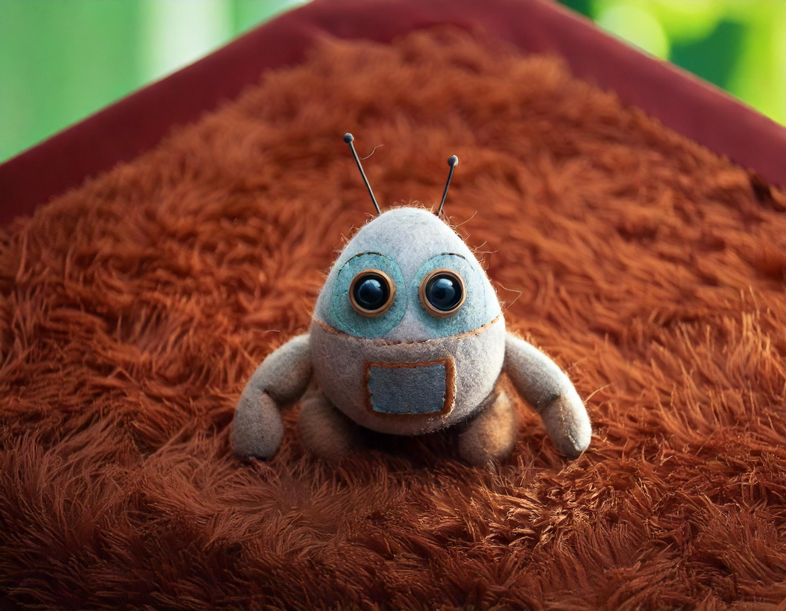

I. Find an interesting existing Alt+Ctrl Interface

The Sword

* <https://www.youtube.com/watch?v=Kwi6uEYIEXU>

"The sword was born about 100 years ago. And long time, anyone could not pull out the sword. But, if make a Holy Grail that weighs the same as the artifact, can pull out the sword."

\-

\-

II. Come up with a concept for my own Alt+Ctrl Interface

1. Explore one sensor

Arduino Weighing Scale with Load Cell and HX711

* <https://makersportal.com/blog/2019/5/12/arduino-weighing-scale-with-load-cell-and-hx711>

\-

2. Things that could be detected with the sensor and objects that could the sensor be attached to

This sensor can be connected to a small basin for weighing.

\-

3. Come up with a new game

Two key points of the AI Companionship Robot: 

* Sharing common life experiences with the user
* Being able to actively interact with the user

Design: A robot positioned by the window or on the dining table that can use its camera to capture and recognize the user's home and window views. When it detects the user at the dining table, it proactively engages in conversations based on real-life data. Users can place objects in the small dish on the robot to express their psychological energy needs. The AI adjusts its personality traits based on the weight of the objects to provide appropriate companionship to the user.

\-

4. Sketches

\-

\-

III. Complete the MyCourses introductions for the 3D Printing and Laser Cutter workshops (DONE)

* <https://mycourses.aalto.fi/course/view.php?id=23273>
* [https://mycourses.aalto.fi/course/view.php?id=19552](https://mycourses.aalto.fi/course/view.php?id=23273)
