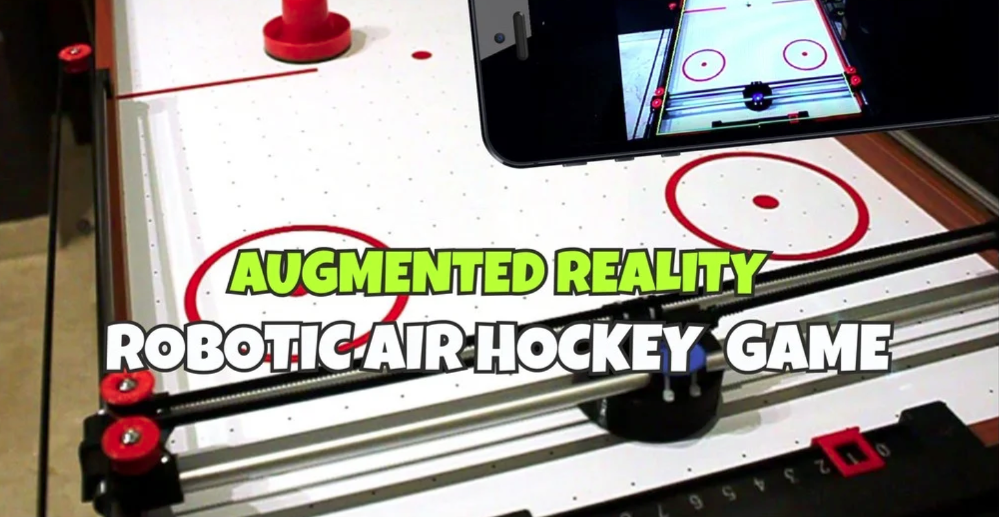

**Final Project Outline** 

I’ve really enjoyed some of the works I’ve seen on the course – the self-wrapping space cloth was great, and I also found the Chinese piece with magnetic liquid metal quite beautiful. When I combined this with my long love for kinetic sculptures and long-overdue, unsatisfied need to build a sand drawer, I decided I wanted to do some kind of curious piece of furniture – a surprising table of sorts, enjoyable to watch, doing curious things.

There are plenty of projects with sand drawers online, so that will not obviously do, fun to make but boring and unoriginal. A place to start, anyway: It’s a simple thing, a sand drawer – a 2-axis CNC setup on the bottom, magnet to move a metal ball on a plate, and sand where the ball leaves a mark. Good structure to build on, so I need a 2-axis setup.

I’m thinking of a square table, perhaps 600x600 mm and about 900 mm high (good working height). An plywood box on legs sounds solid. I’m not going to use too much energy on that, and when done right, it will have a finished look anyway + the work should be under a thin glass, easy to find. The box should incorporate the CNC setup and the work itself, so maybe 300 mm of height: 100 mm for the engine room and 200 for the show room? Plus 600 mm IKEA legs, and we’re at 900 mm. Solid.

The CNC projects found online are all too complicated; there must be a simpler setup around this size – and there is: I can snatch the openly available plans from an air-hockey robot we tested at work a few years back: just a few tubes, easy-to-find parts, and 3D printing. The project is old and the authors website is down, but the 3D print files are still on Instructables (https://www.instructables.com/Air-Hockey-Robot-EVO/). Some adjustments to the STL files, and this setup will move my magnet. I already have the stepper motors and metal tubes, I’ll just need to find the motor control circuit and any CNC shield; shouldn’t be too hard.

For the show case floor I’m thinking of laser-cutting a ø450 mm circle out of some brightly coloured acrylic that has great light-scattering qualities and lighting it by integrating LEDs into the fasteners: the metal ball will dance on this lit-up dance floor.  I should still have some Black 3.0 or Musau Black somewhere, so rest of the inside of the box should be light-sucking dark: to compensate, I should probably get some ultra-bright LEDs - if there are none in the workshop, I’ll just salvage a few from somewhere. Making the LED-controlling unit should be a breeze.

From here on, the idea gets more foggy – what will make the ball move? I’m thinking of creating some kind of sensor setup to get the ball dancing, but don’t yet have no idea of what that might be. Proximity? Capacitive? Checking the color of the clothes the visitors are wearing? I’ll leave this and the more creative part to emerge while work under the hood.

Next steps:

1. Build a working 2-axis setup
2. Code it to obey
3. Build the box
4. Build the acrylic floor with LEDs
5. Use the great idea that emerges to move the ball

To be continued.
