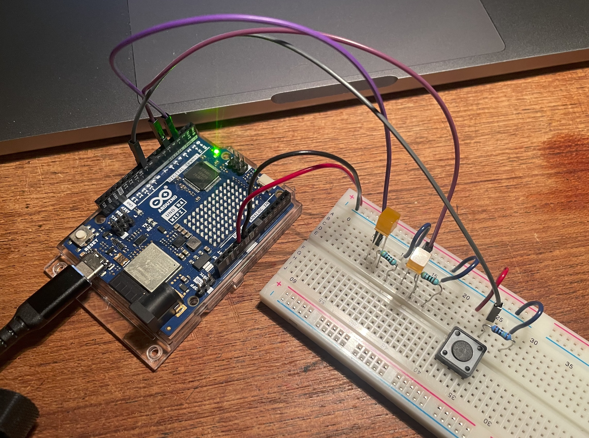

Leds on and off.

Circuit:

\- Leds with resistors to pins 3 and 5.

\- Voltage divider with button to pin 9.

Code:

\- Button input high adds 1 to a variable.

\- If var=1, then led 1 output high.

\- if var=2, then leds 1 output and 2 high.

\- if var=3, then leds output low and var back to 0.



```
int led1=3;
int led2=5;
int btnPin=9;
int btnVal=0;
int stage=0;


void setup() {
  // put your setup code here, to run once:
pinMode(btnPin, INPUT);
pinMode(led1, OUTPUT);
pinMode(led2, OUTPUT);
  Serial.begin(9600);
}

void loop() {
btnVal = digitalRead(btnPin);
if(btnVal==HIGH){
  stage=stage+1;
  delay (1000);}
if(stage==1){
  digitalWrite(led1,HIGH);
    }
    if(stage==2){
  digitalWrite(led1,HIGH);
    digitalWrite(led2,HIGH);
    }
        if(stage==3){
  digitalWrite(led1,LOW);
    digitalWrite(led2,LOW);
    stage=0;
    }
  Serial.println(stage);
  delay (100);

  
  
  // put your main code here, to run repeatedly:

}

```
