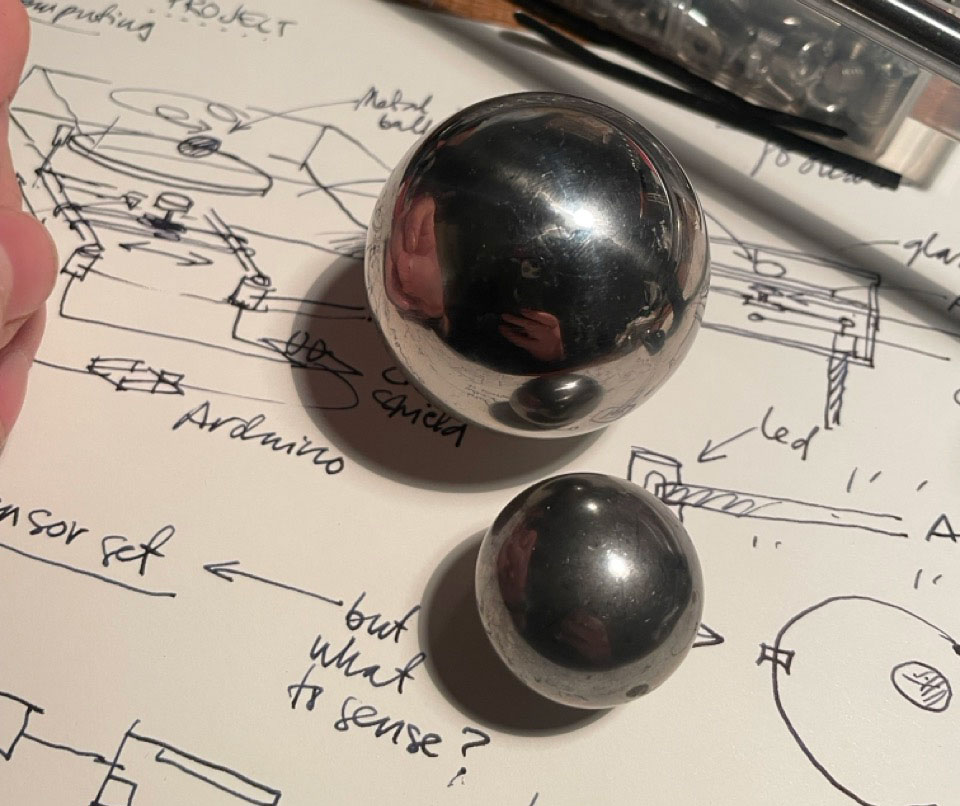
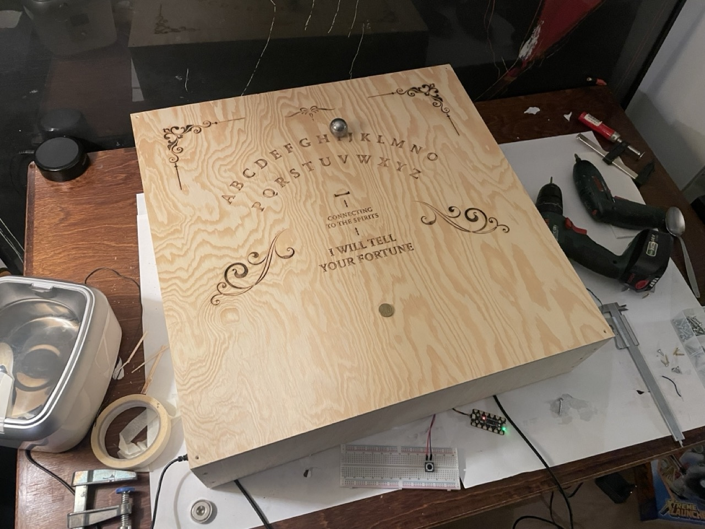
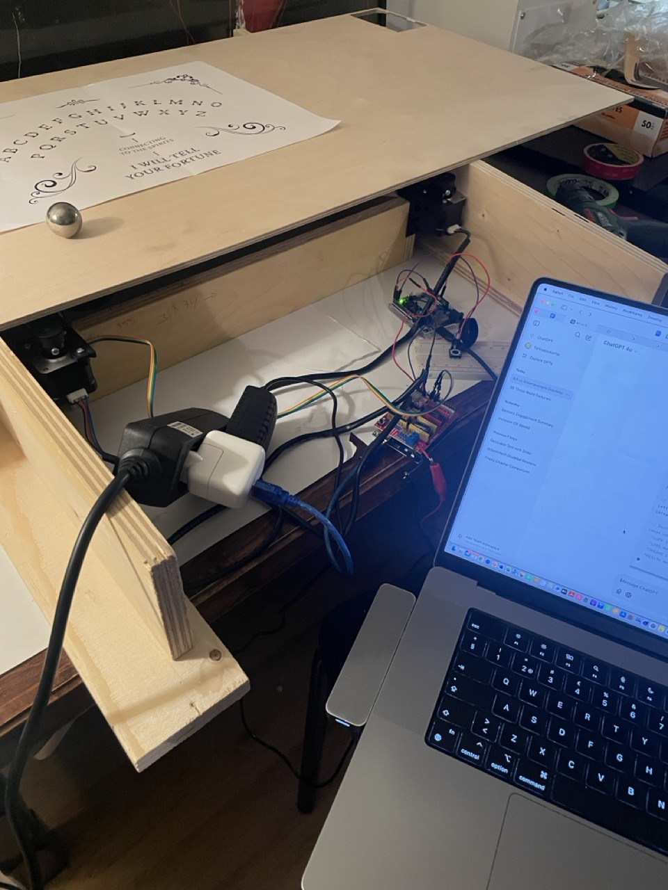
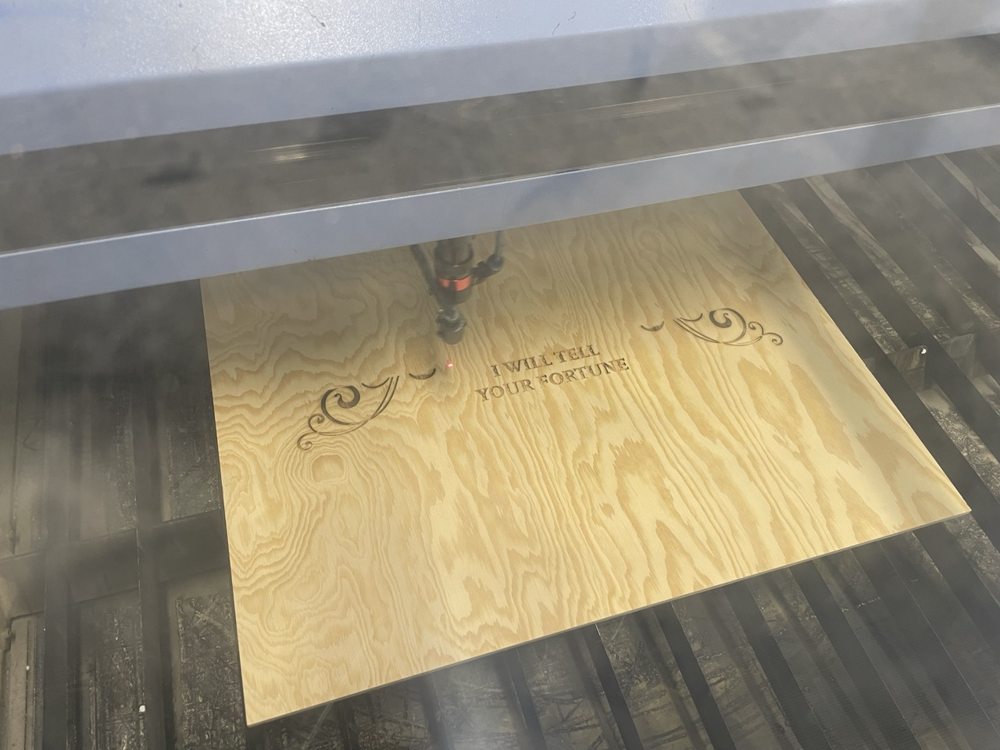
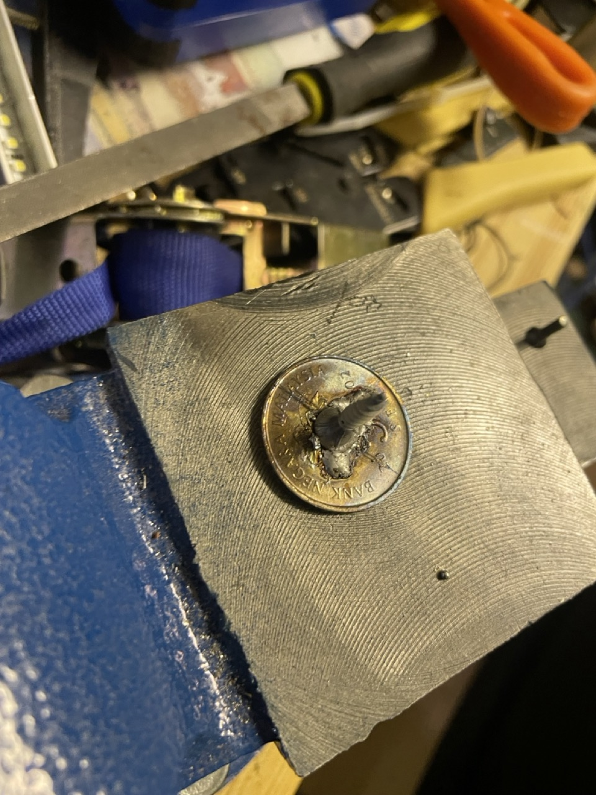
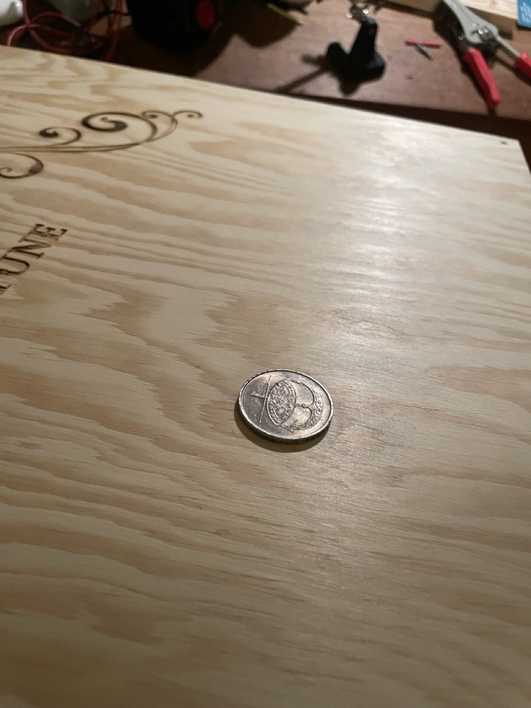
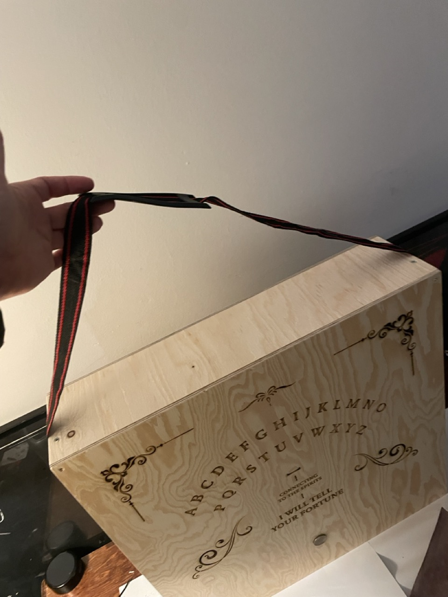
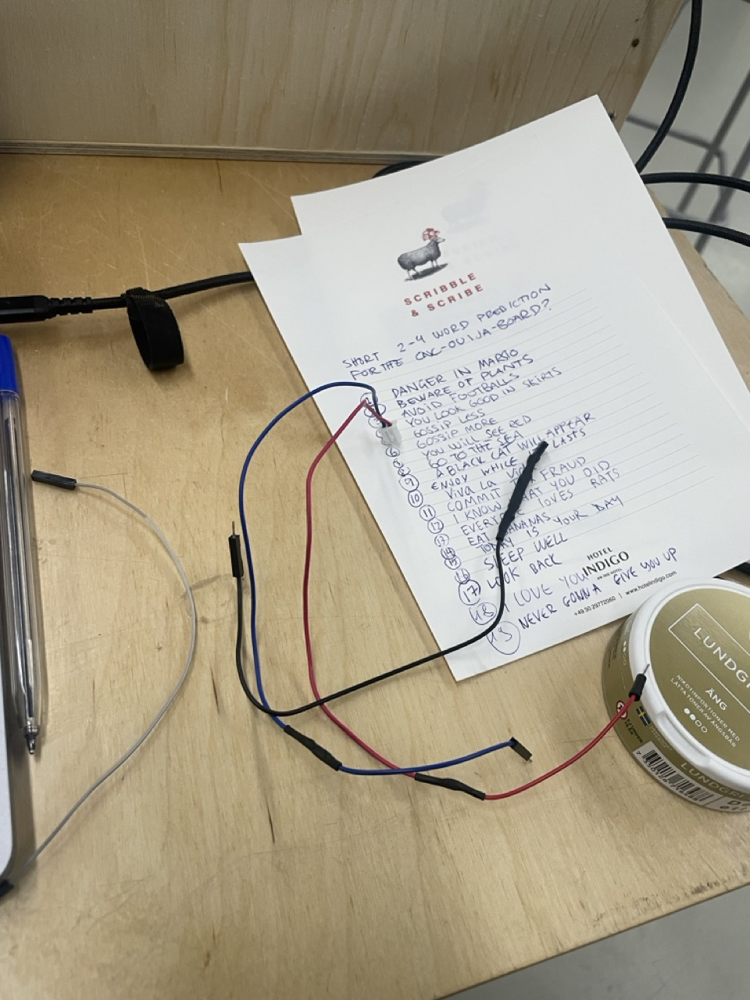
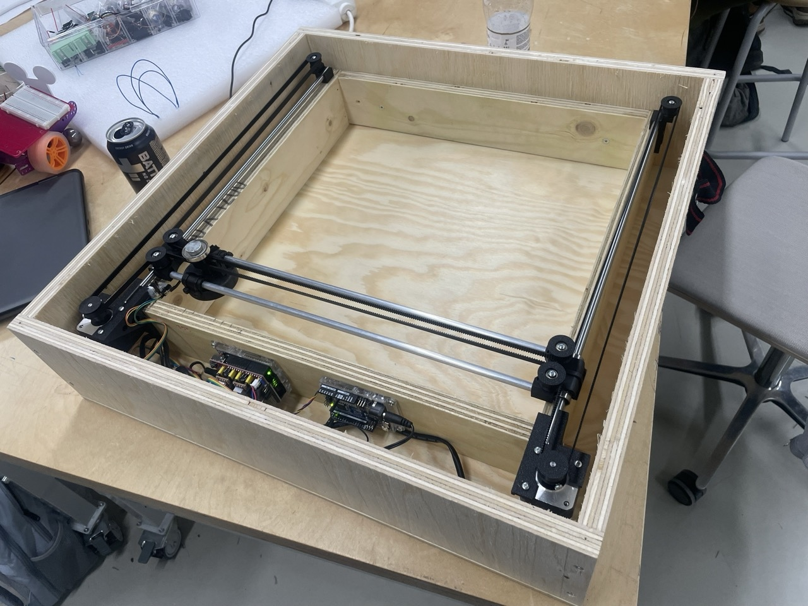
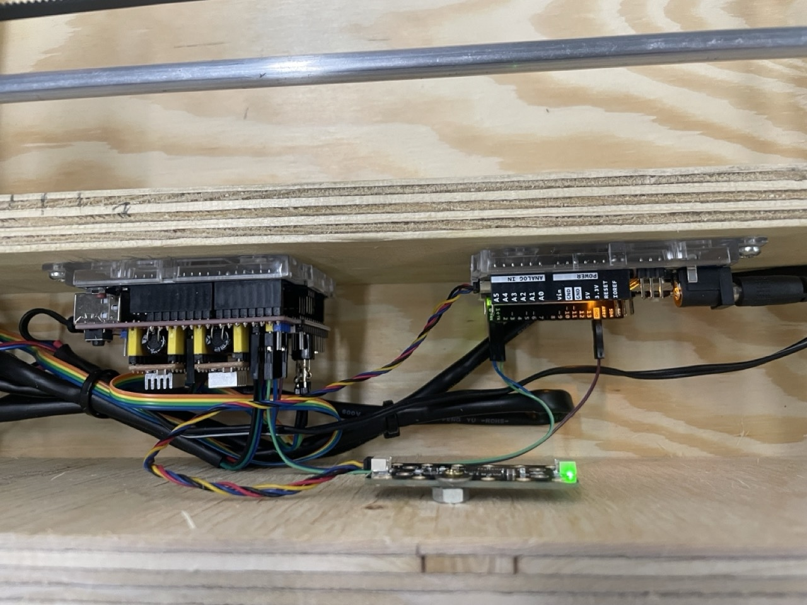

Now that I got the stepper motors and belts working physically, I needed to make the setup obey as a CNC machine - and to figure out how it would fulfil its role as a Physical Computing project.

Here were the steps:

* Added limit switches to donw-left corner
* Bought a CNC Shied 3.0 just to realise it does not work with UNO R4 (wrong processor)
* Bought a UNO R3
* Installed GRBL to R3
* Figured out the settings (for XY-plane, homing sequence and H-BOT configuration)
* Installed GRBL to R3 again
* Installed Unversal G-Code Sender to my mac
* Got to know the limits of my setup (broke it down 3 times, good thing it's pretty flimsy)
* Figured out the speed, soft limits, scale, step count etc for my setup - plenty of good sites for this, unfortunately did not keep record. Chat GPT was also able to answer many questions.
* Learned how the G-Code works, and created test codes with chatGPT. Broke and fixed the machine 2 more times.
* When the H-BOT/GRBL -setup was ok, learned how to make an R4 and the R3 talk to each other via the RX and TX pins over software serial: now all I needed to do was to make an Arduino code that sends G-code. Easy, right?
* Finally got the GREAT IDEA of making an ouija-board (also the first tangible idea; time was running out)
* Setbacks with the ferrofluid tank (see Sidetrack), so desided to go with plan B: plywood and metal ball.
* Designed the ouija layout with letters from A to Z, built a 660x660 box from plywood and burned my design to the cover (cheap plywood, cound not use Aalto laser, had to use an industrial type instead)
* Soldered a screw to a coin for a capacitive button, just like in one of my tests before.
* Box ready, some generic fortunes created, all electronics in place, used UGS to point out the coordinates, now code. Wait, I do not know how to do all of that?
* Crazy times, I used ChatGPT a lot. With a looong discussions with LLM, the “automatic generation” of the code took approximately eight hours of chatting and tweaking.
* The working method was pretty good for a dad burning midnight oil after the kids went to sleep: even if the code did not work as expected, it usually technically worked when uploading to the Arduino and kept frustration at a minimum.
* Here’s how the code flows (after all tweaks)

  * Includes SoftwareSerial.h for the TX/RX communication, stdlib.h for  random functions and Adafruit_MPR121.h and wire.h for the capasitive sensor
  * Defines pins 0 and 1 for serial communication
  * Setup and seetting for the Adafruit_MPR121.h – copied this from my previous code
  * Gives coordinates for each letter in a space of 370 x 350
  * Defines a list of fortunes
  * Function for startup: wait 1000 ms and send G-code to unlock, home and zero the GRBL
  * Function for the touch sensor: just one touch for start of the cycle and wait unresponsive until the machine is back at start again.
  * Function to ignore any G-Code over 370x350 space (had enough of flying machine parts)
  * Function to select a random sentence
  * Function to point a coordinate to each letter and space
  * Function to generate G-Code out of the sentence's coordinates and to make a slight detour if there are two same letters in a row
  * Function to send the G-Code over software serial
  * Function to wait for an “Idle” status after each g-code line before sending the next line (a bit slow but now it does not skip letters)
  * loop to run all this in order

Summa summarum: Would not have finished this without an LLM, in time anyway, but the code design is all mine and I know what each line does and why it's there. And got it working! Pretty proud! Here it is:

```
#include <SoftwareSerial.h>
#include <stdlib.h>
#include "Wire.h"
#include "Adafruit_MPR121.h"

const int TX_PIN = 1;
const int RX_PIN = 0;
const int BUTTON_PIN = 2;
SoftwareSerial grblSerial(RX_PIN, TX_PIN);

Adafruit_MPR121 cap = Adafruit_MPR121();

const int touchPad = 0;
bool touchEnabled = true;
unsigned long lastTouchTime = 0;
const int debounceDelay = 50;

int touchThreshold = 10;
int releaseThreshold = 6;

struct LetterCoord {
  char letter;
  float x;
  float y;
};

void sendCommand(const char *command, bool waitForOk = true);
void sendGCode(const char *command, float x, float y, bool includeDelay = true);
void generateGCode(const char *sentence);
bool isTouchDetected();
const char *selectRandomSentence();
LetterCoord findLetterCoord(char letter);
bool isWithinBounds(float x, float y);
void waitUntilIdle();

LetterCoord alphabet[] = {
  {'A', 0.00, 220.00}, {'B', 25.00, 245.00}, {'C', 45.00, 265.00},
  {'D', 70.00, 280.00}, {'E', 95.00, 295.00}, {'F', 125.00, 305.00},
  {'G', 150.00, 310.00}, {'H', 185.00, 310.00}, {'I', 215.00, 310.00},
  {'J', 230.00, 305.00}, {'K', 260.00, 295.00}, {'L', 285.00, 280.00},
  {'M', 310.00, 265.00}, {'N', 335.00, 245.00}, {'O', 355.00, 220.00},
  {'P', 45.00, 195.00}, {'Q', 65.00, 215.00}, {'R', 95.00, 235.00},
  {'S', 115.00, 245.00}, {'T', 145.00, 255.00}, {'U', 175.00, 260.00},
  {'V', 205.00, 255.00}, {'W', 240.00, 245.00}, {'X', 270.00, 235.00},
  {'Y', 295.00, 215.00}, {'Z', 315.00, 195.00}, {' ', 180.00, 205.00}
};

LetterCoord step1 = {'1', 180.0, 75.0};
LetterCoord step2 = {'2', 180.0, 145.0};

const char *sentenceList[] = {
  "LUCK IS NEAR", "TROUBLE LIES AHEAD", "WEALTH IS COMING",
  "LOSS MAY HURT", "LOVE WILL GROW", "A FRIEND BETRAYS",
  "DREAMS COME TRUE", "MISTAKES WILL COST", "HELP IS NEAR",
  "HEALTH MAY WORSEN", "SUCCESS IS YOURS", "LIES WILL SPREAD",
  "A GIFT AWAITS", "TRUST MAY BREAK", "JOY SURROUNDS YOU",
  "ANGER WILL RISE", "HAPPINESS IS NEAR", "FEAR WILL TEST",
  "TRAVEL BRINGS JOY", "DANGER APPROACHES", "PEACE FILLS YOU",
  "REGRET WILL LINGER", "FORTUNE FAVORS YOU", "A SECRET HURTS",
  "HOPE GUIDES YOU", "LOSS WILL PASS", "FRIENDS WILL HELP",
  "FATE WILL INTERVENE", "LIGHT SHINES AHEAD", "DARKNESS MAY RETURN",
  "DANGER IN MARSIO", "BEWARE OF PLANTS", "AVOID FOOTBALLS",
  "YOU LOOK GOOD IN SKIRTS", "GOSSIP LESS", "GOSSIP MORE",
  "YOU WILL SEE RED", "GO TO THE SEA", "BLACK CAT WILL APPEAR",
  "ENJOY WHILE IT LASTS", "VIVA LA VIDA", "COMMIT TAX FRAUD",
  "I KNOW WHAT YOU DID", "EVERYONE LOVES RATS", "EAT BANANAS",
  "TODAY IS YOUR DAY", "SLEEP WELL", "LOOK BACK", "I LOVE YOU",
  "NEVER GIVE UP", "MATRIX HAUNTS YOU", "SEED YOUR FUTURE",
  "SHEEP WILL RISE", "IT WILL BE OVER SOON", "BEWARE OF SUCCESS",
  "HANG IN THERE", "BOTTOMS UP", "BEER NEVER ENDS", "DONT PANIC",
  "BIG CHICKEN COMING", "HELP IM IN THE BOX", "CATS WILL TAKE OVER",
  "ENEMY IN AGRID", "ASK FOR PARANOID", "ART WILL OVERCOME", "YOU MAY TRIP",
  "TRUST STRANGERS", "ALWAYS GO LEFT", "DONT BE AFRAID", "DEMO EFFECT DAY",
  "NEXT ONE WILL WORK", "NEVER GROW UP", "I AM BEHIND YOU"
};
const int sentenceCount = sizeof(sentenceList) / sizeof(sentenceList[0]);

void setup() {
  Serial.begin(115200);
  grblSerial.begin(115200);
  Wire1.begin();

  if (!cap.begin(0x5A, &Wire1)) {
    Serial.println("MPR121 not found, check wiring?");
    while (1);
  }
  Serial.println("MPR121 found!");

  cap.setThresholds(touchThreshold, releaseThreshold);

  Serial.println("Waiting for plotter to initialize...");
  delay(3000);

  Serial.println("Initializing GRBL...");

  sendCommand("$X");
  delay(500);

  sendCommand("$H");
  delay(500);

  sendCommand("G92 X0 Y0");
  Serial.println("Set (0,0) after homing");

  Serial.println("Initialization Complete. Ready for Commands.");
}

void loop() {
  if (touchEnabled && isTouchDetected()) {
    touchEnabled = false;
    Serial.println("Touch detected. Starting plot...");

    const char *randomSentence = selectRandomSentence();

    generateGCode(randomSentence);

    Serial.println("Plot complete. Touch re-enabled.");
    touchEnabled = true;
  }
}

const char *selectRandomSentence() {
  int randomIndex = random(0, sentenceCount);
  return sentenceList[randomIndex];
}

LetterCoord findLetterCoord(char letter) {
  letter = toupper(letter);
  for (int i = 0; i < sizeof(alphabet) / sizeof(alphabet[0]); i++) {
    if (alphabet[i].letter == letter) {
      return alphabet[i];
    }
  }
  return {'?', 0.0, 0.0};
}

void generateGCode(const char *sentence) {
  Serial.println("; Program Start");
  sendCommand("G21 ; Set units to millimeters");
  sendCommand("G90 ; Absolute positioning");
  sendCommand("G17 ; Select XY plane");

  sendGCode("G0", 0.0, 0.0, false);

  Serial.print("; BEGIN: ");
  Serial.println(sentence);

  sendGCode("G0", step1.x, step1.y);
  sendGCode("G0", step2.x, step2.y);

  for (int i = 0; sentence[i] != '\0'; i++) {
    char letter = sentence[i];
    LetterCoord currentCoord = findLetterCoord(letter);

    if (currentCoord.letter == '?') continue;

    if (i > 0) {
      char previousLetter = sentence[i - 1];
      LetterCoord previousCoord = findLetterCoord(previousLetter);

      if (toupper(letter) == toupper(previousLetter)) {
        sendCommand("G4 P1");

        float detourY = previousCoord.y - 30.0;
        if (detourY < 0) detourY = 0;

        sendGCode("G0", previousCoord.x, detourY, false);
        sendGCode("G0", previousCoord.x, previousCoord.y, false);

        sendCommand("G4 P1");
      }
    }

    sendGCode("G0", currentCoord.x, currentCoord.y);
    waitUntilIdle();
  }

  sendGCode("G0", 0.0, 0.0, true);
  waitUntilIdle();

  Serial.println("; Program End");
  Serial.print("; END: ");
  Serial.println(sentence);
}

void sendGCode(const char *command, float x, float y, bool includeDelay) {
  if (!isWithinBounds(x, y)) {
    Serial.println("Warning: Coordinate out of bounds. Command skipped.");
    return;
  }

  char xStr[10], yStr[10];
  dtostrf(x, 1, 2, xStr);
  dtostrf(y, 1, 2, yStr);

  String gcode = String(command) + " X" + xStr + " Y" + yStr;
  sendCommand(gcode.c_str());

  if (includeDelay) {
    sendCommand("G4 P1");
    waitUntilIdle();
  }
}

void sendCommand(const char *command, bool waitForOk) {
  grblSerial.println(command);
  Serial.print("Sent: ");
  Serial.println(command);

  if (waitForOk) {
    unsigned long startTime = millis();
    while (true) {
      if (grblSerial.available() > 0) {
        String response = grblSerial.readStringUntil('\n');
        response.trim();
        Serial.println("Response: " + response);
        if (response.equals("ok")) break;
        if (response.startsWith("error")) {
          Serial.println("GRBL Error: " + response);
          break;
        }
      }
      if (millis() - startTime > 5000) {
        Serial.println("Warning: Timeout while waiting for OK.");
        break;
      }
    }
  }
}

bool isTouchDetected() {
  uint16_t touchState = cap.touched();
  if (touchState & (1 << touchPad)) {
    unsigned long currentTime = millis();
    if ((currentTime - lastTouchTime) > debounceDelay) {
      lastTouchTime = currentTime;
      return true;
    }
  }
  return false;
}

bool isWithinBounds(float x, float y) {
  return (x >= 0 && x <= 370 && y >= 0 && y <= 350);
}

void waitUntilIdle() {
  unsigned long startTime = millis();
  while (true) {
    grblSerial.println("?");
    delay(500);

    if (grblSerial.available() > 0) {
      String status = grblSerial.readStringUntil('\n');
      Serial.println("Status: " + status);

      if (status.startsWith("<Idle")) {
        break;
      }
    }

    if (millis() - startTime > 10000) {
      Serial.println("Warning: Timeout while waiting for idle state.");
      break;
    }
  }
}
```

There are still some parts not needed (like the debug button and code for G-code delays and parsing small letters to big ones), but I did not dare to touch it any more after I got it working.

The G-code looks like this:

Startup:

```
$X ; Unlock
$H ; Home
G92 X0 Y0 ; Set zero
```

And a fortune:

```
G21 ; Set units to millimeters
G90 ; Absolute positioning
G17 ; Select XY plane
G0 X0.00 Y0.00 ; start from zero, just in case

; BEGIN: MISTAKES WILL COST
G0 X180.00 Y75.00 ; step 1
G0 X180.00 Y145.00 ; step 2
G0 X310.00 Y265.00 ; first letter - here "M"
G0 X215.00 Y310.00 ; second letter - here "I"
G0 X115.00 Y245.00 ; third letter - here "S"

; and so on, until at the end:

G0 X145.00 Y255.00 ; third letter - here "T"
G0 X0.00 Y0.00 ; return to zero.
; END: MISTAKES WILL COST
```

After each line the R4 asks "?" and waits for R3-GRBL to report - if it reports "RUN" or anything else, R4 waits and tries again, until R3 says the magic word "IDLE": only after this the next line is send, and so on.

That's it! Hard to believe it actally works - but it does. Some pictures with explanations:

Close to ready, still with debug button:



First working physical setup:



Burning the design:



Adding the coin:





Extra: Students travel with public transportation, right? (special thanks to Aalto parking policy)




Adding the Fortunes from the class and replacing some crappy serial wires:



Final setup inside the box:




