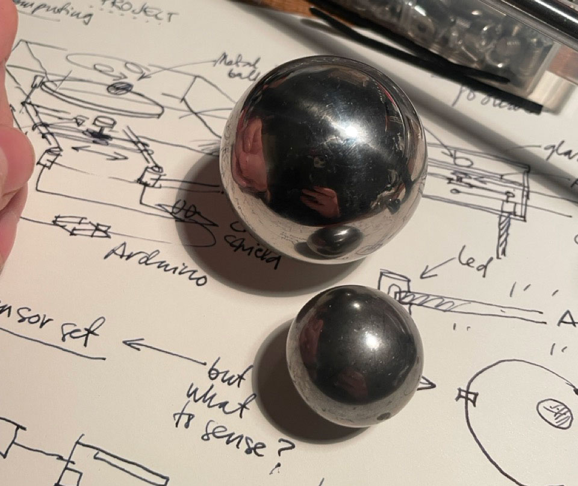

My Physical Computing Project was to make a H-BOT type CNC / plotter setup and use it for something unexpected. In the end, the project turned out to be a CtrlALT Ouija board, that gives questionable fortunes by moving a metal ball on an ouija board to anyone who touches the coin placed on top of the machine box.

In a nutshell, the project consists of a box incorporating a H-BOT setup made out of 3D-printed parts, metal rods, timing belt and two stepper motors. This all controlled by a Arduino Uno R3 running a GRBL software, and the R3 is controlled by an Uno R4 with the code made for this project. The R4 has a touch-sensitive capacitive sensor attached to it’s I2C, and the Fortune Cycle starts by touching the coin connected to the sensor. I designed the whole thing to work out-of-the-box by just plugging in the 12V power, and to be pretty moveable: the box is rather sturdy and even has a handle to move it around.

I experienced great fun and true frustration doing the project. I’m happy to say I didn’t know most of the skills I used in this project beforehand: I have a pretty solid background with electronics, so I wanted to do something I hadn’t tried before – always wanted to play with CNC setups, so now I have. Additionally, I haven’t coded a line in the last 20 years, so writing code for the Arduino was both fun and challenging – and completely different now that an LLM is there to assist.

During the project, I familiarised myself with a bunch of information we didn't learn in class and I didn’t know I needed, like GRBL, CNC shields, different Arduino processors, ferrofluid and things that do not work with it, software serial communication, G-Code, plotters, printers, and more, and I was happy to learn. Thank you all for a great course!
