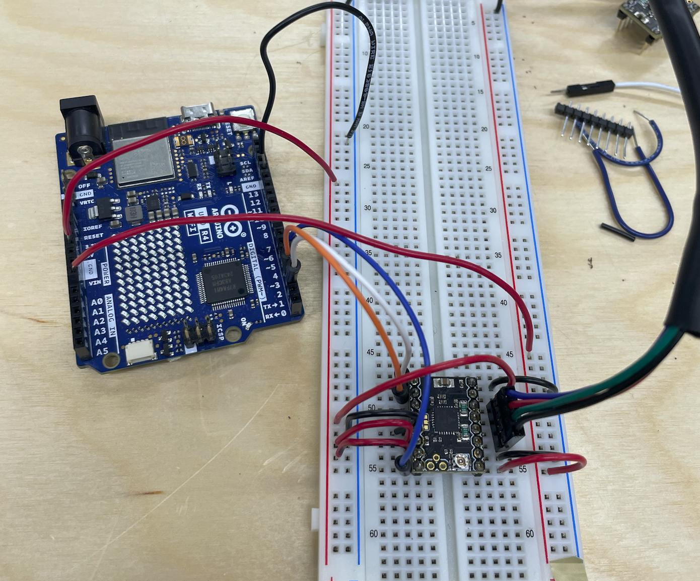
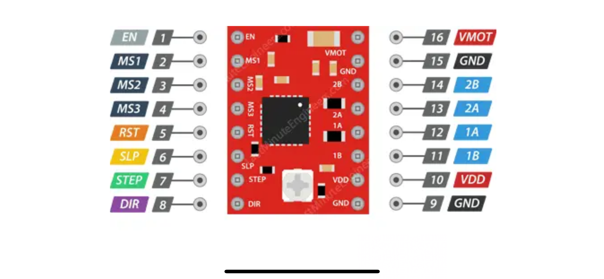
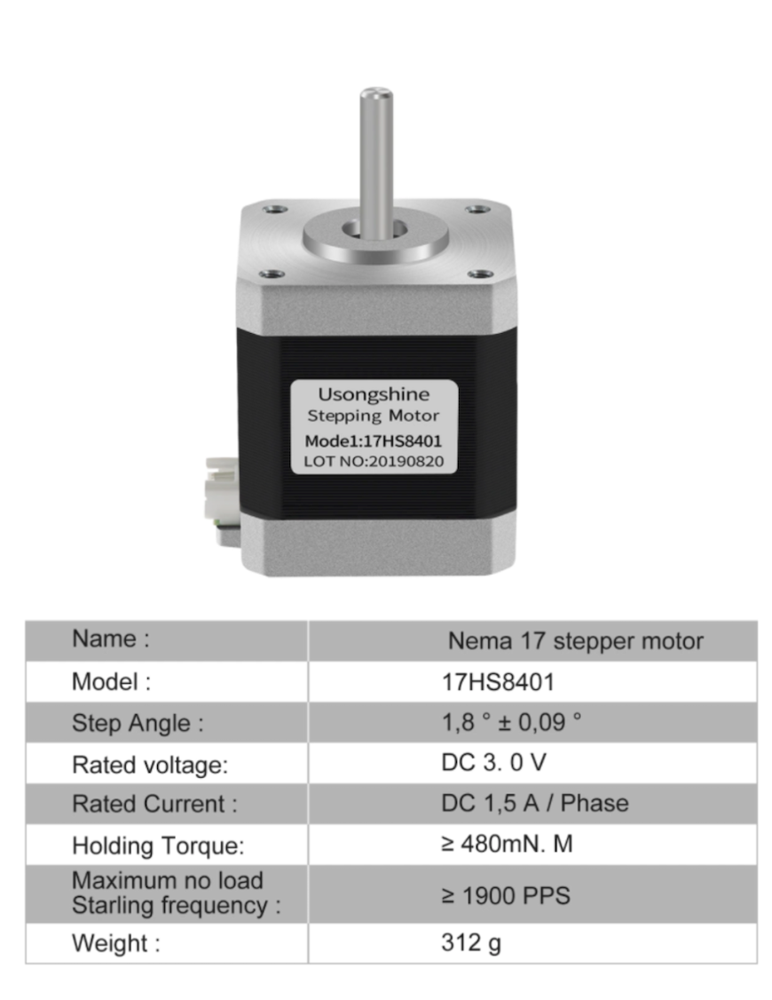

Brief Steps:

Step 1: First structure with two stepper motors done: Plywood, metal tubes and modified 3D-printed parts from the EVO project. 

Step 2: Trying to get the stepper motors to obey - not that easy, I think the SilentStepSticks from the workshops were broken:

Found some used A4988 from work, and tried them on the breadboard:

Great success, jos needed to change the setps to 200 from Matti's test code.

