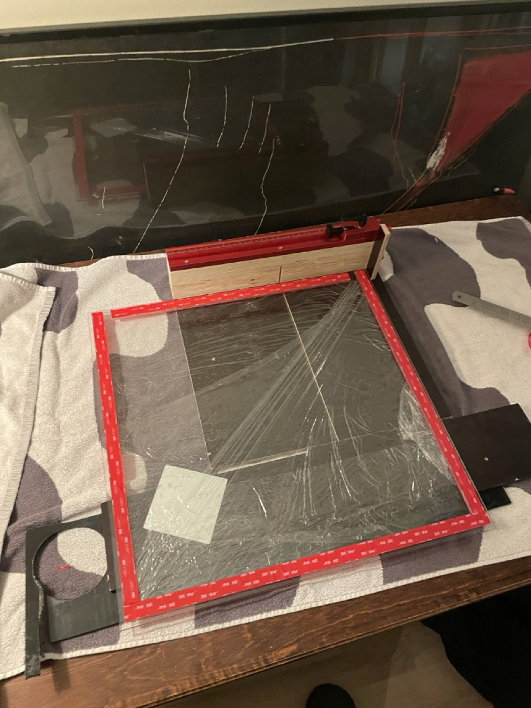
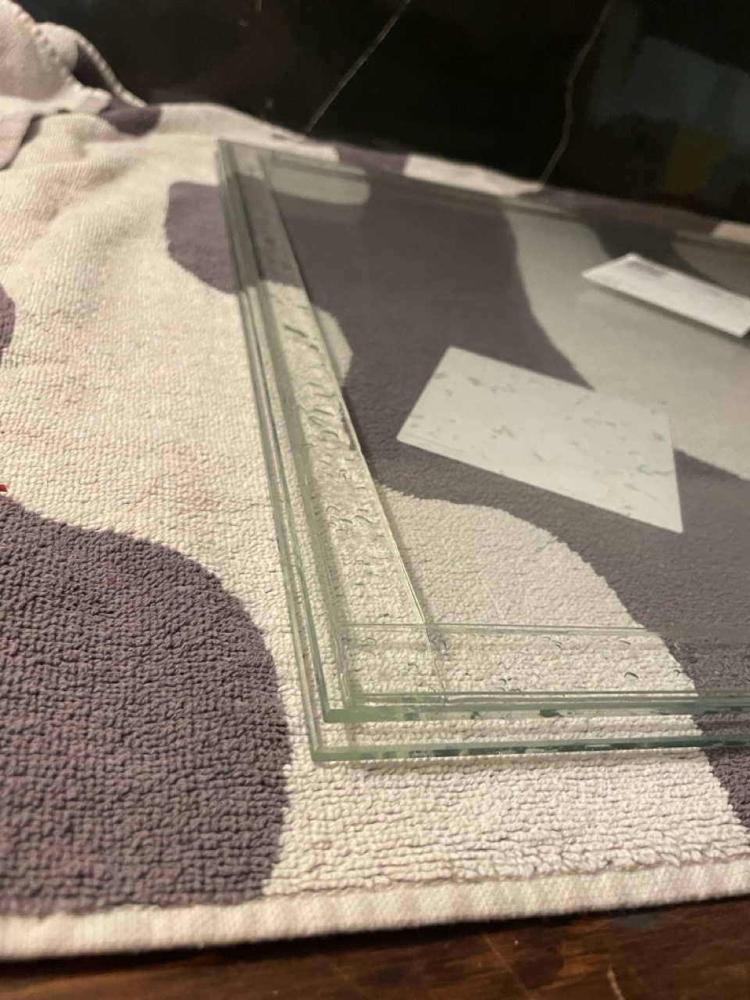
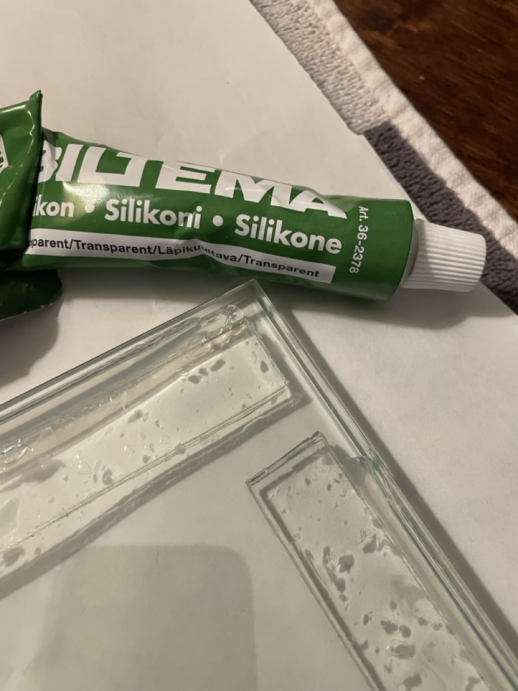
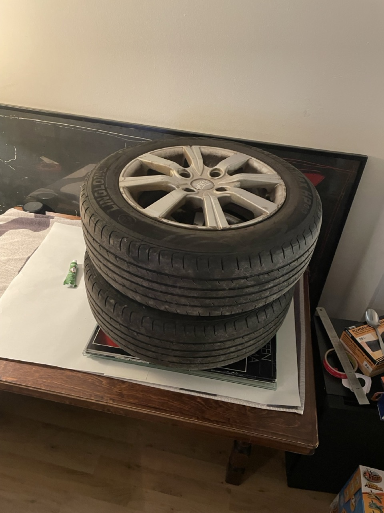
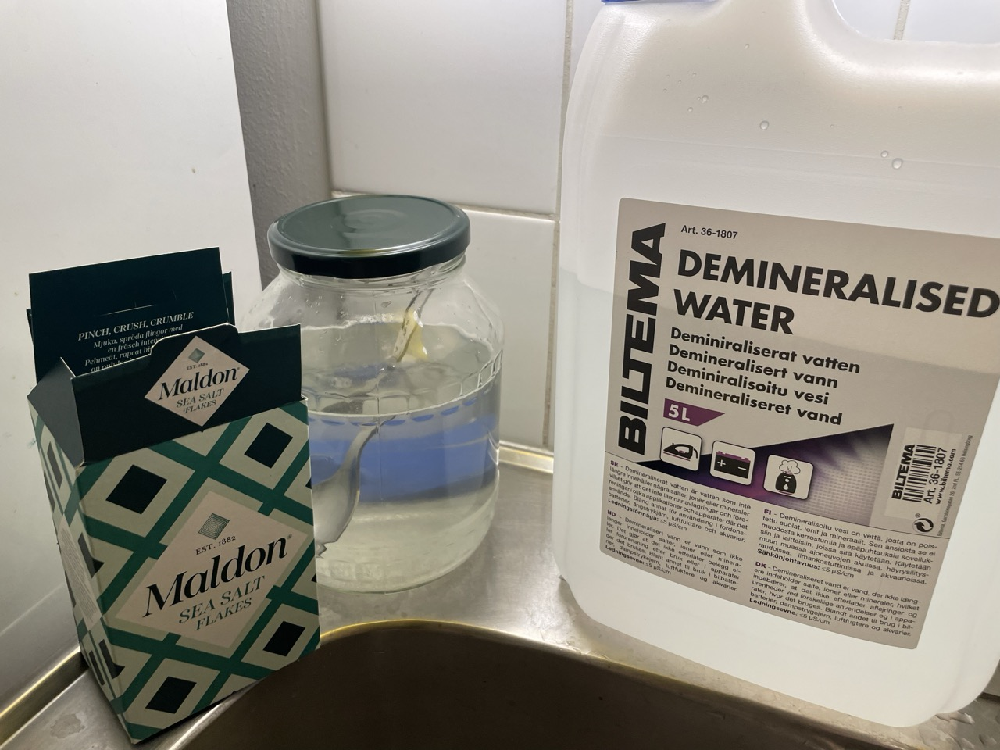
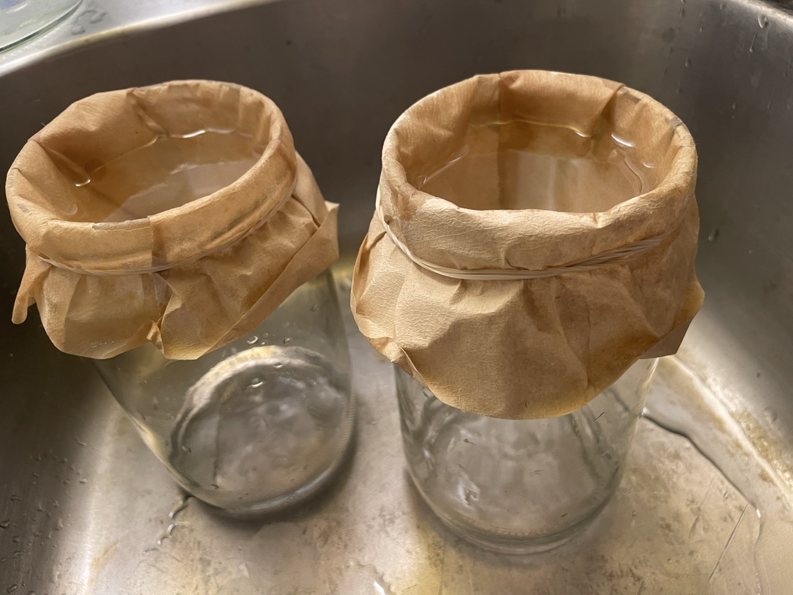
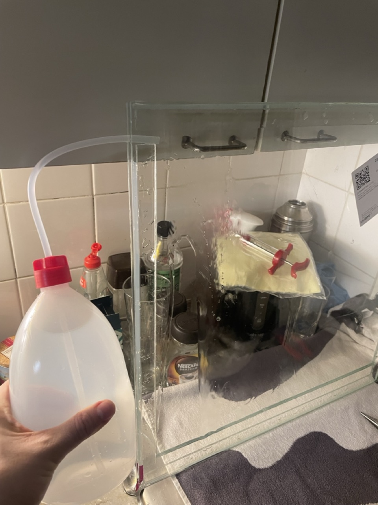
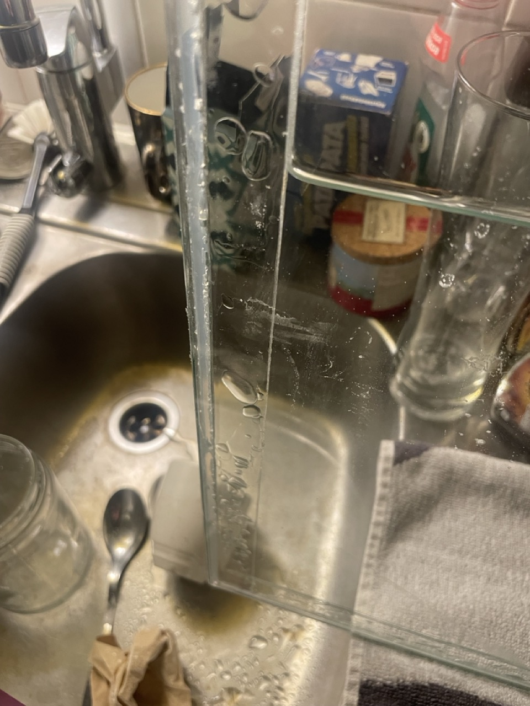
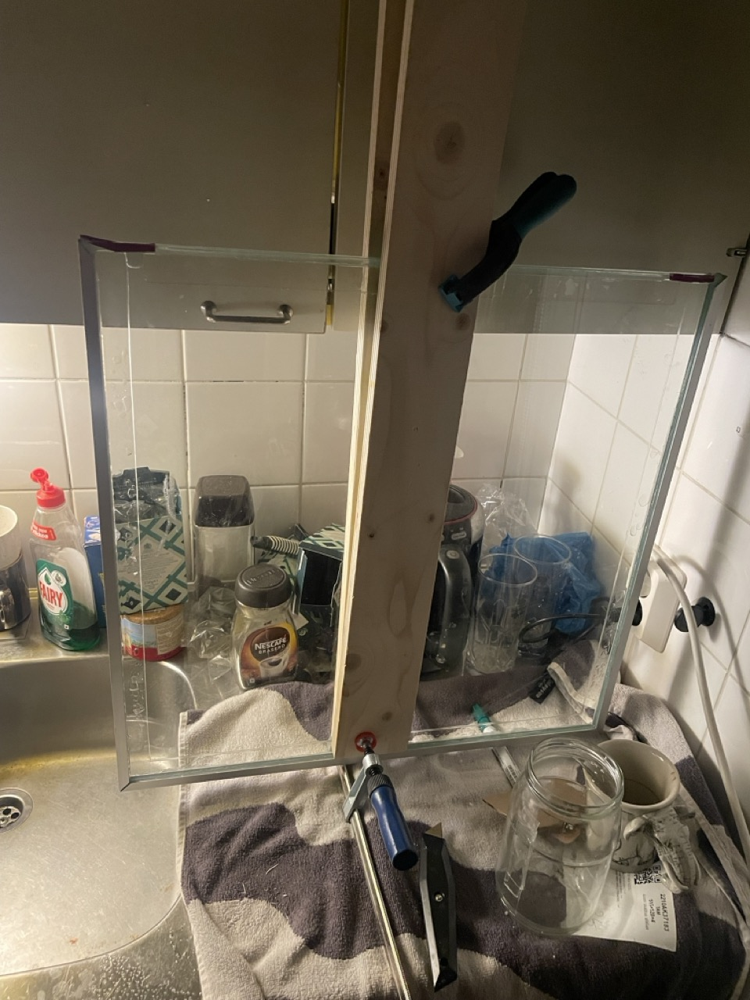
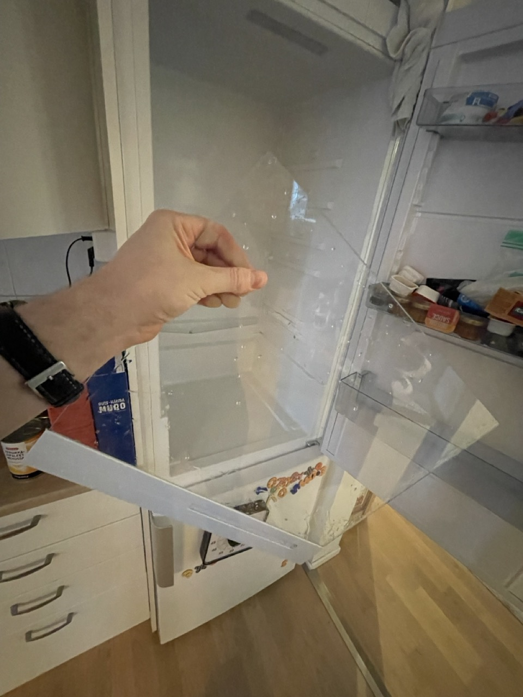

Still under construction, I've been trying to figure out how to make a working ferrofluid display, i.e., a tank where magnetic ferrofluid swims freely in a clear solution. The main problem is that the ferrofluid tends to shatter into smaller pieces and stain the tank's surface.

There are plenty of sources on the internet, the best ones:\
<https://www.instructables.com/Really-Beautiful-Swimming-Ferrofluids/>

<https://www.youtube.com/c/AppliedProcrastination>

<https://www.youtube.com/watch?v=ZA7YTcBD56c>

I'll be using ferrofluid from supermagnete:\
<https://www.supermagnete.de/eng/school-magnets/ferrofluid-10-ml_M-FER-10>

Here's the procedure (probably):

1. A glass tank, well-cleaned
2. Heating and washing with OxyAction (contain sodiumpercarbonate). Did not do this, I had a fresh glass straight from factory. Maybe a mistake, we'll see.
3. Soaking in vinegar. I used 10% vinegar in the tank for 48 hours.
4. Saturated sodium-chloride solution (kosher salt + distilled water; I used Maldon, which does not have anticoagulants)
5. Leaving the saltwater in the tank for a week (I'm here now)
6. Boiling down the ferrofluid - now it floats - must eliminate the excess petroleum. 100°C, they say, not yet done.
7. Injecting the boiled-down ferrofluid into the tank. Not yet. 
8. Water- and airproof sealing of the tank: final step, will use silicone.

Some pictures with explanations:

To make the tank, which is about 500x500 mm, I used 4mm hardened glass straight from the factory and 5 layers of 3M VHB tape.

Sealed the edges with window silicone - good and waterproof! + added pressure for 24h

Added water + salt (filtered for impurities) and went for a work trip...

..it leaked in 48 hours. Salt everywhere. The VHB did not stay waterproof, but still held the tank together (and privided the 5mm needed for volume). My silicone was holding, but there was a leak. More silicone needed!

Washed up, added some alumium profiles and more silicone. Now added first vinegar for 48 hours, washed well with distilled water and added the saltwater again. Has not leaked for four days, promising. Also added some pressure to the center of the glass - the bulging added at least 500 ml to the volume. Will boil down the ferrofluid and make the final steps in a week. Victory or bust!

Byt the way, if someone wants to try this after me and does not have factor made thing hardened glass, figured this when cleaning my refrigerator. Good glasses might be found from Kierrätyskeskus?

