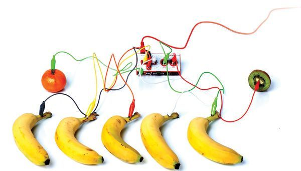

**Alt+Ctrl Interface**

I chose Makey Makey: mostly because I was just thinking to use the capacitive sensor for something similar, but also because it was a) tongue-in-cheek funny, b) out-of-the-box and c) despite all of that, MIT.

https://makeymakey.com



**Here’s my 5 penny user interface mock-up:**

**1.	The challenge**: This exhibit – actually on my work list atm - has a round screen as a curiosity, and the UI should have a large wheel around the screen. The visitors will use the wheel to operate the exhibit, but also needs buttons for language selection and for confirming the choices made with the wheel. Buttons take space I don’t have.

A touchscreen would solve the problem, but a) we don’t need a touchscreen for anything else b) a touchscreen version of this novelty round screen costs bananas.

**2.	The mock-up:** I’ll place thin capacitive buttons on the screen; this way I can control the UI and also change the button labels when needed! Whee.

**3.	The practice:** Clear conductive film would be nice, but I want this done quick. I have three 5 cent coins in my pocket and three identical alligator wires: off with the wrong-end clips, a little filing and soldering, and my "5 cent capacitive buttons" are ready. The name sounds stupid, so I call them “5 penny buttons”. Piece of clear film on the screen, coins with VHB tape to the film, alligator clips to MPR121 and we’re good to code.

**4.	The code:** Arduino to read the sensor, emulate a keyboard, and to output touches as keystrokes. Adjustment needed: serial filtered data shows that with the coin+wire+alligator combination, the idle is around 200 and active around 80, compared to 400/80 of an empty slot. Simple p5.js and the browser in kiosk mode to change still images as a mock-up UI.


[Video Here](https://www.dropbox.com/scl/fi/jpfboz65mei359i51a59b/IMG_2577-2.MOV?rlkey=1sa1mki67u6ppxpmm82xriajf&dl=0)

Arduino code:

```
#include "Wire.h"
#include "Adafruit_MPR121.h"
#include <Keyboard.h>

Adafruit_MPR121 cap = Adafruit_MPR121();

int touchThreshold = 10;
int releaseThreshold = 6;

const int button1 = 1;  
const int button2 = 3;  
const int button3 = 5; 

bool button1Pressed = false;
bool button2Pressed = false;
bool button3Pressed = false;

void setup() {
  Serial.begin(115200);

  // Start the MPR121 sensor
  while (!cap.begin(0x5A, &Wire1)) {
    Serial.println("MPR121 not found, check wiring?");
    delay(500);
  }
  Serial.println("MPR121 found!");

  cap.setThresholds(touchThreshold, releaseThreshold);

  Keyboard.begin();
}

void loop() {

  Serial.print("Touch Data (Electrodes 0-11): ");
  for (uint8_t i = 0; i < 12; i++) {  
    Serial.print(cap.filteredData(i)); 
    Serial.print("\t");                
  }
  Serial.println();

  // Read touch inputs from the MPR121
  uint16_t touchState = cap.touched();

  if (touchState & (1 << button1)) {
    if (!button1Pressed) {
      Keyboard.press('1'); // Send '1' key
      button1Pressed = true;
    }
  } else {
    if (button1Pressed) {
      Keyboard.release('1');
      button1Pressed = false;
    }
  }

  if (touchState & (1 << button2)) {
    if (!button2Pressed) {
      Keyboard.press('2'); // Send '2' key
      button2Pressed = true;
    }
  } else {
    if (button2Pressed) {
      Keyboard.release('2');
      button2Pressed = false;
    }
  }

  if (touchState & (1 << button3)) {
    if (!button3Pressed) {
      Keyboard.press('3'); // Send '3' key
      button3Pressed = true;
    }
  } else {
    if (button3Pressed) {
      Keyboard.release('3');
      button3Pressed = false;
    }
  }

  delay(100);
}
```

p5.js code:

```
let img1, img2, img3;
let currentImage;

function preload() {
  img1 = loadImage('1.jpg');
  img2 = loadImage('2.jpg');
  img3 = loadImage('3.jpg');
}

function setup() {
  createCanvas(1280, 128023212);
  currentImage = img1;
}

function draw() {
  background(0);
  image(currentImage, 0, 0, width, height);
}

function keyPressed() {
  if (key === '1') {
    currentImage = img1;
  } else if (key === '2') {
    currentImage = img2;
  } else if (key === '3') {
    currentImage = img3;
  }
}
```

**5.	Reflection:** Language selection seems to work, as a mock-up anyway. Nice. Quick and dirty, ready for iteration.


``
