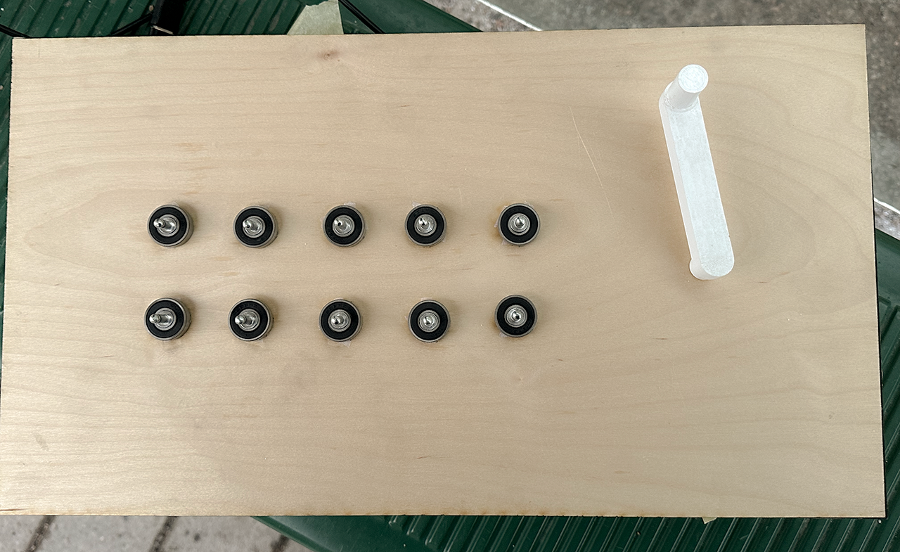

**Millennia at Play**

Project Introduction:					

Millennia at Play is an interactive project inspired by the Color-Painted Relief Scene
of Musicians Playing. Drawing from this historical masterpiece, I reimagined and
redrew the twelve lady musicians, infusing their ancient forms with renewed
vitality. Through digital animation and sound, their instruments are brought back to
life, echoing melodies that transcend a thousand years.

**Q&A:**

1. Why I choose this topic?
   Like many other young people, I used to keep my eyes on trends and keep track of the latest tech hotspots. But in the last few years, I've become interested in traditional things, so this time I wanted to make a attempt to use the physical interaction skills I learned in class to see how I can better combine tradition and digitalization to revitalize things that have been forgotten in history.

2.Why I choose this image?
  At first I tried to find an ancient painting as my original image, but it was a difficult problem to choose among the many paintings, so I decided to choose a familiar one. I have already cited the image of "Color-Painted Relief Scene of Musicians Playing" in my previous research paper, so I don't need to spend more time on various details and historical research, and I can spend more time on the production of the project, which I think is efficient.

**Process:**

1. Redrew the image
   Since the relief was unearthed in the Five Dynasties period, the details of the figure's clothing, modeling, and patterns refer to various murals from the late Tang Dynasty to the Five Dynasties, so as to avoid historical mistakes. In terms of color matching, I used a gradient color scheme, referring to a little Tang Sancai's color scheme, the purpose is to make the characters more comic, more in line with the aesthetics of the younger generation, not so much like a direct copy of the original image. I also completed the incomplete part of the image in the back row of the relief so that it could be used in a separate introduction.


2.Animate the characters
      I animated each of them by using AE to show the complete image of each musician and the introduction of the instrument.
	


3. Sensor testing
    I chose the capacitive touch sensor and the rotary encoder sensor to complete the physical part. Each musician can be showed by touching the capacitive touch sensor, by the mean time, use the rotary encoder sensor to manipulate the crank handle to transform the background scenes.


```
#include <Encoder.h>
#include "Wire.h"
#include "Adafruit_MPR121.h"


Adafruit_MPR121 cap = Adafruit_MPR121();
Encoder myEnc(5, 6);  
long lastEncoderPosition = 0; 
unsigned long lastTouchTime = 0; 
const unsigned long touchDelay = 200; 
unsigned long ct = 0;
unsigned long pt = 0;

// 动态范围
long minEncoderValue = 0;  
long maxEncoderValue = 1000; 

void setup() {
  Serial.begin(115200);

  while (!cap.begin(0x5A)) {
    Serial.println("MPR121 not found, check wiring?");
    delay(500);
  }
  Serial.println("MPR121 found!");


}

void loop() {
  ct = millis();

  
  uint16_t touched = cap.touched();
  String touchOutput = "Touch,";
  for (int i = 0; i < 12; i++) {
    if (touched & (1 << i)) {
      touchOutput += "1,";
    } else {
      touchOutput += "0,";
    }
  }


  long currentEncoderPosition = myEnc.read();
//Serial.println(currentEncoderPosition);
  if (currentEncoderPosition < minEncoderValue) {
    myEnc.write(minEncoderValue);
    //minEncoderValue = currentEncoderPosition;
  }
  if (currentEncoderPosition > maxEncoderValue) {
    myEnc.write(maxEncoderValue);
    //maxEncoderValue = maxEncoderValue;
  }


  float normalizedValue = 0;
  if (maxEncoderValue != minEncoderValue) { // 防止除以 0
    normalizedValue = (float)(currentEncoderPosition - minEncoderValue) / (maxEncoderValue - minEncoderValue);
  }

  String encoderOutput = "Encoder," + String(currentEncoderPosition) + ",Normalized," + String(normalizedValue);

  
  if (ct - pt > 50) { 
    Serial.println(touchOutput + encoderOutput);
    pt = ct;
  }
}
```


4. Combined with Touchdesigner
     Use TD to convert the data obtained from Arduino into an index to control the change of the scenes.


5.Integration :Laser cutting + 3D Printing
     I use 3D printing printed the handle and made a wooden box using laser cutting to facilitate wiring.




6.Final Exhibition


**Reflection**\
   I've been thinking a lot lately about whether I should focus more on technology or content, and after thinking about it, I still think that the content or the idea you want to convey is more important. Therefore, I did not make this project technical, and I was very restrained in the selection of electronic components. Even without the use of complex technology, it is difficult to achieve every detail well, especially if you lack relevant experience. And the workload of content production is also heavy, in short, it caused a lot of anxiety.

   But I'm still happy with the end result, I learned a lot about physical interaction in this course and applied it to my own projects, which is a great feeling! If I want to do some projects like this in the future, I would have a clear idea of how to do.
