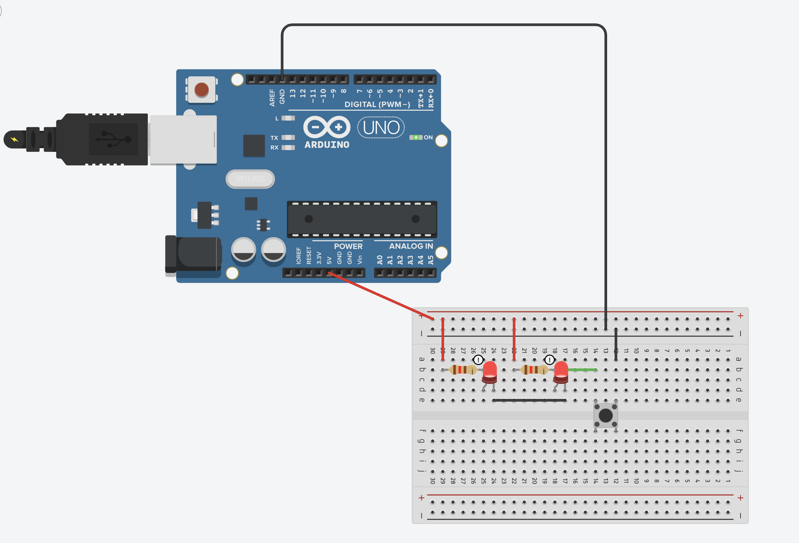
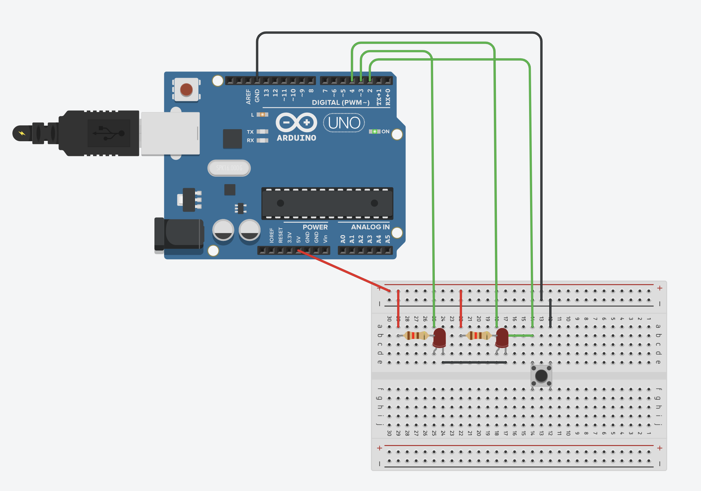
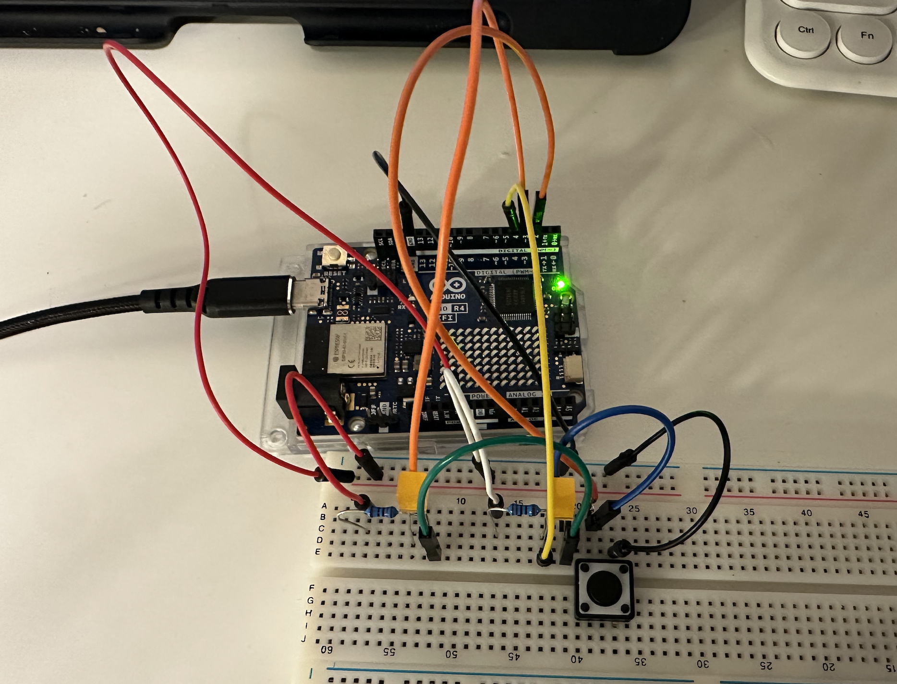
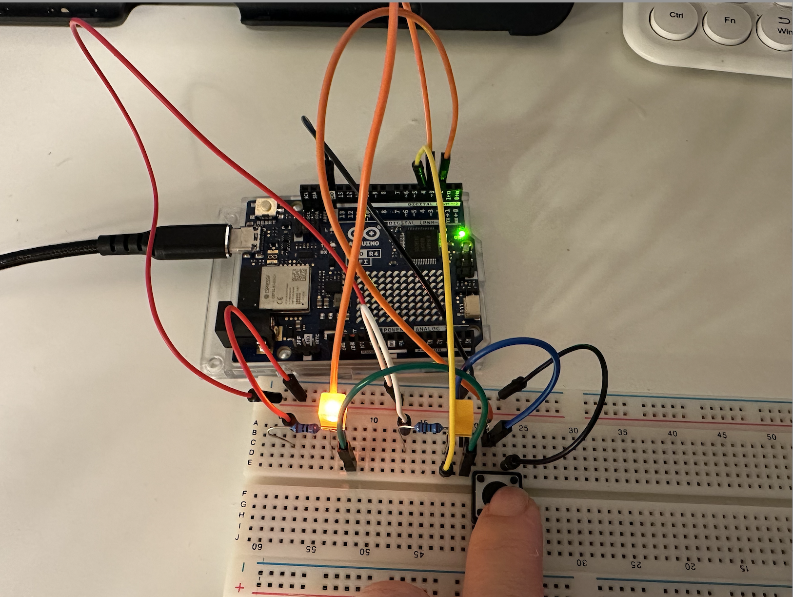
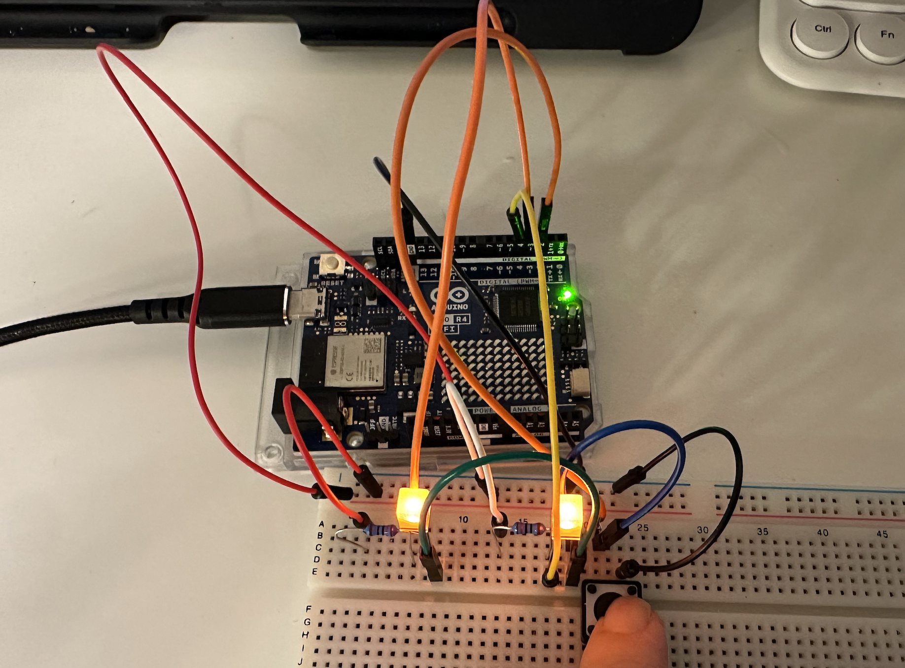

#### Task Description⬇️

Create a circuit and Arduino code that does the following

**Circuit #**

1. Connect two LEDs to your Arduino using a breadboard
2. Connect one switch to your Arduino using a breadboard

**Code #**

1. Read a momentary switch being pressed
2. When the program starts, both LEDs are off
3. When the switch is pressed once, the first LED turns on
4. When the switch is pressed the second time, the second LED turns on (the first one should also still be on)
5. When the switch is pressed the third time, both LEDs turn off
6. Repeat this same cycle of LEDs turning on and off in sequence (off, one LED, two LEDs, off…)

### Procession💻

Step 1: Design the circuit and test it




 Step 2: Connect to the Pin



Step 3: Coding

```
int switchPin = 2;   
int led1Pin = 3;     
int led2Pin = 4;   

int switchState = 0;       
int lastSwitchState = 0;   
int ledState = 0;         

void setup() {
  pinMode(switchPin, INPUT);   
  pinMode(led1Pin, OUTPUT);    
  pinMode(led2Pin, OUTPUT);  
  digitalWrite(led1Pin, LOW);  
  digitalWrite(led2Pin, LOW);  
}

void loop() {
  switchState = digitalRead(switchPin);

 
  if (switchState == HIGH && lastSwitchState == LOW) {
    ledState = (ledState + 1) % 3;
    
   
    if (ledState == 0) {
      digitalWrite(led1Pin, LOW);
      digitalWrite(led2Pin, LOW);
    } else if (ledState == 1) {
      digitalWrite(led1Pin, HIGH);
      digitalWrite(led2Pin, LOW);
    } else if (ledState == 2) {
      digitalWrite(led1Pin, HIGH);
      digitalWrite(led2Pin, HIGH);
    }
  }


  lastSwitchState = switchState;


  delay(5);
}
```

Step 4: Test







### Watch test video below⬇️

<https://drive.google.com/file/d/1UjvzJuJ95IECoHElp2IQSQyfIDwb61G6/view?usp=sharing>
