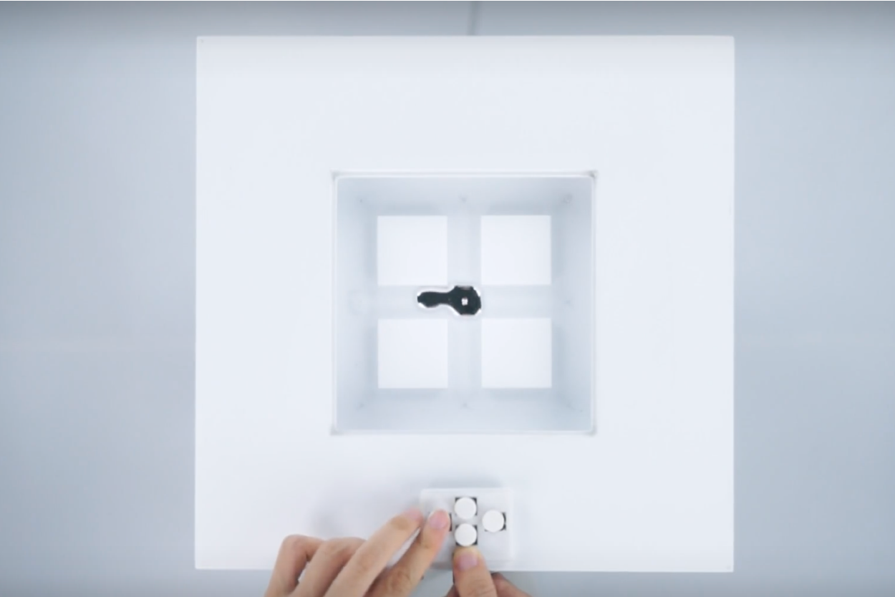
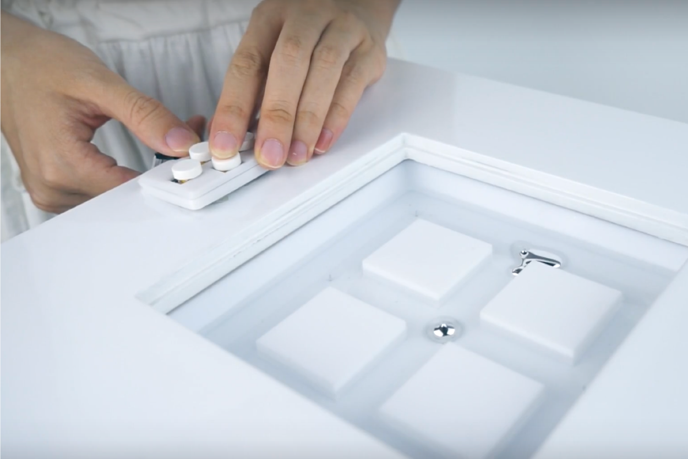

### Alt+Ctrl Interface

"Metal Life"

Introduction:\
What is Life? If a liquid metal droplet can eat and digest aluminum, obtaining energy for its own movement; can play with companions, or even have personalities such as shyness, curiosity, brightness and naughty, is it alive?

MetaLife is a series of interactive installations, representing different "personalities" of liquid metal "mollusks". 

Watch Video Here:  <https://www.milab.design/project-06>

