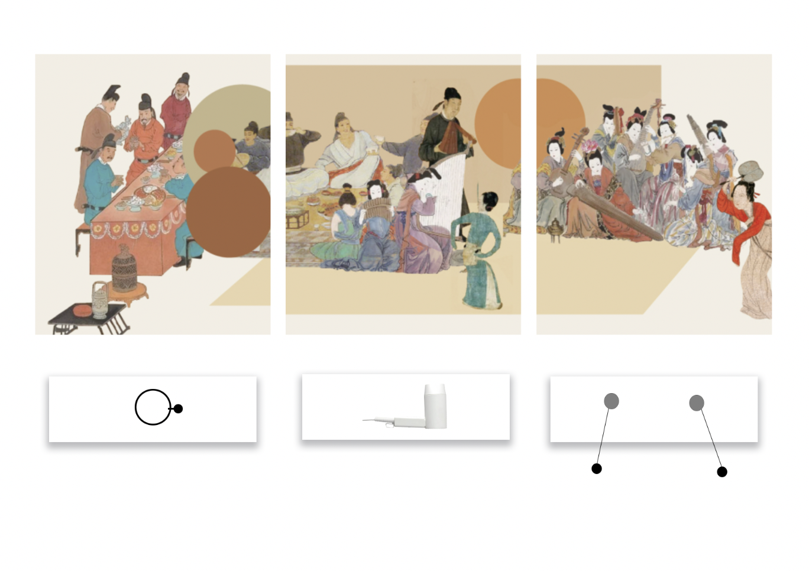
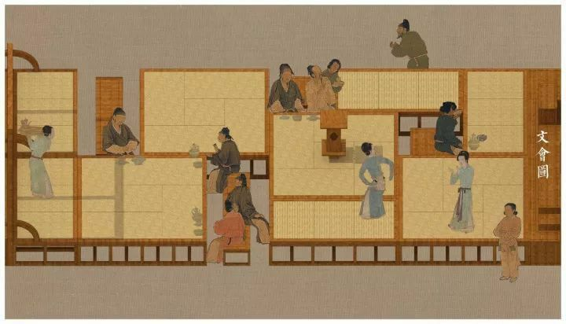

### Project Brief:

The idea is to connect with traditional Chinese painting through an interactive experience. By interacting with ancient paintings, I aim to bring new vitality to traditional culture and capture the attention of younger generations. This approach is not only a tribute to traditional art but also a way to create a modern interactive experience that resonates with history, sparking interest and a sense of connection with cultural heritage.

### Script:

The interactive methods are diverse. For instance, pulling a rope causes parts of the painting to shift, inviting viewers to explore different sections. Blowing air makes the hair of figures in the painting flutter, creating a sense of immersion. Turning a hand-crank switches scenes, allowing viewers to experience different moments within the story. Or using flashlight to detect the intensity of light and reproduce the color of the painting.

These interactions aim to transform traditional viewing into an engaging, multi-sensory experience that connects the audience with ancient art in a dynamic way.

\
\
The idea needs to be refined.

### Reference:

[https://drive.google.com/drive/folders/1NEhuBA1NGjsaxVtI9kbLmqKjJk5lcPY_?dmr=1&ec=wgc-drive-globalnav-goto](https://drive.google.com/drive/folders/1NEhuBA1NGjsaxVtI9kbLmqKjJk5lcPY_?dmr=1&ec=wgc-drive-globalnav-goto)

