## [](<>)Basic concept + recap :

I am expanding my project I am working with in the Computational Art & Design course: I am planning to do drawing exercises on spirals and other circular paths with p5.js They are inspired by old s[pecial figure skating figures](http://www.skatingaheadofthecurve.com/SpecialFigures.html) as well as beautifully illustrated [choreographical manuals for old ballroom dances](https://publicdomainreview.org/collection/dances-in-beauchamp-feuillet-notation/) called Beauchamp-Feuillet notation.

In Physical Computing I aim to focus on creating a user interface that enables interaction with the drawing exercises

My initial inspiration was the sensation of drawing with finger on sand. Hence, I wanted to focus on the touch and how it feels on one's finger to trace slowly a spiral. The optimal controller would have a soft to touch ”furrow” without any sharp edges. An important factor for me is also the aesthetics and materials: I’d like it to be beautiful so that it would invite one to use it. 

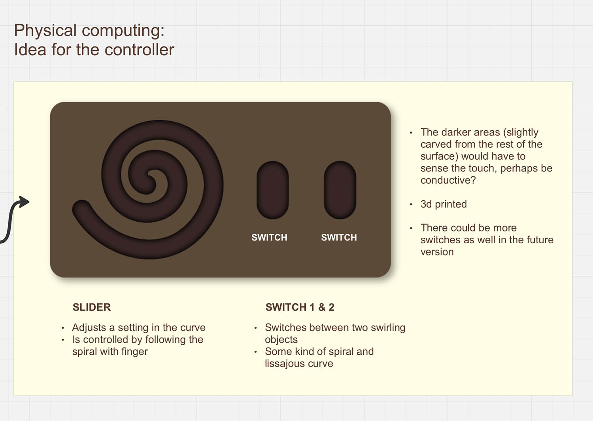

### 19.11.2024: Things to consider

* Here's a sensor that might work with this kind of spiral slider: [https://learn.bela.io/products/trill/about-trill/](<>)
* Matti told that the spiral could be cut from copper sticker in Fablab -> they have a suitable material for the vinyl cutter. Other option is to cut it by hand or use conductive ink.

**3d model for some sort of casing:**

* Rounded edge for the spiral for soft touch
* What's the size of the controller and the thickness/depth of the "furrow"?
* Is there some kind of structure inside for the wiring? How are the top and bottom part attached? A 3d printed bottom layer for the copper sticker to put on, is it just a square/circle or a spiral as well? How to fit the spiral perfectly with the 3d printed top part? 

**For the spiral:**

* In how many sections should the spiral be cut? 30 was the number in one of the Bela Trill sensors
* For now I think the controller will be connected to the computer with usb-c cable where it will also get power from -> in the future version it would need batteries
* Figure out how to connect the data from the sensor with p5.js

### The Trill Ring sensor

Prior making my own custom spiral slider, I did a test with connecting a ring shaped Trill sensor to my computer to understand how Trill sliders work and what kind of data they provide in Arduino.

For the sensor to work, it needed two pull-up resistors between SCL + 5 v and SDA + 5v. 

[Here's a link to the instructions from Matti](https://learn.adafruit.com/working-with-i2c-devices/pull-up-resistors)

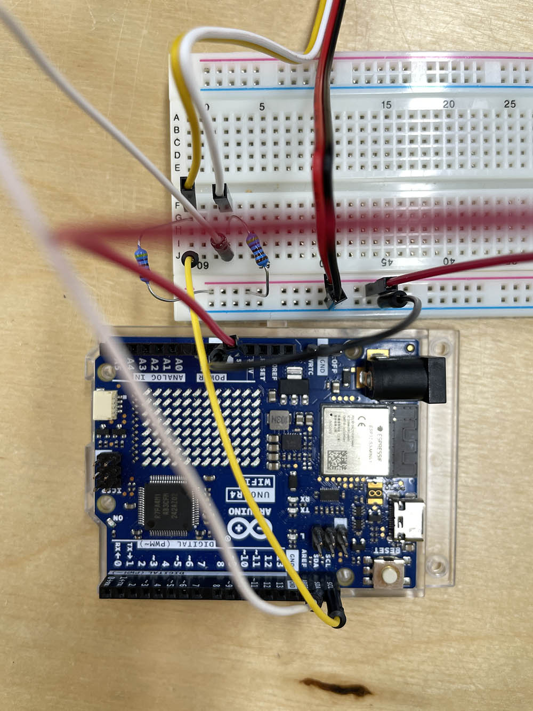

The working palette with sensor, pull-up resistors etc. 

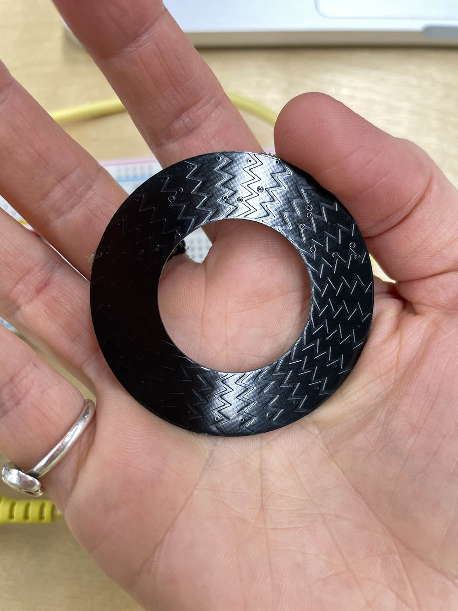

**THE ARDUINO AND SENSOR VALUES**

The sensor detects multiple touches, the location and the size of the touch. The two values below are ***location*** and ***size.*** The values for the location are between 0 and 3500(+100) when sliding the ring clockwise. 

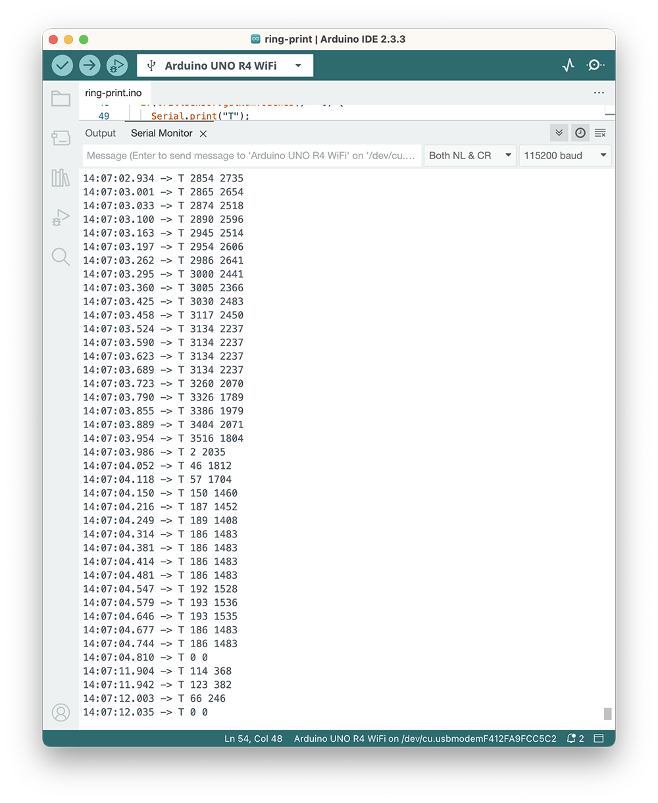

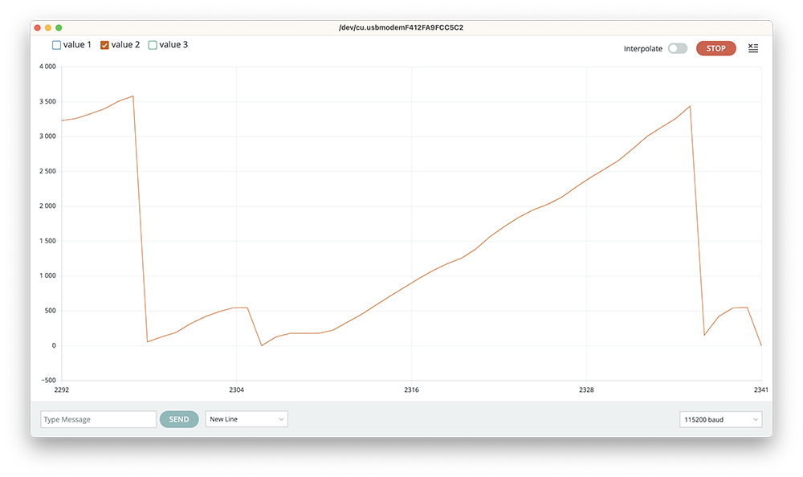

**HOW TO TRANSFER THE SLIDER DATA TO p5.js?**[](<>)

Here's a code from the course website: <https://learn.newmedia.dog/courses/physical-computing/week-04/lesson-01/>

This connects the arduino data to p5.js in order to draw a circle. Remember to add the following line inside the **head** tags in the **index.html**:

```html
<script src="https://unpkg.com/@gohai/p5.webserial@^1/libraries/p5.webserial.js"></script>
```

```javascript
//Example from course website
//https://learn.newmedia.dog/courses/physical-computing/week-04/lesson-01/


let port;
let c;
let s=10;
let touch;

function setup() {
  createCanvas(600, 600);
  port = createSerial(); //connect to arduino
  c = color(255);
}

function draw() {
  background(255, 250, 207);
  
  if(port.available()>0){
  touch = port.readUntil("\n");
    port.clear();
    c = map(touch,0,3550,0,255,true); //0-3590 values from arduino
    s = map(touch,0,3550,10,400);
  }
  fill(255,0,0);
  text("touch: " + touch,20,40);

  fill(c);
  circle(width/2, height/2, s);
}

function mousePressed(){
  if (!port.opened()) {
    port.open(115200);
  }
}
```

[](https://learn.newmedia.dog/courses/physical-computing/week-04/lesson-01/)



### 24.11.2024: 3d printed samples

Okay! So after testing how the sliders work I continued with figuring out the actual design of the controller. As the experience of touch was the main character of the interaction, I wanted to pay attention on figuring out the right kind of shape, its size and other measurements. 

* I sampled with 3d printer to figure out the width and depth of the furrow, best furrow measurements were 2mm (depth), 120mm (full width), 60mm (open area/hole)
* To get the right kind of spiral, I coded it with p5.js and turned into SVG vector. Before this I had drawn by hand a spiral shape on a millimeter paper to figure out what is the most pleasing length and size for the spiral.
* Last part was to print an actual size spiral and see how it feels when touched. All this was done with the help of Miro and his 3d printer!

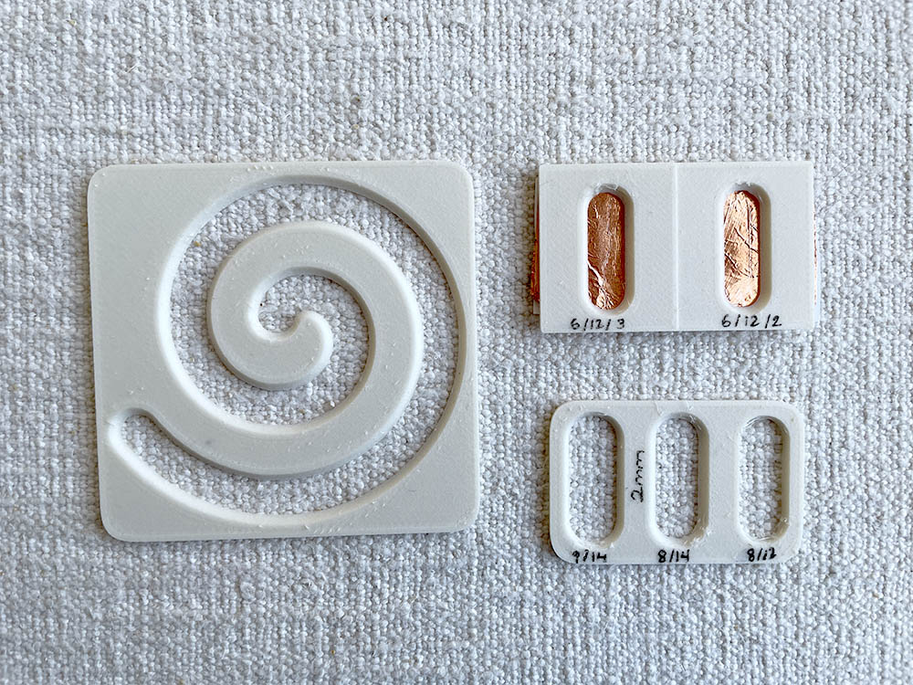

### Mon 25.11. - Sun 1.12.2024: The design challenge

As the size and measurements were decided, it was time to start figuring out final design and how the controlled was built. I had decided to use 20 individual capacitive sensors on the slider + 2 extra for the buttons. These were to be soldered to the Trill Craft sensor: [https://learn.bela.io/tutorials/trill-sensors/working-with-trill-craft/](<>)

I found some inspiration for the individual sensors for the slider stickers from here: [https://www.kobakant.at/DIY/?p=6607](<>) . I was pondering between arrow and arch sticker but decided to start with the arrows. The basic idea with that shape is that the capacitive sensors are able to read the finger's position either from one or two sensors at the same time providing more detailed data. Along the week I was:

* Drawing and fixing vector files for the copper tape. Somehow the 20 sensors on the spiral turned into 19 pieces.
* Made the laser cut files for the inner structure, which were cut from acrylic. The structure is sort of a sandwich, where the spiral slider and buttons are embedded in-between the cover and a bottom layer! No need for glue!
* Finished cutting the copper tape pieces from a copper tape by hand (!!) and placing them to the laser cut spiral (I couldn’t use the vinyl cutter at Fablab). I used a 3d printed "stencil” to trace the lines with a scalpel. It took quite many tries and two days to get it right :D
* Finally a prototype for the top cover was 3d printed with the help of Miro, who also helped with figuring out the inner support structure.

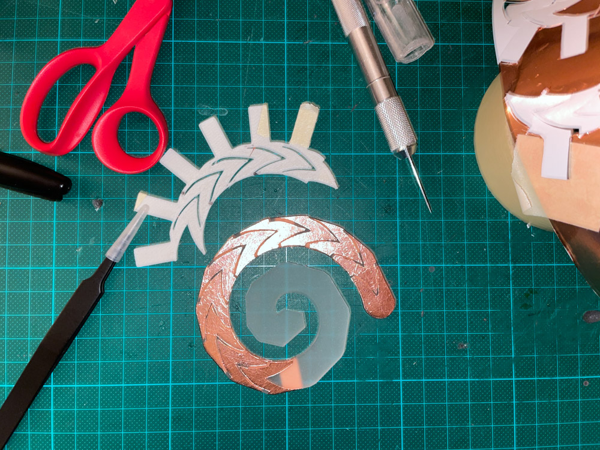

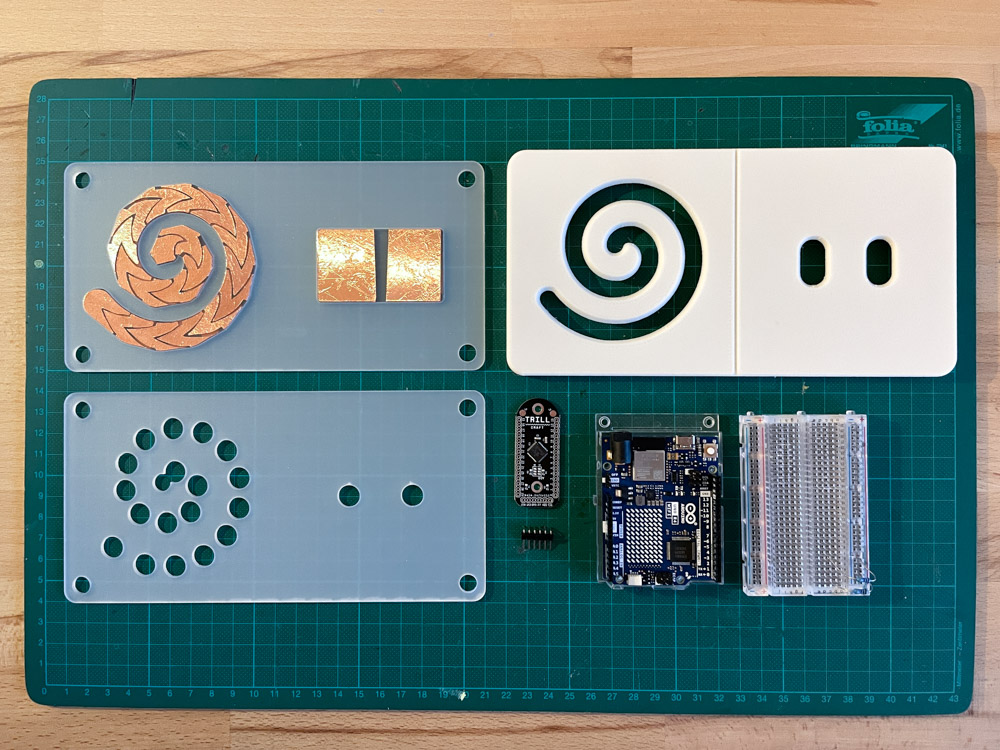

Here are all the pieces for the controller (minus wiring) ready to be attached!

### Mon 2. - Tue 3.12.2024: Building and soldering

Now that all the bits and pieces were ready, it was time to learn how to solder properly and start building the actual piece, here’s what happened:

* I soldered the spiral sensors (19x) and buttons (2x) to a bunch of red and bendy silicone wires --> looks like a shrimp! I got good tips from Matti and I think I made a quite good job of clean and pretty soldering though my hands were shaking.
* I went to get a final 3d print for the top cover from a nice brown PLA from the Aalto 3d print workshop. However the print turned out to be quite badly made so I decided to go with the earlier white version made at home.
* Soldered the other end of the wires to the trill craft sensor... I spent hours on figuring out the placing of the wires to the acrylic board so that they do not touch each other. This prevents the capacitive sensors from taking unwanted signals from each other. A lot of tape was used!
* I used the pins 0-18 in the Trill Craft, 19 sensors in total. When moving on to the other long edge of pins on the Trill sensor, soldering became quite tricky due to tight space! But I managed!

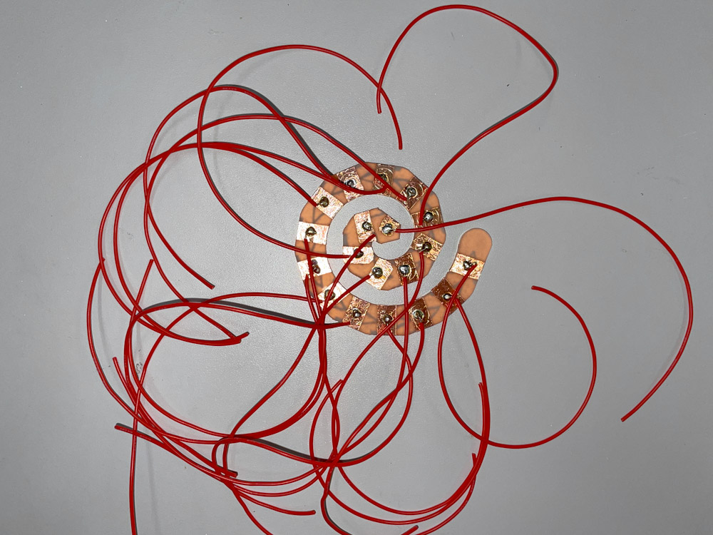

### Wed 4.12.2024: It works!

What happened:

* I soldered the last two button, pin 25 for the left button sensor and pin 29 for the right button sensor.
* To prevent glue on the Trill Craft, I attached it to a piece of EVA foam with few stitches and that to the acrylic layer with 2-sided tape.
* Attached the SCL, SDA, power (5V), grounding and 2 resistors via breadboard to the Arduino UNO board.
* Connected Arduino on my computer and run an example code from the Trill library with the help of Matti. IT WORKS! I also succeeded in connecting the slider to my p5.j sketches. The artwork still required some adjusting with lerping and the all the visuals to get a calm and smooth animation that would correspond the slow tracing of the spiral with finger.
* 3d printed a bottom piece for the controller to protect the wiring. Arduino and breadboard are still separate from the controller so the this solution was not the most ideal, but works for now. Thanks Miro again for help!

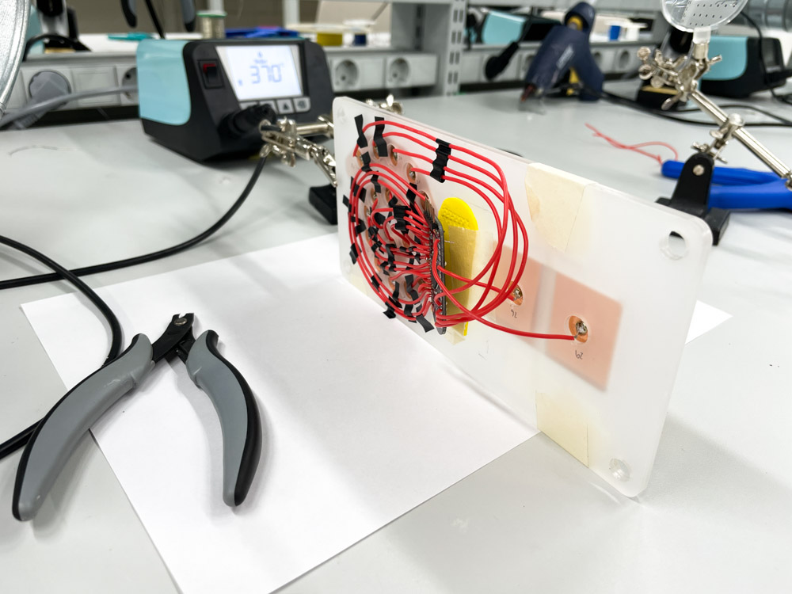

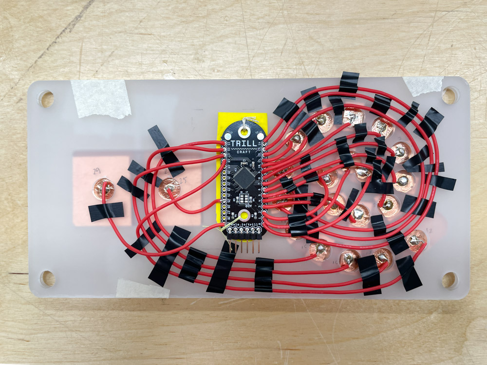

### Here's the code working in Arduino:

```cpp
#include <Trill.h>

Trill trillSensor;

const unsigned int NUM_TOTAL_PADS = 30;
CustomSlider::WORD rawData[NUM_TOTAL_PADS];

const uint8_t slider0NumPads = 19;
const uint8_t slider1NumPads = 1;
const uint8_t slider2NumPads = 1;

// Order of the pads used by each slider
uint8_t slider0Pads[slider0NumPads] = {0,1,2,3,4,5,6,7,8,9,10,11,12,13,14,15,16,17,18};
uint8_t slider1Pads[slider1NumPads] = {25};
uint8_t slider2Pads[slider2NumPads] = {29};

const unsigned int maxNumCentroids = 3;
const unsigned int numSliders = 3;
CustomSlider sliders[numSliders];

void setup() {
  sliders[0].setup(slider0Pads, slider0NumPads);
  sliders[1].setup(slider1Pads, slider1NumPads);
  sliders[2].setup(slider2Pads, slider2NumPads);
  // Initialise serial and touch sensor
  Serial.begin(115200);
  int ret;
  while(trillSensor.setup(Trill::TRILL_CRAFT)) {
    Serial.println("failed to initialise trillSensor");
    Serial.println("Retrying...");
    delay(100);
  }
  Serial.println("Success initialising trillSensor");
 // trillSensor.setMode(Trill::DIFF); //OG SET MODE IS DIFF
  trillSensor.setMode(Trill::CENTROID);
  // We recommend a prescaler value of 4
  trillSensor.setPrescaler(4);
  // Experiment with this value to avoid corss talk between sliders if they are position close together
  trillSensor.setNoiseThreshold(200);
}

void loop() {
  // Read 20 times per second
  delay(50);
  if(!trillSensor.requestRawData()) {
    Serial.println("Failed reading from device. Is it disconnected?");
    return setup();
  }
  unsigned n = 0;
  // read all the data from the device into a local buffer
  while(trillSensor.rawDataAvailable() > 0 && n < NUM_TOTAL_PADS) {
    rawData[n++] = trillSensor.rawDataRead();
  }
  for(uint8_t n = 0; n < numSliders; ++n) {
    // have each custom slider process the raw data into touches
    sliders[n].process(rawData);
     Serial.print(n);
     Serial.print(",");
     Serial.print(sliders[n].getNumTouches());
     Serial.print(",");
    if(sliders[n].getNumTouches() > 0) {
      for(int i = 0; i < sliders[n].getNumTouches(); i++) {
          Serial.print(sliders[n].touchLocation(i));
          Serial.print(",");
      }
    }
    Serial.println("");
    delay(10);
  } 
}
```

## The finished work:

I took some nicer product photos :) Below you will find the project documentation video to see the actual interaction and artwork.

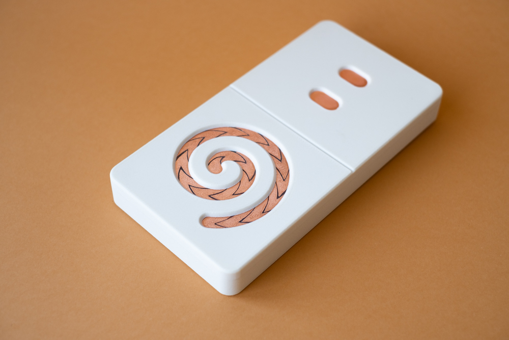

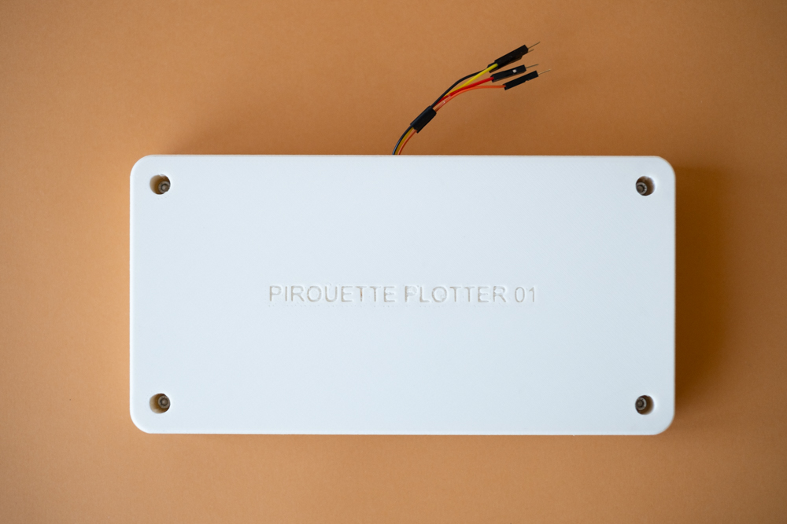



Music in the video: *Freezing but warm* by Meydän, Licensed under CC BY <https://freemusicarchive.org/music/Meydan/Ambient_1860>

**Description (same text as in the Computational Art & Design course documentation):**

*Discovering Pirouettes: Pirouette Plotter* is a set of drawing experiments exploring spiral motives and the use of sine and cosine with p5.js. The project was inspired by the documentation of special figure skating patterns and choreography manuals of historical ballroom dances. 

The project was combined with Physical Computing course, where I built a physical controller to interact with the sketches. The controller consists of three sets of capacitive copper sensors: a spiral shaped slider and two buttons. The interaction of tracing the spiral with finger was inspired by the feeling of drawing on sand with finger.

## Reflection

This course flew by extremely fast. I have no previous experience on working with electronics so all the new knowledge felt almost paralyzing. When the time came to come up with an idea for the final project, all I heard was crickets.

But as always, when you least except it, the ideas start pouring in. For me this happened during a singing bowl relaxation (äänimalja-rentoutus in Finnish), During the relaxation I saw vibrating spirals and my finger following them :-D So without further thinking, I started working with the idea straight away. 

**Here are some improvements I would do for the controller:**

* I would like to try how the signal changes if the copper would be covered with a fully closed cover. The copper is extremely beautiful and it would be a shame to hide it, but the edges of the copper tape pieces are quite fragile and should be covered somehow. This could be done also with some transparent plastic. Other and more fancy option would be to mill/cut the pieces from actual copper sheet and let them create a green patina. Nice!
* So yes, I learned that the capacitive sensors detect touch also through the cover. Due to this I should make the copper pieces for the buttons a lot smaller. Now they react when touching the cover near them and even when just hovering my fingers on top of them. This creates accidental button presses.
* I would like to rethink the aesthetics of the controller and its shape. To me the rectangular shape and sleek white PLA feels too clean and I would like to aim for something more organic and raw in texture. What about the shape, could it be circular? What about the electronics inside, could it be done with a raspberry pi and somehow making the resistor wiring more tight without the breadboard?

**Other comments:**

I enjoyed most of the craftwork related to this project:

* Making the spiral slider and attaching the copper tape pieces to it. Piece by piece it reminded me of an ancient jewelry due to the copper and the scratch marks.
* Soldering was fun and at some point the ancient jewelry slider turned into a glimmering shrimp! I spent a lot of time just staring at the beauty of the materials.
* Figuring out the wiring from the slider to the Trill craft sensor and then soldering. Though it felt almost impossible task to keep the wires de-attached from each other, I was extremely happy (and relieved) I managed to do it.

I have to admit that for the very last minute I was expecting something to fail. Hence the surprise of it working without any major errors really drew a big smile on my face! 

There is still a lot develop when it comes to the marriage of my p5.js artwork and the controller. I didn’t have a lot of time to work on my artwork and as the interaction worked quite nicely with tracing the spiral, what happened on the screen was not that interesting. After the presentation I did some improvements on the p5.js code and to me it feels now more poetic and responsive giving the ”user” a bit more control over the drawing. I have more reflection on that process on my *Computational Art and Design* documentation.

Just to finish off, I want to say I started slowly warming up for physical computing: I kept getting ideas for wacky art projects along the way of creating this controller. If I’d have a chance to do this course again, I would create a more independent and experimental project on its own. But perhaps there is a chance for me in the future now that working with electronics frightens me less than 1,5 months ago!
