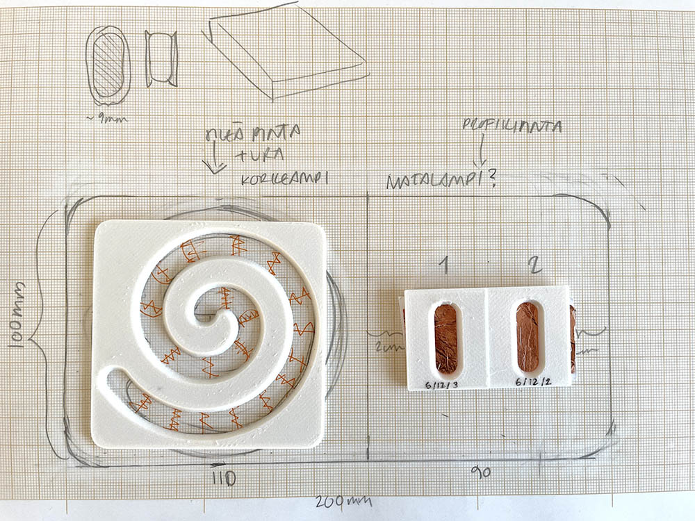

[Link to the Miro board](https://miro.com/welcomeonboard/aUtCL1RzQVVNRldUdWFEV2Z3RDZsdndEZWc5Q2p4RDBsYVE4UHowMnJZZHVJUFZlM2UrYjBpa2hJaHgyR21JVU9pd1poK2JBWHdlVGJqdU43YTZ4aUZqeFQycnYvVUFIM3RHRVd6ZTUwSnNEVUVOTGxKUi84V1BzVDFEZDUzc3chZQ==?share_link_id=566865071552)


### 19.11.2024 Things to consider

Here's a sensor that might work with this kind of spiral slider: [https://learn.bela.io/products/trill/about-trill/](<>)

* Matti told that the spiral could be cut from **copper sticker in Fablab** -> they have a suitable material for the vinyl cutter
* **3d model** for the top part but also for the wiring etc beneath:

  * Rounded edge for the spiral for soft touch
  * What's the size of the controller? 
  * The thickness/depth of the "furrow" (ura in Finnish)?
  * Is there some kind of structure inside for the wiring? How are the top and bottom part attached? 
  * A 3d printed bottom layer for the copper sticker to put on, is it just a square/circle or a spiral as well? To ease the wiring?
* For the spiral:

  * How much margin/saumavara for the wires if they are soldered on the sides of the spiral
  * **In how many sections should the spiral be cut?** 30 was the number in one the Bela sensors
  * How to fit the spiral perfectly with the 3d printed top part? 
* For now I think the controller will be connected to the computer with usb-c cable where it will also get power from -> in the future version it would need batteries
* Figure out how to **connect the data** from the sensor with **p5.js**

### The Trill Ring sensor

For the sensor to work, it needed two pull-up resistors between SCL + 5 v and SDA + 5v. Prior the custom spiral sensor, I am going to use a Trill ring sensor with the same slider capacities.

[Here's a link to the instructions from Matti](https://learn.adafruit.com/working-with-i2c-devices/pull-up-resistors)


The working palette with sensor, resistors etc. 


**THE ARDUINO AND SENSOR VALUES**

The sensor detects multiple touches, the location and the size of the touch. The two values below are ***location*** and ***size.*** The values for the location are between 0 and 3500(+100) while sliding the ring clockwise. 


*How to transfer the data to p5.js --> [https://learn.newmedia.dog/courses/physical-computing/week-04/lesson-01/](<>)*

[](https://learn.newmedia.dog/courses/physical-computing/week-04/lesson-01/)Here's a code from p5.js to connect the arduino data to draw a circle. Remember to add the following line inside the **head** tags in the **index.html** :

```html
<script src="https://unpkg.com/@gohai/p5.webserial@^1/libraries/p5.webserial.js"></script>
```

```javascript
//Example from course website
//https://learn.newmedia.dog/courses/physical-computing/week-04/lesson-01/


let port;
let c;
let s=10;
let touch;

function setup() {
  createCanvas(600, 600);
  port = createSerial(); //connect to arduino
  c = color(255);
}

function draw() {
  background(255, 250, 207);
  
  if(port.available()>0){
  touch = port.readUntil("\n");
    port.clear();
    c = map(touch,0,3550,0,255,true); //0-3590 values from arduino
    s = map(touch,0,3550,10,400);
  }
  fill(255,0,0);
  text("touch: " + touch,20,40);

  fill(c);
  circle(width/2, height/2, s);
}

function mousePressed(){
  if (!port.opened()) {
    port.open(115200);
  }
}
```

[](https://learn.newmedia.dog/courses/physical-computing/week-04/lesson-01/)



### 24.11.2024 3d print samples

\- Sampling with the width and depth of the furrow

\- Size of the spiral

\- Best furrow measurements were 2mm (depth), 120mm (full width), 60mm (open area/hole)



