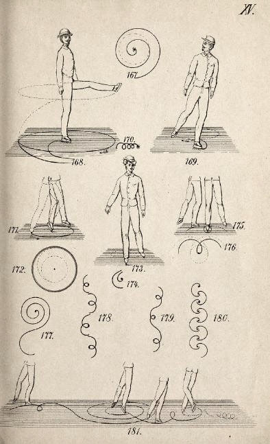

### **Starting point:**

* I am expanding my project I presented in  Computation A&D course on Fri 8th of Nov, link to [the Miro board](https://miro.com/app/board/uXjVLIm3lwU=/).
* In **p5.js** I am planning to do **drawing exercises on spirals and other circular paths** inspired by old s[pecial figure skating figures](http://www.skatingaheadofthecurve.com/SpecialFigures.html) as well as beautifully illustrated [choreographical manuals for old ballroom dances](https://publicdomainreview.org/collection/dances-in-beauchamp-feuillet-notation/) called *Beauchamp-Feuillet notation*

**In Physical Computing** I aim to focus on creating **a user interface** that enables interaction with the drawing exercises

### **What kind of interaction and UI?**

**OPTION 1:** 

* **A physical control,** possibly a potentiometer functioning as a slider, which **alters the patterns in some way** 
* **A nicely rotating knob** that fits nicely to one's hand (my hand ofc), a beautiful to look and use. Perhaps two knobs for different properties? Or the second one could be a nice button or a switch?
* The **patterns are drawn to a display**/a projected surface
* Similar knob size I have in mind, this controls the computer volume: https://www.instructables.com/Desktop-Scroll-Wheel-and-Volume-Control/

Some simple controllers, I would like to do something even more tangible and fun: https://www.instructables.com/Control-Box/

A comment: *This option is the most straigth-forward one with physical knobs and buttons. It would be fun to tinker with different design options for the knobs (how it feels when touched, color, materials, the overall user experience).*

**OPTION 2:**

* **A sensor detects the movement/steps of a participant**
* A projector projecting to the floor where the participant is located, translates the sensor data to draw patterns based on my p5.js algorithm
* Perhaps it creates patterns, that the participant needs to follow to perform a dance... or to **just make the projection alive**
* Perhaps the participant could even lie on the floor? 

A comment: *This is a playful option with the whole body interaction. However this approach adds a new level of complexity for detecting movement and for me to come up with a goooood and algorithm for the p5.js part. I am a quite worried of time.*

**OPTION 3:**

* **A sensor in something wearable** detecting the movement of the feet for example or hands
* A projector OR a display that translates the sensor data to draw the images with my algorithm
* Similar project:
  

A comment: *This is the hardest option but also quite interesting.  I might get into trouble with time since I am still a beginner in coding + tinkering with sensors and wearables is an unknown terrain for me. It would most likely develop into a too complex project for now.*

### **Parts and components needed:**

**OPTION 1:** 

* Arduino
* Potentiometer(s) and a button? Or a big switch?
* Some knobs, I am hoping to thrift some fun parts that I could alter or then 3d print something
* A container for the controls

**OPTION 2 + 3:** 

* Arduino
* A sensor for detecting movement --> LOOK INTO THIS
* For option 3 something wearable for the sensor to go in
* A projector for option 2 OR a display for option 3

### Some comments:

In my p5.js class there was a suggestion to look at the *Guidonian hand*, a pedagogical system used prior to the invention of musical notation. In short, it was a system where each finger and knuckles (?) represented a different note, a full step (koko sävelaskel in Finnish): 

*It was the most basic pedagogical tool for learning new music in the European Middle Ages, and was often referenced in contemporary musical theory. In each hexachord, all adjacent pitches are a whole tone apart, except for the middle two, which are separated by a semitone.*

Source: <https://en.wikipedia.org/wiki/Guidonian_hand>

*Guidonian hand* and refiguring the functionality of it to this project (for controlling the patterns) would be an ideal BUT I think for this timeframe I have do something more simple. However, I will definitely keep this sidetrack in mind for the future!
