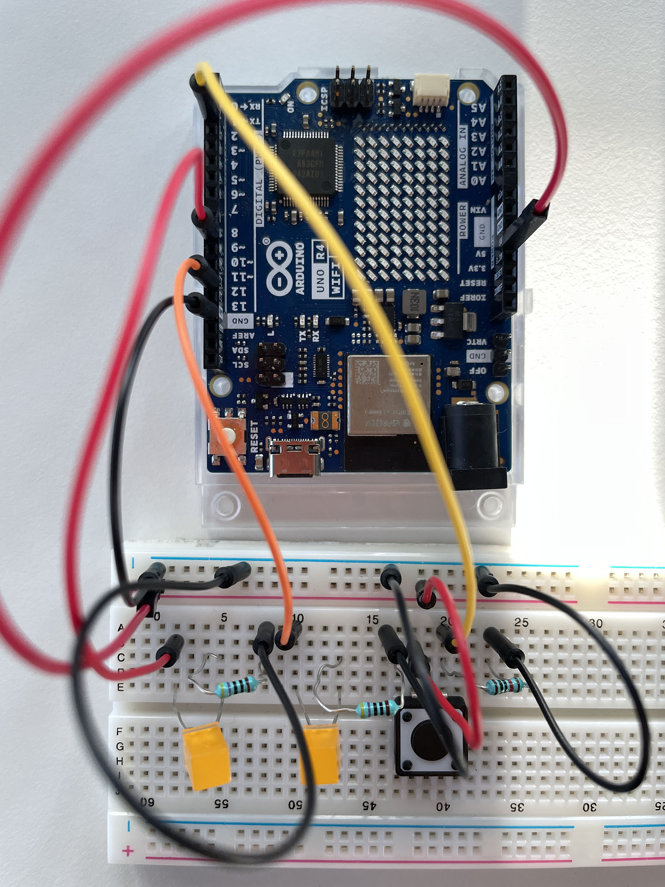
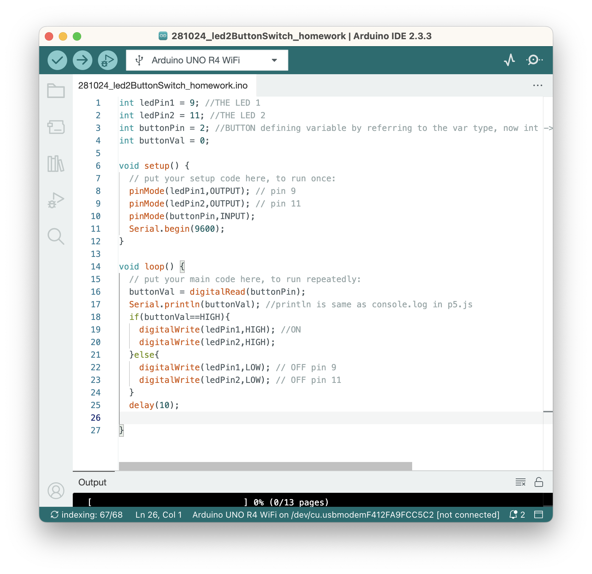
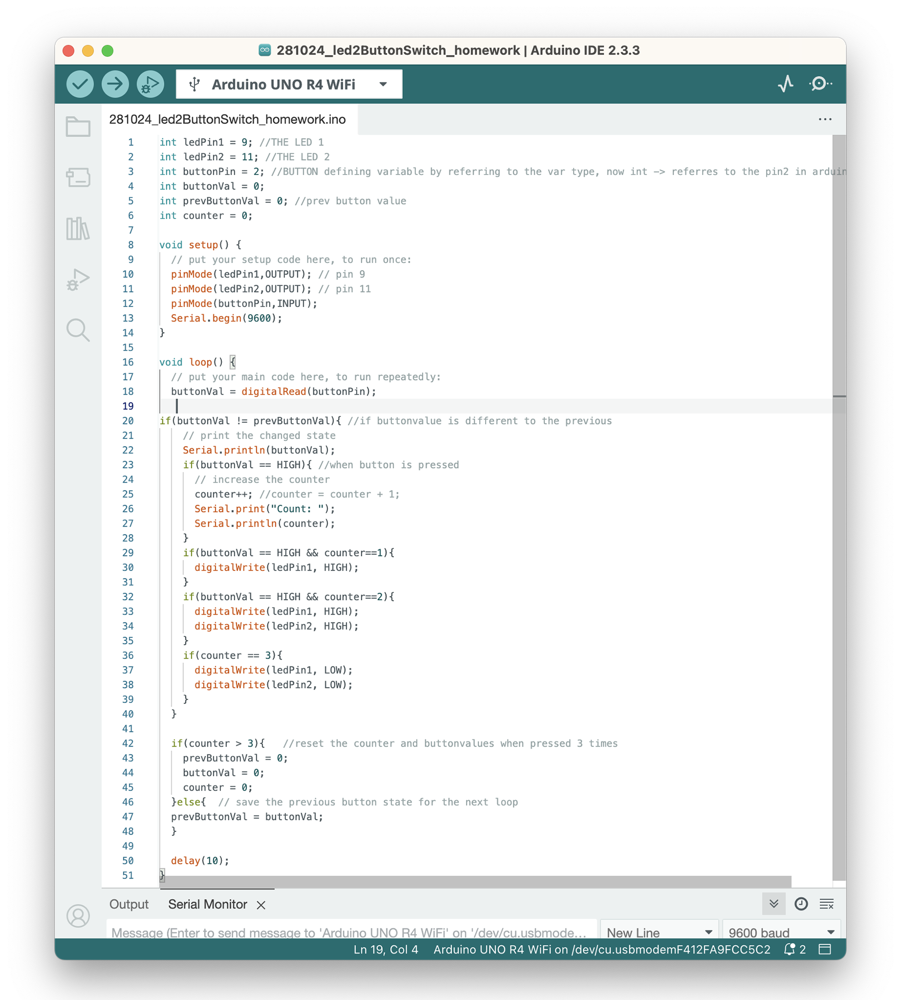

## **The task:**

*Create a circuit and Arduino code that does the following*

***Circuit***

1. *Connect two LEDs to your Arduino using a breadboard*
2. *Connect one switch to your Arduino using a breadboard*

***Code*** 

* *Read a momentary switch being pressed*
* *When the program starts, both LEDs are off*
* *When the switch is pressed once, the first LED turns on*
* *When the switch is pressed the second time, the second LED turns on (the first one should also still be on)*
* *When the switch is pressed the third time, both LEDs turn off*
* *Repeat this same cycle of LEDs turning on and off in sequence (off, one LED, two LEDs, off…)*

## Let's start!

I am continuing on the arduino sketch we did at class with 1 led+switch.

**What do I need to have:**

* 1 led + a resistor with the yellow line first (470 ohm) 
* A red cable (orange one)+  black cable to connect to the blue line (negative).. to the grounding
* I have to select a second pin for the second led -> pin 11

**What I did for the circuit:**

1. Added a second led+resistor after the first led+resistor (in the same pattern)
2. Added a black cable to the second led’s resistor and that to the blue (negative) row
3. Added an orange cable to the second led and to the pin 11 (with the wavy line)



*Side note: Here the second led is connected to the pin 12 which I changed later to pin number 11.*

### **The code:**

What do I need to add to make the second led work?

* Activate the pin 11 (second led) in the code
* Add a variable for the second pin
* Add the digitalWrite command high+low

**Here's the code:**



I was stuck with figuring out the sequencing but found some tips here: <https://learn.newmedia.dog/tutorials/arduino-and-electronics/arduino/digital-io-rising-or-falling-edge/>

**And here's the final code that actually worked after some experimenting:**



```c
int ledPin1 = 9; // THE LED 1
int ledPin2 = 11; // THE LED 2
int buttonPin = 2; // BUTTON, refers to the pin2 in arduino
int buttonVal = 0;
int prevButtonVal = 0; // prev button value
int counter = 0;
void setup() {
  // put your setup code here, to run once:
  pinMode(ledPin1,OUTPUT); // pin 9
  pinMode(ledPin2,OUTPUT); // pin 11
  pinMode(buttonPin,INPUT);
  Serial.begin(9600); 
}
void loop() {
  // put your main code here, to run repeatedly:
  buttonVal = digitalRead(buttonPin);
// if button value is different to the previous button value:
if(buttonVal != prevButtonVal){ 
// print the changed state*

    Serial.println(buttonVal);
    if(buttonVal == HIGH){ //when button is pressed
    // increase the counter
    counter++; // counter = counter + 1;
    Serial.print("Count: ");
    Serial.println(counter);
    }
    if(buttonVal == HIGH && counter==1){
    digitalWrite(ledPin1, HIGH);
    }
    if(buttonVal == HIGH && counter==2){
    digitalWrite(ledPin1, HIGH);
    digitalWrite(ledPin2, HIGH);
    }
    if(counter == 3){
    digitalWrite(ledPin1, LOW);
    digitalWrite(ledPin2, LOW);   
    }
  }
  // reset the counter and button values when pressed 3 times
  if(counter > 3){
   prevButtonVal = 0;
     buttonVal = 0;
    counter = 0;
  // save the previous button state for the next loop 
  }else{ 
  prevButtonVal = buttonVal;
  }
  delay(10);
}
```
