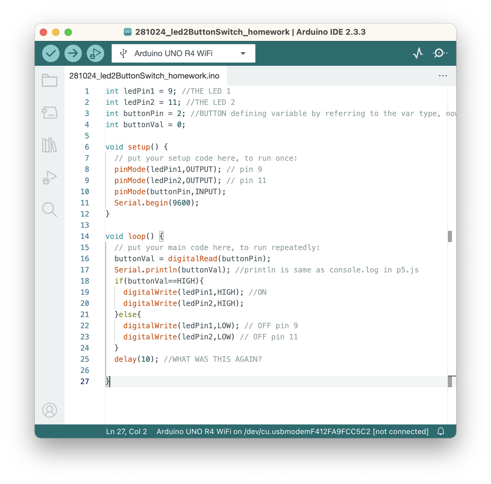

## **The task:**

Create a circuit and Arduino code that does the following

**Circuit**

1. Connect two LEDs to your Arduino using a breadboard
2. Connect one switch to your Arduino using a breadboard

**Code** 

* Read a momentary switch being pressed
* When the program starts, both LEDs are off
* When the switch is pressed once, the first LED turns on
* When the switch is pressed the second time, the second LED turns on (the first one should also still be on)
* When the switch is pressed the third time, both LEDs turn off
* Repeat this same cycle of LEDs turning on and off in sequence (off, one LED, two LEDs, off…)

## Let's start!

I am continuing on the led+switch done on class with one led.

**What do I need to have:**

* 1 led + a resistor with the yellow line first (470 ohm) 
* A red cable (orange one)+  black cable to connect to the blue line (negative).. to the grounding
* I have to select a second pin for the second led -> pin 11

**What I did for the circuit:**

1. Moved the button and red+yellow cables first end (start) with three to the right
2. Moved the button's resistor with three to the right + the black cable connected to it
3. Added a second led+resistor after the first led+resistor (in the same pattern)
4. Added a black cable to the second led’s resistor and that to the blue (negative) row
5. Added an orange cable to the second led and to the pin 11 (with the wavy line)

## **ADD PICTURE**

**The code:**

What do I need to add to make the second led work?

* Activate the pin 11 (second led) in the code
* Add a variable for the second pin
* Add the digitalWrite command high+low

**I ran the code but only the led 1 in pin 9 works...**

**Here's the code:**

