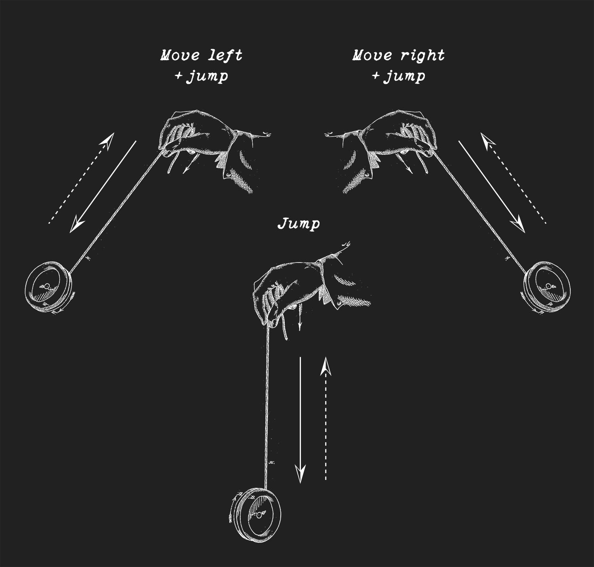
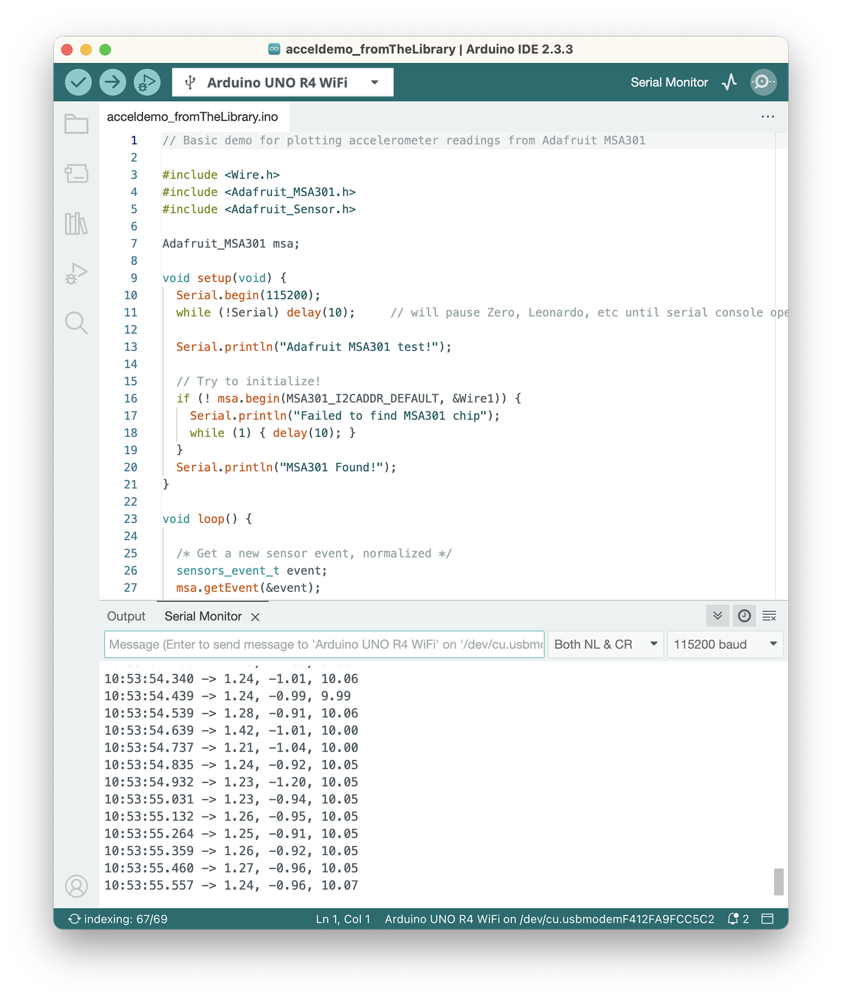
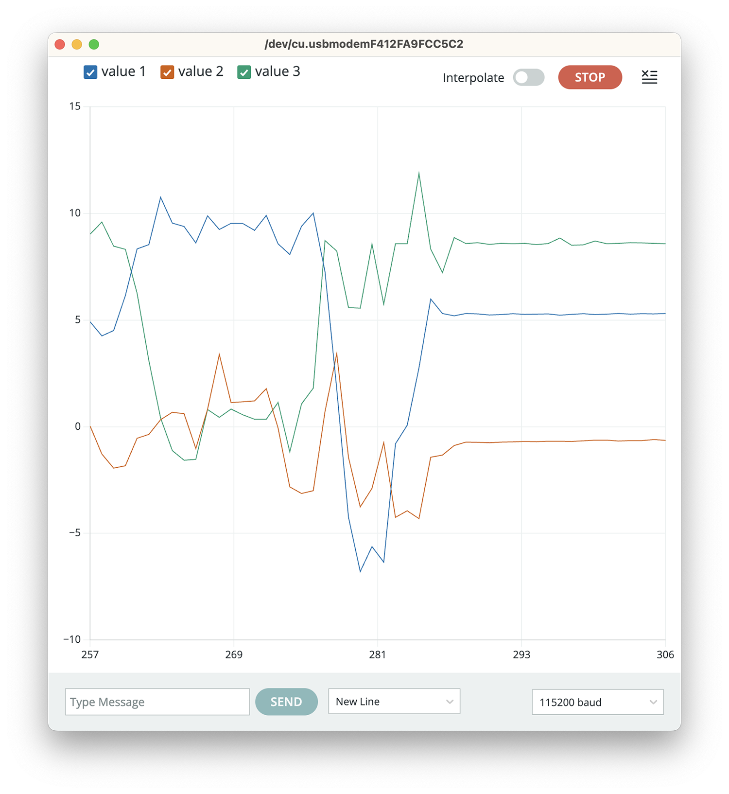

## 1 Alt+CTRL interface

I chose *Ghostboi* as an interesting Alt+ctrl interface. It is a game, where you control a ghost character with a bendy pink controller. The controller molded from translucent silicone in the shape of a cartoon ghost works with touch sensors and vibration motors giving haptic feedback for the player. The storyline deals with emotions and memories of mortal life that the ghostboi character faces during his journey to afterlife.



While browsing the projects, the pink color and cute aesthetics made me open the link (so obvious). It was nice to see how the actual experience of touching an interface, its materials, shape and color, were part of the storyline of the game. I don't really play video games, but the theme of nostalgia, afterlife and mortality also felt fresh in this context. 

Link to the project: <https://shakethatbutton.com/ghostboi-in-the-land-of-the-dead/>

## 2. Come up with a concept for your own Alt+Ctrl Interface

* *Explore at least one sensor in more detail + figure out how to read the values from it with your Arduino. Print out the data from the sensor to the Serial Monitor or Serial Plotter.*
* *Find out what type of data you can get out of it. Is it on/off signal, continuous number, some more complex data?*
* *Think of different interactions and/or gestures that could be detected with the sensor you picked. What kind of objects could the sensor be attached to?*
* *Choose an existing video game that could be controlled using the interaction/interface enabled by this sensor OR come up with a completely new game or game mechanic.*
* *Come up with the idea/concept for your alternative controller. These can be silly, experimental, ridiculous, absurd…*

## Let's start!

**What I chose to work with:**

1. **Video game**: Crash Bandicoot 1, level 8: Hog Wild
2. **Sensor:** MSA301 triple-axis accelerometer
3. **Tool/object for interaction** - a yo-yo, controls the hog's jump (y-axis) and movement to left + right (x- and z-axis)

*Illustration of the concept.*



**How to:**

The player uses yo-yo to control the hog's movement and jumps:

The jump is controlled by throwing the yo-yo down (y-axis) and movement of the hog between left or right (to dodge obstacles) is controlled by simply moving one's hand in the same direction (x-axis).

These gestures can be combined: the hog can jump either left or right when the yo-yo is thrown to the corresponding direction (x and z-axis to enable the throw both forward and diagonal).

The sensor is attached to the disk(s) of the yo-yo.

**A comment:**

There is a limitation for this concept and that is TIME. The gameplay is quite fast so throwing a yo-yo and waiting it to return to the player's hand is not the fastest gesture. But of course there are different kinds of yo-yos and we can assume that this one is extremely lightweight and fast to throw.

**Arduino:**

In Arduino, the sensor gives 3 numeral values with decimals, both - and + , but I'm not sure about the full range of the data. Nevertheless, I think this sensor would provide me with the data to detect the movement needed for this yo-yo controller.

Serial monitor values where the first value indicates the movement of the x-axis, the second y-axis, and the third z-axis. Below are the same values in a visual plotter.

*Original source for the edited yo-yo illustration: James L. Haven; Charles Hettrick - US patent application 59745, James L. Haven; Charles Hettrick, "Whirligig", published 1866-11-20. Public domain. [https://commons.wikimedia.org/wiki/File:US59745AWhirligig(1866published)_by_James_L._Haven;_Charles_Hettrick-_Yo-yo,_Fig._1,_2,_3.png](https://commons.wikimedia.org/wiki/File:US59745A_Whirligig_(1866_published)_by_James_L._Haven;_Charles_Hettrick_-_Yo-yo,_Fig._1,_2,_3.png)*
