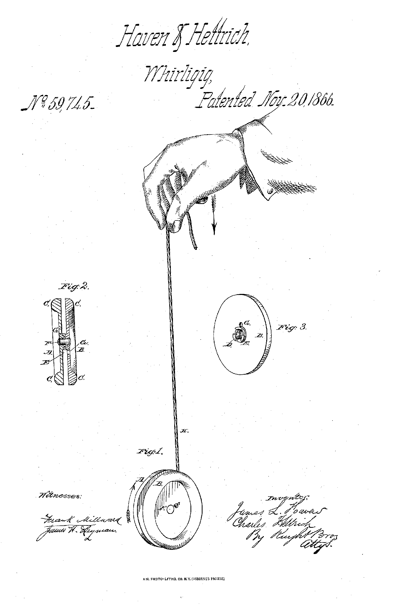

## 1 Alt+CTRL interface

I chose *Ghostboi* as an interesting Alt+ctrl interface. It is a game, where you control a ghost character with a bendy pink controller. The controller molded from translucent silicone in the shape of a cartoon ghost works with touch sensors and vibration motors giving haptic feedback for the player. The storyline deals with emotions and memories of mortal life that the ghostboi character faces during his journey to afterlife.



While browsing the projects, the pink color and cute aesthetics made me open the link (so obvious). It was nice to see how the actual experience of touching an interface, its materials, shape and color, were part of the storyline of the game. I don't really play video games, but the theme of nostalgia, afterlife and mortality also felt fresh in this context. 

Link to the project: <https://shakethatbutton.com/ghostboi-in-the-land-of-the-dead/>

# TO DO:

## 2. Come up with a concept for your own Alt+Ctrl Interface

* *Explore at least one sensor in more detail + figure out how to read the values from it with your Arduino. Print out the data from the sensor to the Serial Monitor or Serial Plotter.*
* *Find out what type of data you can get out of it. Is it on/off signal, continuous number, some more complex data?*
* *Think of different interactions and/or gestures that could be detected with the sensor you picked. What kind of objects could the sensor be attached to?*
* *Choose an existing video game that could be controlled using the interaction/interface enabled by this sensor OR come up with a completely new game or game mechanic.*
* *Come up with the idea/concept for your alternative controller. + Write about your idea on your site. You can draw sketches or other ways to illustrate your idea.*
* *These can be silly, experimental, ridiculous, absurd…*

## Let's start!

**What I chose to work with:**

1. **Video game**: Crash Bandicoot 1, level "Hog Wild"
2. **Sensor** ??? something with velocity + direction ? 
3. **Tool/object for interaction** - a yo-yo for the jumps and movement to left or right corners

*James L. Haven; Charles Hettrick - US patent application 59745, James L. Haven; Charles Hettrick, "Whirligig", published 1866-11-20. Public domain.*

To do:

Write a description/instruction how to use it

How the sensor captures the movement and translates it to a jump (x on playstation controller)

Illustrate the movement -> drawn? photos?



https://www.youtube.com/watch?v=X2yDxSFadHM
