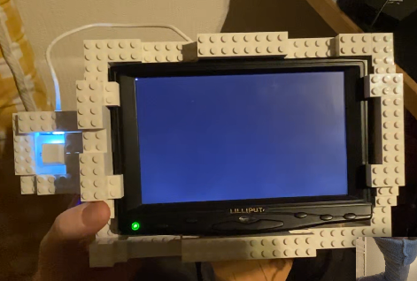

**Final project: Building a DIY VR-headset & control system**

The initial plan was to make a system to view and control a virtual reality environment with a more do-it-yourself approach that would also have a critical making point of view for VR.

My personal gripe with VR systems is their high price and lack of comfortable usability. A more specific VR setup built for a specific use and occasion could possibly be more interesting and fun to use than a VR system manufactured by a big corporation aiming for a large target audience and as many sold consumer units as possible.

So I started to outline the system, which turned out to be much more complex than I had envisioned - thinking I could just slap things together. I did not have much experience with the physical or electronics side of things when it came to 3-dimensional worlds. My background in 3D allowed me to grasp ideas rather quickly and come up with a partial solution, a DIY VR headset with an embedded controller for moving around.

I wanted to use **Blender** as my main 3D creation tool for the project, but I was unsure if the old game engine could interface with Arduino at all. The **Arduino Uno R4** was provided by our teacher Matti Niinimäki at the start of the course and we did some basic projects together with the board.

3-dimensional orientation was the first thing I wanted to get working. As mentioned above, I was unsure how Blender could be utilized, since the game engine that was buil into the software had been left out of the mainline Blender software trunk since 2019. However, having a large fanbase, the game engine lived on as a fork known as **UPBGE**, which is still being developed to this day. I found this to be a good tool for building and interfacing with my virtual world and the Arduino.

I was using Blender and TouchDesigner simultaneously, testing the output from Arduino first in TouchDesigner and then moving on to Blender for the final build.

The sensor I used with the Arduino Uno R4 was an **Adafruit LSM6DSOX + LIS3MDL - Precision 9 DoF IMU - STEMMA QT / Qwiic.**

This is a sensor that affords the user nine degrees of freedom, meaning orientation and positioning in the real world is calculated by three components: A gyroscope, magnetometer and accelerometer.

The installation of the sensor was relatively simple since it is an i2c -compliant board. The i2c is a serial communications bus standard that allows the user to connect multiple sensors to a microcontroller without having to attach a breadboard or do any soldering necessarily. The i2c in my case used two connections to the Arduino Uno board - the SDA and SCL pin connectors in addition to 3.3V power and ground. So altogether I connected four jumper cables between the sensor’s breakout board and the Arduino microcontroller.

[Video: getting raw orientation data from the sensor](https://drive.google.com/file/d/106e-mSIs1b3dQv-vNDp4xcS0OxPL_zHX/view?usp=drive_link)

[Video: raw orientation data into TouchDesigner](https://drive.google.com/file/d/104hZIceYY3rGWAa-cEmBChAi7MZdtiC6/view?usp=drive_link)

I began facing issues with the i2c STEMMA QT / Qwiic connector, which is supposed to provide ease of use. On my Uno R4 unit I was not able to get sensor data, since apparently the standards of coding this secondary input for i2c are not very uniform. It took me several tries with no success, until I found a cable with a Qwiic connector on the other end and a basic connector with four separate pins for voltage, ground, SDA and SCL. This enabled me to use the first priority i2c interface on the Arduino, not having to find out what cryptic code to add to get things working. Documentation on i2c devices with more than one interface could be better for the Arduino. Especially when the Qwiic connector is marketed as a beginner-friendly and fast method for i2c - for me it was anything but.

As I was now able to receive actual orientation data properly into my computer via the serial connection, I tried to apply this data into a simple TouchDesigner 3D project. On the Arduino side, I used Adafruit’s AHRS library to get simple orientation output from the sensor.

[Video: WebGL-based testing application for the Adafruit AHRS filters](https://drive.google.com/file/d/1-zxRv_7xNE1BRFymBuOrYRNdJftgoJqA/view?usp=drive_link)

I ran into several issues again, getting raw data output working fine but not being able to use the more sophisticated filters Adafruit had provided as ready sketches. I tried to solve the problem of not getting any data output from the Arduino, resorting to asking AI-assistants ChatGPT and Claude for help and trying to code my way out of the issues. However, nothing seemed to work and I looked closer into the documentation of the sensor filtering tools themselves that Matti had kindly provided to me. Apparently the orientation data is being saved for filtering on the Arduino board on the EEPROM memory - a component that had gone through significant changes in the revised R4 model. After going through several forum posts about R4 sketch compatibility issues, I began suspecting the library was not meeting the hardware’s requirements or vice versa, and replaced the R4 with my own Uno R3 microcontroller. The output was not producing acceptable results.

My simple TouchDesigner 3D test patch was at first a cube being rotated by the incoming filtered orientation data. The result was a rather shaky cube that had one huge problem - it was rotating diagonally when I moved the sensor on the vertical axis - usually represented as either Y or Z in 3D software. Matti mentioned that possibly this was to do with euler and quaternion rotation methods being messed up at some point during the pipeline. He also mentioned it was a good idea to try and calibrate the sensor.

I looked into the matter and prompted ChatGPT and Claude to give me code to test different rotation methods after filtering in the Arduino code. After many days of prompting and reviewing code, I found the Adafruit calibration webpage tutorial Matti had shown me already earlier. The sensor’s magnetometer was successfully calibrated, resulting in good rotation in the test scene in TouchDesigner. Next, I built a more complex scene in TouchDesigner where I would control the camera with incoming serial data.

Everything seemed to work smoothly and I began building housing for the system. Matti had provided a small 7-inch screen with an HDMI connector for my project. It also had a 12V-power requirement. I built the first headset prototype to feature a handle and shell for the display using Lego blocks. The Legos afforded me fast prototyping as I first divided the screen between two eyes, but quickly realized it would not work without lenses - it was better to have a flat fullscreen image rather than trying to force the user to look at the low-resolution screen from a very close distance.

After getting started with the case prototype, I went back to software and figured out how I could get serial input into the Blender Game Engine. I prompted questions to my trusty AI team, receiving an answer that I needed the **Pyserial-library** to get the functionality I wanted. In TouchDesigner I wouldn’t have to download or install any extra stuff to get serial input working.

Studying further, I found out that I needed to install the Pyserial library into my Blender’s integrated Python package. This meant that I had to install pip, which was a bit tedious on a Windows computer at first but successful after some documentation reading, AI prompts and searching online forums and videos. I got serial input now working into Blender with minimal lag which I was very happy about. TouchDesigner suffered from some lag whereas Blender was very responsive in moving 3D objects around with the incoming data.

I tested the serial input on both Blender 2.79 version and UPBGE 0.25, finally deciding to use UPBGE since it seemed more stable.

[Video: LEGO block prototyping for the case](https://drive.google.com/file/d/1-rpJBvifCmjxpVm6hiGY-KnD714SB56t/view?usp=drive_link)

I also decided to install **Xubuntu Linux** on my tiny **Asus VivoStick Computer**, hoping I could fit all the technology running the VR experience into the headset itself. The Linux distro worked well and I was able to install UPBGE and Serialpy on it without a sweat. I had my .blend-file running on startup with a small shell script initializing when the terminal app started on system startup. So the basic framework was ready for the VR headset, and I planted everything into a Lego shell that became quite heavy, so I dropped the initial idea of having a single-handed handle in the bottom of the unit. Instead, I made the headset system resemble more like a Steamdeck or other handheld gaming systems, where the user would place their hands on the sides of the screen. This choice also received positive feedback from users, but changed the original idea quite a lot.

Because I had taken so long working out the sensors and interaction between serial and UPBGE, I did not have time to build a proper positioning system for the device, which was now essentially a handheld console that you could use as a small window into a virtual environment. So I added a button to the side of the unit that the user could press to move forward. That was the only button in the whole unit, since I got inspired by the octapad example, where a Nintendo NES controller was broken down into several controllers with just one button each one of them.

I was also trying to power some devices from a powerbank, which failed due to low amperage coming out of the powerbank, as my VivoStick required 5V and 3A of power. However, I was able to power the Arduino from the USB 3.0 connector on the VivoStick, which was a step towards the right direction. I built a separate compartment for the sensor breakout board so I could easily remove it for debugging. This compartmentalization could benefit the whole system.

As for what I learned from this project, I found out lots of new things about 3-dimensional rotation methods and a bit of the mathematics behind it, even though quaternions’ fourth dimension still goes a bit over my head. I understood the gimbal lock effect much better, which I have come across in 3D animation but have been able to go around quickly and not give it that much thought. Now I really had to study this effect of gimbal locking and what it means. The final method of rotation was actually using euler, but avoiding the gimbal lock by setting the order of the rotation axes to have X axis as the very last one. Since a player or VR environment visitor rarely looks ninety degrees up or down, the gimbal lock effect can be overcome by rotating the X axis last.

I also learned about soldering, doing some exercises in class with fixing small things not really related to my final project. But considering the continuation of this project, soldering will be valuable for using smaller microcontrollers that will have the jumper cable pins soldered on them directly.

My final project featured a scene from a video game I’m developing, and making it work in the semi-mobile virtual reality handheld device gave ideas for the level design and how environmental storytelling could augment the game and its main character.

Going further, I want to cut down the size, weight and cost of this system to possibly make a kit out of this for people who want to make DIY VR experiences. I believe a Raspberry Pi Zero could possibly run UPBGE or Blender and display some basic 3D graphics, as the 3D environment does not exactly have to be realistic in order to be engaging or immersive. I want to study this Lo-Fi immersion possibility closely and move onto adding control schemes around this well-working prototype of 3D orientations in a 3D space. Harnessing the quaternions would be another thing I have to dig deeper into, as I feel the euler rotation method will eventually not be enough for climbing ladders or flying, for example.

The project made me deepen my existing knowledge and go into uncharted territory I thought I knew, but which revealed to be a huge undertaking in itself.

[Video: the final working handheld VR device](https://drive.google.com/file/d/1qQV0PV5Inafc4MOuO-DYfu9EU5H9Rod_/view?usp=sharing)
