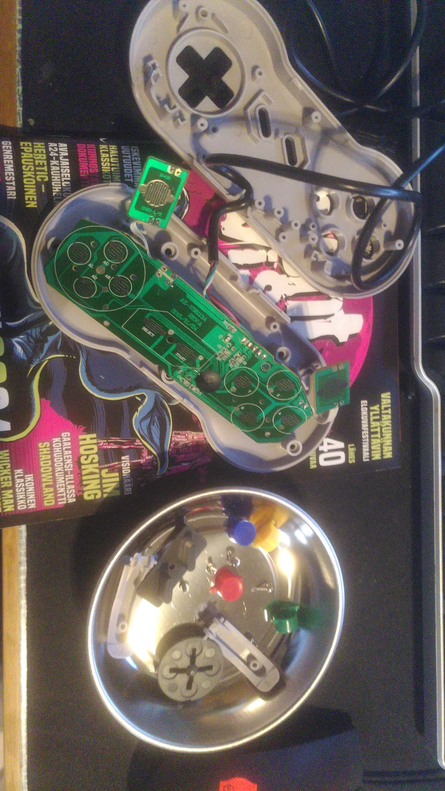
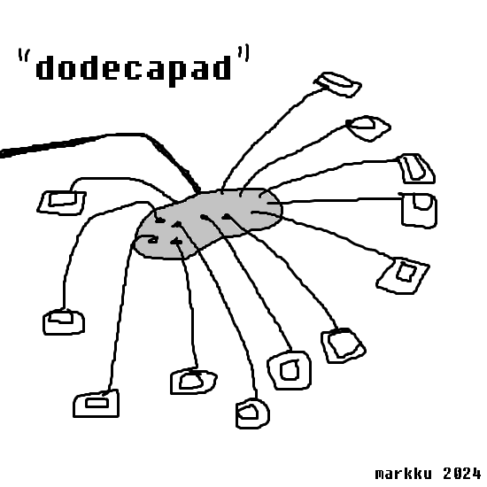

From the 2019 alt.ctrl.GDC Archive one controller really stood out for me - the Octopad. The Octopad divides the game controller that usually has several buttons into several controllers that each have only one button on them. This kind of intuitivity of single-button controllers has intrigued me for a while now.

<http://patrick-lemieux.com/projects/Octopad/>

I found an old SNES knock-off USB controller that I opened up and started studying. It would be enjoyable to discover ways to make a thing similar to the Octopad, using this broken controller and maybe build a video game around the idea of social interaction between players trying to work together - or the opposite.

If I managed to fix the broken switch (there's one on the pad) - the pad would have 12 buttons. Thus, the name of the controller would be "dodecapad", where the buttons/sensors could be somehow different each. One thing I was wondering is how to make a game that can be enjoyed by a single player, if no team is available. Maybe some kind of restaurant management game could be fun?

